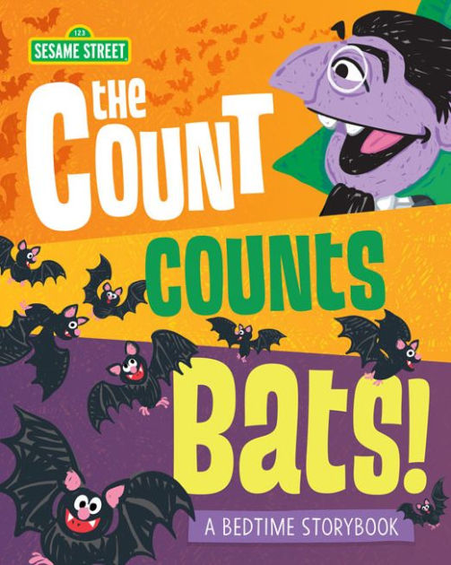
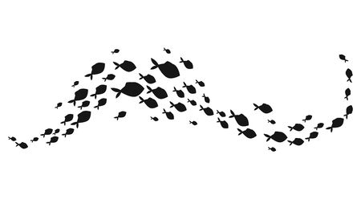
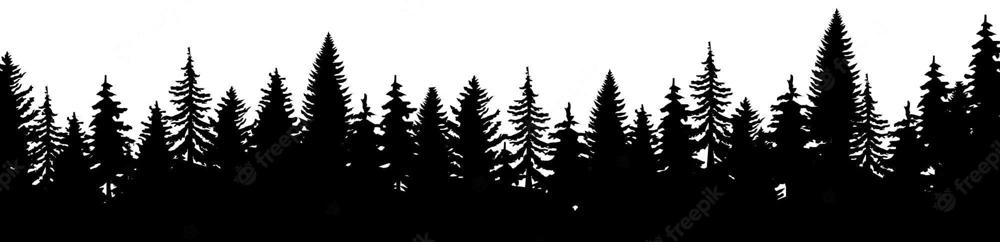
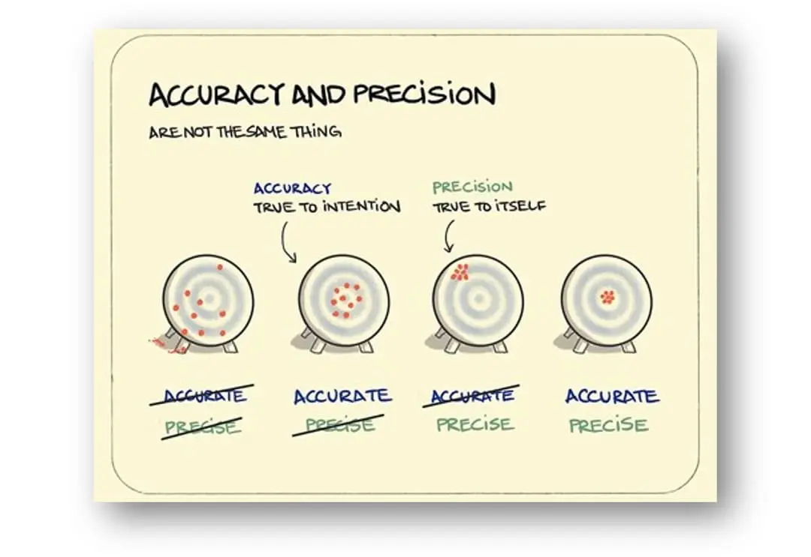
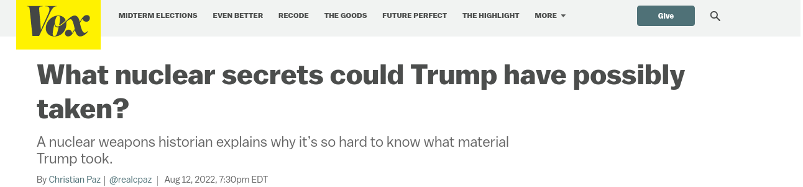
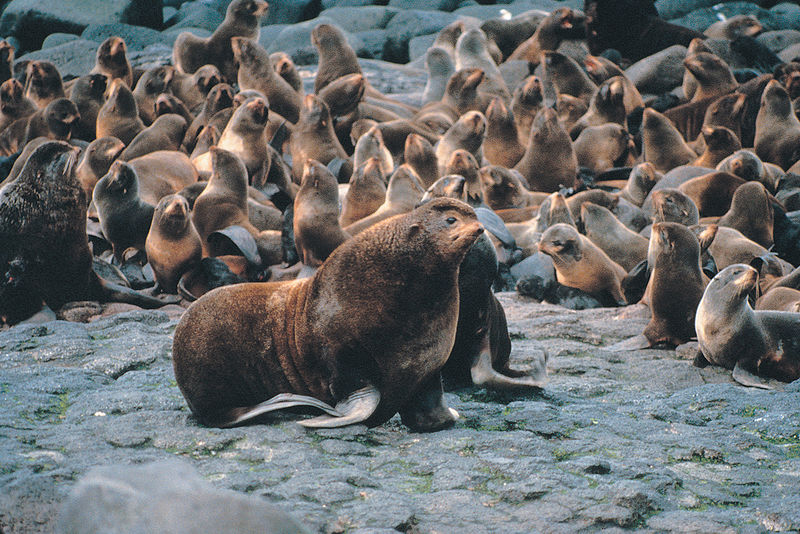
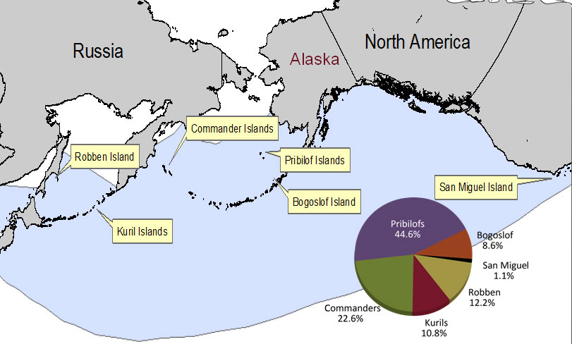
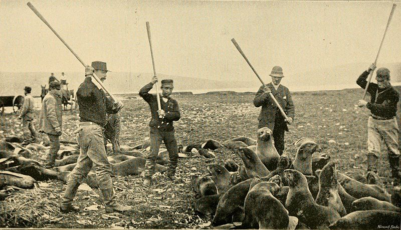
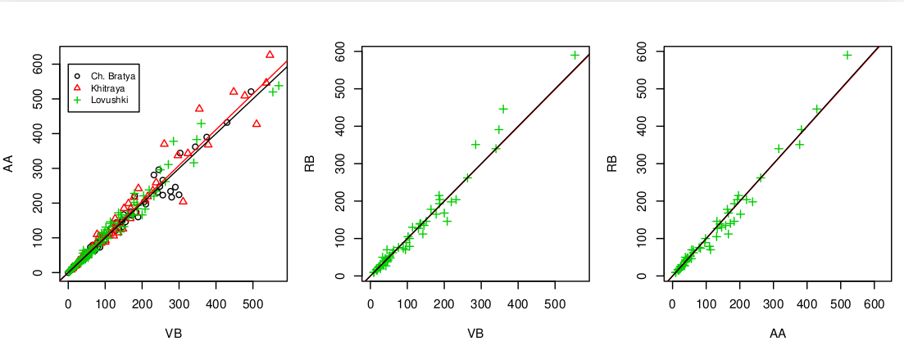
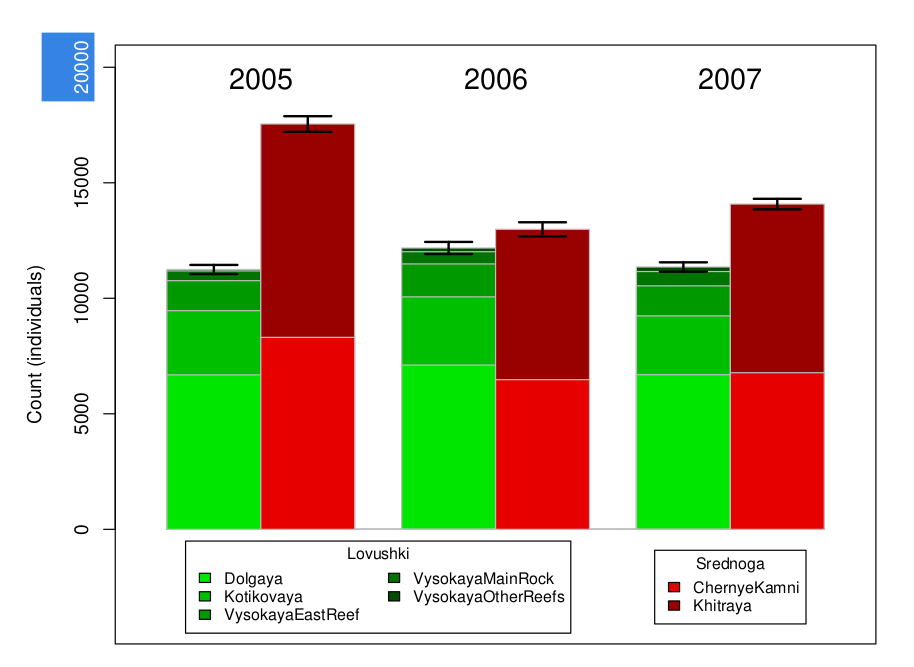

<!-- https://bookdown.org/yihui/rmarkdown/xaringan-format.html -->
```{r, echo = FALSE, eval = FALSE}
# renderthis::to_pdf("Lecture04_CountingAnimals.Rmd")
```

```{r setup, include=FALSE}
knitr::opts_chunk$set(echo = FALSE, message = FALSE, 
                      warning = FALSE, las = 1)
#output: html_document
```


```{r colsFunction, eval = FALSE}
system("cp ../mycss.css ./")
system("cp images/LyoshaCounts.jpg ./bg.jpg")
xaringan::inf_mr()
```


.pull-left-60[.content-box-blue[

## Goals of wildlife management

1. make them increase
2. make them decrease
3. keep them stable
4. do nothing - but keep an eye on them
]]

--

.pull-left-60[.content-box-yellow[
## What do we need to know!?
]]


---


# A count can be simple

.pull-left.footnotesize[

1, 2, 3, 4, 5, 6, 7, 8, 9, 10, 11, 12, 13, 14, 15, 16, 17, 18, 19, 20, 21, 22, 23, 24, 25, 26, 27, 28, 29, 30, 31, 32, 33, 34, 35, 36, 37, 38, 39, 40, 41, 42, 43, 44, 45, 46, 47, 48, 49, 50, 51, 52, 53, 54, 55, 56, 57, 58, 59, 60, 61, 62, 63, 64, 65, 66, 67, 68, 69, 70, 71, 72, 73, 74, 75, 76, 77, 78, 79, 80, 81, 82, 83, 84, 85, 86, 87, 88, 89, 90, 91, 92, 93, 94, 95, 96, 97, 98, 99, 100, 101, 102, 103, 104, 105, 106, 107, 108, 109, 110, 111, 112, 113, 114, 115, 116, 117, 118, 119, 120, 121, 122, 123, 124, 125, 126, 127, 128, 129, 130, 131, 132, 133, 134, 135, 136, 137, 138, 139, 140, 141, 142, 143, 144, 145, 146, 147, 148, 149, 150, 151, 152, 153, 154, 155, 156, 157, 158, 159, 160, 161, 162, 163, 164, 165, 166, 167, 168, 169, 170, 171, 172, 173, 174, 175, 176, 177, 178, 179, 180, 181, 182, 183, 184, 185, 186, 187, 188, 189, 190, 191, 192, 193, 194, 195, 196, 197, 198, 199, 200
]

.pull-right[]

---

# ... or a count can be pretty darned complex

Variance on the estimator of the variance of a **Pacific cod** count based on on-deck observations of harvest in pots: 


.center[Miller 2005 (Ph.D. dissertation)]

---

# An observation

.center[]

.large.center.blue[Counting **fish** is just like counting **trees**, except they're *invisible* and they *move* ...]

.center[]


---
background-image: url('images/aerialcount.jpg')

### .white[Three broad approaches (with sub-categories)]


.pull-left-60[.full-width[.shadow[.content-box-yellow[
1. **Compete census** (total count)

2. **Sample count**
  - Counts along transects or variable plots

2. **Mark-racapture/resight**
  
3. **Population index**
  - count *signs* or *correlates*, not *animals*
]]]]

---
background-image: url('images/aerialcount.jpg')

### .white[Some considerations]


.pull-left-70[.full-width[.shadow[.content-box-yellow[
- Do I **need** absolute numbers? 
- How **precise** of an estimate do I want?
- What is the **cost** of the estimate? 
- Is an **index** sufficient?
- How frequently do we need to survey/census? 
]]]]


---

.pull-right-70[]

### Accuracy

Is the estimate .blue[**biased**]?

Determined by **design**. 

Can be difficult to assess. 

--

### Precision

What is the .red[*error*] or .red[*variance*] or .red[*spread*] on the resulting estimate?   

Quantified with .green[**Confidence Intervals (C.I.)**] or .green[**Coefficients of Variation (C.V.)**]

Generally determined by **effort** and computed with **fancy statistics**. 

Generally **smaller** the bigger the **sample**.  

---


### Very accurate, but very imprecise:





.content-box-green[
*“It could be anything ranging from **something that would endanger the lives of hundreds of millions** of people to something that **has no impact on anything whatsoever**. That’s how vague the classified categorization is,” Alex Wellerstein, a historian of science and nuclear weapons, told me.*]

---

### Goal

.large[
Increase both **accuracy** and **precision** 
- (maybe, generally, a higher premium on **accuracy** ... which is harder). 


***or***

Maybe it's just enough to know how things are *changing*. 
]


---

### Total Count, aka. **Census**


.pull-left[
#### Pros

- Simple to explain!
- Simple math (*arithmetic*)!
- Very precise (no "confidence interval")

#### Cons

- Usually - VERY difficult to perform!
- Only possible for certain kinds of animals
- Accuracy? 

.red[***What kinds of animals can we census?***]

]
.pull-right[]


---
background-image: url('images/elephantcensus.jpg')
background-size: cover

## .white[**Census Examples**]

.full-width[.shadow[.content-box-yellow[
- U.S. Census
- Hippopatomuses in clear rivers*
- Large game (elephants, rhinos, wildebeest) within some parks / game reserves in African savanna*
- Apparently - until the 1950's - many deer / elk herds in the West.* 

*- .small[*examples from Fryxell book ... but a bit tricky to confirm.*]]]]


---

### Northern Fur Seals *Callorhinus ursinus*

.pull-left[

]

.pull-right[

]

.pull-left[
.small[
- Once extemely abundant
- VERY heavily harvested
- Paid off 1867 purchase Alaska in 30 years 
- Reproduce (essentially) in only 6 **rookeries** worldwide
- At heart of the first international wildlife management treaty.  
]]
.pull-right[]

---
background-image: url('images/countem_tuleny.jpg')
class: bottom


.white.center[
###**Count 'em!**
Tyuleni Island]

---
background-image: url('images/LyoshaCounts.jpg')
background-size: cover

## Lovushki Island Fur Seal Pup Count

**technology:**  Count Clickers |  Notepad 

---
background-image: url('images/bamboopoles.jpg')
background-size: cover

## Lovushki Island Fur Seal Pup Count

**technology:** Bamboo poles for self-defense

---

## Fur seal count:  Source of variation?

--

### Individual counters



Pretty good agreement. 

---

## Fur seal count: High Precision!

.pull-left-60[

]

.pull-right-40[

**Point Estimate:**  
 $\widehat{N} = 28,792$

**Standard Error (s.e.):** 
 $\sigma_e = 216$

**95% Confidence Interval**
 $\widehat{N} \pm 2 \sigma_e = (28,630 - 29,220)$

**Coefficient of variation** 
 ${\sigma_e \over \widehat{N}} = 0.75 \%$
]


---
background-image: url('images/WikiFurSeals.jpg')
background-size: cover

## .white[**Fur seal count: what about accuracy?**]


.pull-left-40[.content-box-blue[
What are potential sources of *error* (bias)?

What *direction* is that bias in?]
]

---
background-image: url('images/WikiFurSeals.jpg')
background-size: cover

## .white[**Fur seal count: Ecological question?**]


.pull-left[.content-box-blue[
What does **the number of pups** really tell you about a population? 
]]


