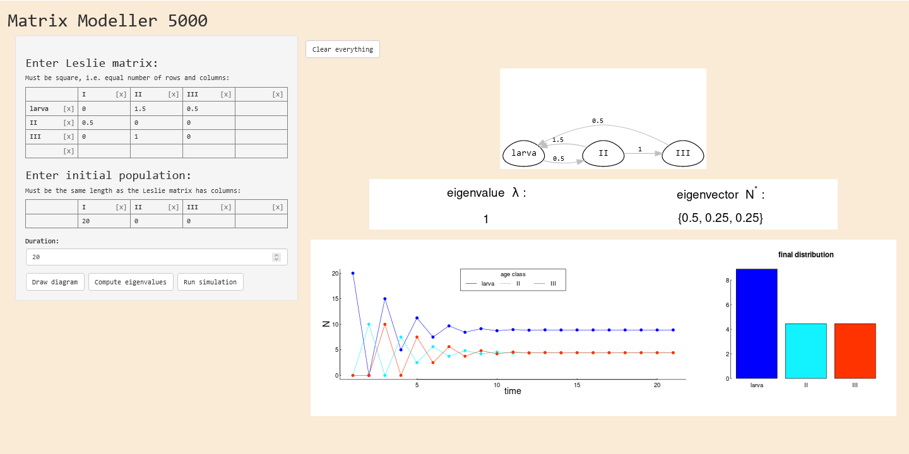
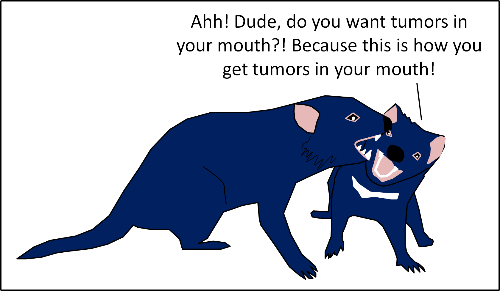

> There are THREE exercises and two additional questions in this lab to submit by midnight Friday, November 3.  

```{css, echo = FALSE}
blockquote {
    padding: 10px 20px;
    margin: 0 0 20px;
    font-size: 16px;
    color: darkgreen;
    font-family: "Garamond";
    background: #DFD;
    border-left: 5px solid #262; 
}
```

```{r setup, include=FALSE}
knitr::opts_chunk$set(echo = FALSE, message = FALSE, warning = FALSE)
```


# Matrix Models

```{r, message = FALSE, warning = FALSE}
require(expm)
require(gplots)
require(plyr)
require(magrittr)
require(utils)
library(DiagrammeR)
source("leslie_diagram.R")
library(magick)
```

In this lab, we are going to experiment with Matrix Models using the [Matrix Population Simulator 5000](https://egurarie.shinyapps.io/MatrixPopulationModels/).  You're basically going to mess around with it long enough to (try to) set up and run a bunch of matrix population processes. 

In the window of Matrix Modeller, you will see the Leslie matrix on the top left, with 3 rows (age classes) and 3 columns and some numbers already entered. Please note that the number of rows and columns should always be **equal**! **If you click on the empty cell, it will automatically create a new row**, which may produce an error saying "Non-square matrix." If that happens, try pressing a little [x] button to remove any accidentally created rows or columns.

You can add new rows or columns by clicking on the empty ones and typing in a name. Once you type a name in, you can click on some other part of the screen and it will be entered. You can also change the existent names - try changing the row names from I, II, and III to "larva," "juvenile," and "adult." 

Under the Leslie Matrix, you have your population vector (bottom left), where you can enter how many individuals you have for each of the age classes. You can see that there are 20 individuals in class I, 0 in class II, and 0 in class III in by default. 

There are three buttons on the bottom: `Draw diagram`, `Compute eigenvalues` and `Run simulation`. Try clicking each one and see what it gives you. Note: if you change any of the parameters, you have to click **each button again** to get a new value or graph! If you want to start over, press the `Clear everything button`.



For all the following processes, obtain (a) population growth $\lambda$ and (b) the  stationary distribution $N^*$. Then, answer remaining questions as they come up.  

## 1. *Monocerus academicus*


```{r}
M <- rbind(c(0,1.5,0.5),c(0.52,0,0),c(0,1,0))
leslie_diagram(M, stages = c("larva", "sophomore", "emeritus"))
```


> **Exercise 1:**
> 
> Change the fecundity of emeritus Monocerus to 0.7.  Report the resulting growth rate ($\lambda$) and stable population distribution ($N^{*}$).  

## 2. A butterfly

Butterflies lay eggs that hatch into caterpillars and become adults.  Not all caterpillars become adults right away, leading to the following diagram:

```{r}
par(mar = c(0,0,0,0))
M <- rbind(c(0,0,60),c(0.1,0.2,0),c(0,.1,0))
leslie_diagram(M, stages = c("egg", "catepillar", "adult"))
```

> **Exercise 2:**
> 
> Report $\lambda$ and $N^{*}$. 
> How many  **eggs** must adults lay to make the growth rate $\lambda = 1$?


## 3. Tasmanian Devil

Pre infectious facial tumor disease, the life history populaiton matrix for Tasmanian devils looked something like this:

```{r}
par(mar = c(0,0,0,0))
M.pre <- rbind(c(0,.1,.5,.7),
               c(.7,0,0,0),
               c(0,.8,0,0),
               c(0,0,.8,.5))
leslie_diagram(M.pre, stages = c("0", "1", "2", ">3"))

```

> **Exercise 3:**
> 
> Report $\lambda$ and $N^{*}$. 


> # **Additional questions** 
> ## (Due: Friday, November 3)
>
> After facial tumor disease emerged and established itself in the Tasmanian devil population, annual mortality of 2 year olds and 3-plus year olds skyrocketed to 90%. This had an immediate impact on the population growth factor $\lambda$.   
> 
> 1. (**3 pts.**) Changing only those survival probabilities, what is the new population growth factor? What is the new stable age distribution? 
>
> 2. (**2 pts.**) As a population-level response, Tasmanian devils radically increased the number of "precocial" births, i.e. 1 yr olds that reproduce.  How high must 1 year old birth rates become to rescue the Tasmanian devil population?   
> 
> **Extra credit:** Can a **stable age distribution** have higher proportions of older animals?  Explain why or why not? 


**Is this Gen Z humor?  If so, I don't get it.**

