<!-- https://bookdown.org/yihui/rmarkdown/xaringan-format.html -->
```{r, echo = FALSE, eval = FALSE}
renderthis::to_pdf("Lecture05_CountingAnimals_PartII.Rmd")
```

```{r setup, include=FALSE}
knitr::opts_chunk$set(echo = FALSE, message = FALSE, 
                      warning = FALSE, las = 1)
#output: html_document
```


```{r colsFunction, eval = FALSE}
system("cp ../mycss.css ./")
system("cp images/aerialcount.jpg ./bg.jpg")
xaringan::inf_mr()
```

## Drawbacks of total counts / censusing

.pull-left-60.large[


Expensive & labor-time intensive

Impractical for MOST species / systems
  - need to ALL be **visible**
  - the **ENTIRE** study area needs to be survey-able
  
Hard to assess precision

]

.pull-right-40[
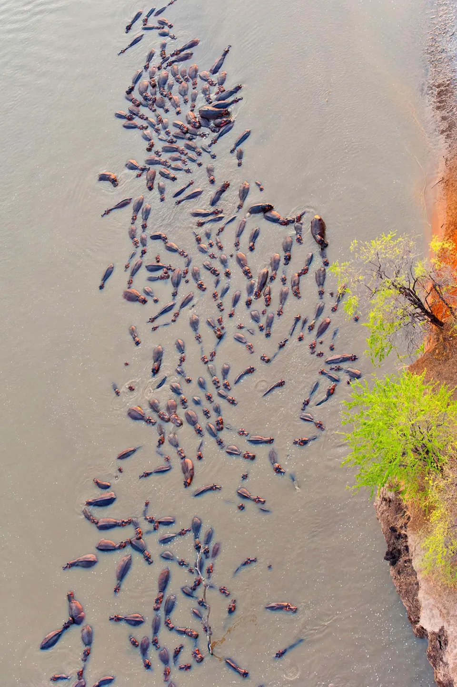

.center[**Hippos**]

.small.grey[(Marc Mol/Mercury Press/Caters)]
]

---

### Is the great Elephant Census a Census?

<iframe src="https://www.youtube.com/embed/imvehfydUpc?controls=0" width="900px" height="500px">
</iframe>

---

## Sample counts

### Simple idea: 
- count *some* of the individuals
- extrapolate!

### In practice:
- Involves some tricky statistics and modeling!
- Necessarily - less *precise* due to *sampling error*. 
- BUT ... if properly done ... more *accurate* and **much less effort**. 

---

```{r, out.width = "100%", fig.width = 6, fig.height = 6, eval = FALSE}


setupPop <-  function(N = 300,  gradient = 0){
    set.seed(1976)
    N.tri <- round(N * gradient)
    
    x1 <- extraDistr::rtriang(N.tri, a = 0, b = 100, c = 100)
    x2 <- runif(N - N.tri, 0, 100)
    
    Z <- c(x1, x2) + 1i * runif(N, 0, 100)
    return(Z)
}

plotPopulation <- function(Z){
    plot(0,0, xlim = c(0,100),ylim = c(0,100), 
             type = "n", asp = 1, bty = "n", 
             xlab = "", ylab = "")    
    rect(0,0,100,100, col = NA, lwd = 3, border = "darkgrey")
    points(Z, pch = 21, bg = "antiquewhite", col = "darkorange")        
}

countSamples <- function(Z, k = 10, size = 10, s= 1976) {
    set.seed(s)
    Z.samples <- runif(k, size/2, 100-size/2) + 1i * runif(k, size/2, 100-size/2)
    xy.samples <- data.frame(x.min = Re(Z.samples)-size/2,
                             x.max = Re(Z.samples)+size/2,
                             y.min = Im(Z.samples)-size/2,
                             y.max = Im(Z.samples)+size/2)
    
   Z.which <- apply(xy.samples, 1, function(z){
        which(Re(Z) > z["x.min"] & Re(Z) < z["x.max"] & Im(Z) > z["y.min"] & Im(Z) < z["y.max"])
    })
    
    Z.counted <- Z[unlist(Z.which)]
    counts <- sapply(Z.which, length)
     
    d.hat <- sum(counts)/(k * size^2)
    list(Z = Z, Z.samples = Z.samples, Z.counted = Z.counted, 
         xy.samples = xy.samples,
         counts = counts, N.hat = d.hat * 100^2)
}

plotSampling <- function(sim){
    with(sim$xy.samples, rect(x.min,y.min,x.max,y.max, col = rgb(0,0,0,.2), bor = "darkgrey"))
    points(sim$Z.counted, pch=19, col = rgb(0,0,0,.3))
}
```

```{r, eval = FALSE}
Z <- setupPop() 
sim <- countSamples(Z, s = 2)

png("images/Pop1.png", width = 500, height = 500, res = 100)
par(tck = 0.01, mgp = c(1.5,.5,0), mar = c(2,2,1,1))
plotPopulation(Z)
dev.off()

png("images/Pop2.png", width = 500, height = 500, res = 100)
par(tck = 0.01, mgp = c(1.5,.5,0), mar = c(2,2,1,1))
plotPopulation(Z)
plotSampling(sim)
dev.off()
```


## A random population

.pull-left-60[

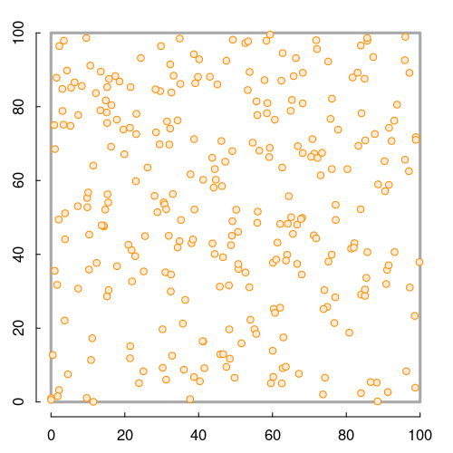

]

--

.pull-right-40[

### Population density

.large[$$N = A \times D$$]
- $N$ - total count
- $A$ - total area
- $D$ - overall density
]

---

## Sampling from the population


.pull-left-60[
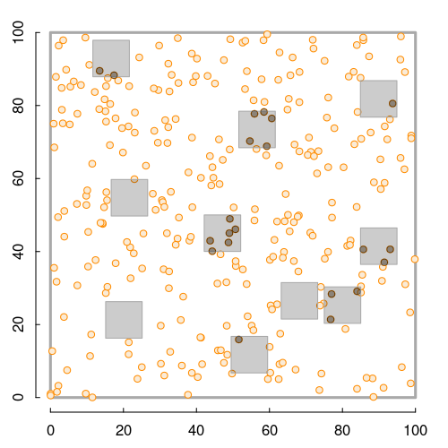

**Squares**, aka, **quadrats**
]

--

.pull-right-40[

### *Sample* density:

$$n_{sample} = \sum_{i=1}^k n_i$$
$$a_{sample} = \sum_{i=1} a_i$$

$$d_{sample} = {n_{sample} \over a_{sample}}$$

]


---
### Sample vs. Population

 | Population | Sample
--|:--:|:--
size | $N$ | $n_s$
area | $A$ | $a_s$
density | $D$ | $d_s$

Note: sample density is an *estimate* of total density.  So $\widehat{D} = d_s$.

--

True population: 

.green.large[$$N = A \times D$$]

Population **estimate** (best guess for $N$): just replace true (unknown) density $D$ with *sampling estimate* of density $d_s$:

.red.large[$$\widehat{N} = A \times \widehat{D} = A \times {n_s \over a_s}$$]


---
## Example


.pull-left[

]

### Data
.blue[10 quadrats; 10x10 km each]

.blue[ `n = {0,0,5,0,3,1,2,3,6,1}`]

.red[**note:** *variability / randomness!*]

--


### Analysis

.green[
$n_s = \sum n_i = 21$
$d_s = \widehat{D} = {35 \over 10 \times 10 \times 10} = 0.021$
$A = 100 \times 100$
]
--


#### final estimate:

.large.green[
$$\widehat{N} = \widehat{D} \times A = 100\times100\times0.021 = 210$$]


---
## What happens when we do this many times?

```{r, eval = FALSE, echo = FALSE}
png("images/popSims.png", width = 600, height = 800, res = 100)
par(tck = 0.01, mgp = c(1.5,.5,0), mar = c(0,0,2,0), mfrow = c(4,3), xaxt = "n", yaxt = "n")
for(i in 1:12){
    sim <- countSamples(Z, s = i)
    plotPopulation(Z)
    plotSampling(sim)
    title(bquote(widehat(N) == .(sim$N.hat)), cex.main = 2)
}
dev.off()
```

.pull-left[
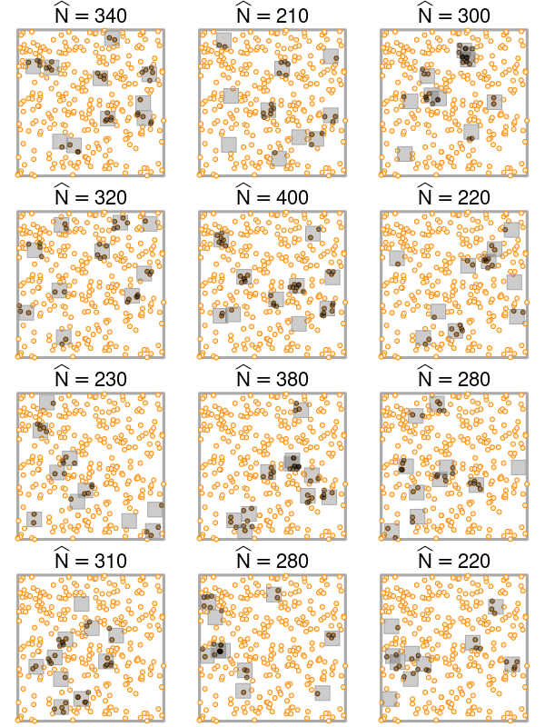
]

```{r, eval = FALSE}
x <- 1:1000
y <- sapply(x, function(y){ countSamples(Z, s = y*10)$N.hat })
```
```{r, eval = FALSE}

png("images/SimHist.png", width = 900, height = 900, res = 150)
par(tck = 0.01, mgp = c(1.5,.5,0), mar = c(3,3,2,1))
hist(y, breaks = seq(min(y-5),max(y+5),10), bor = "darkgrey",
     main = "distribution of 1000 estimates", xlab = "", ylab = "")
dev.off()

png("images/SimHist2.png", width = 900, height = 900, res = 150)
par(tck = 0.01, mgp = c(1.5,.5,0), mar = c(3,3,2,1))
hist(y, breaks = seq(min(y-5),max(y+5),10), bor = "darkgrey",
     main = "distribution of 1000 estimates", xlab = "", ylab = "")
abline(v = mean(y), lwd = 2, col = "red")
abline(v = mean(y) + c(-2,2) * sd(y), lty = 2, lwd = 1.5, col = "red")
text(mean(y), 75, pos = 4, 
     bquote(widehat(N)==.(round(mean(y), 1))), col= "darkred", cex = 2)
arrows(mean(y), 50, mean(y) + sd(y), 50, col = "darkred", lwd = 3)
arrows(mean(y), 50, mean(y) - sd(y), 50, col = "darkred", lwd = 3)
text(mean(y), 60, pos = 4, 
     bquote(s[N] ==.(round(sd(y), 1))), col= "darkred", cex = 2)

dev.off()

```


.pull-right[
Every time you do this, you get a different value for $\widehat{N}$. 

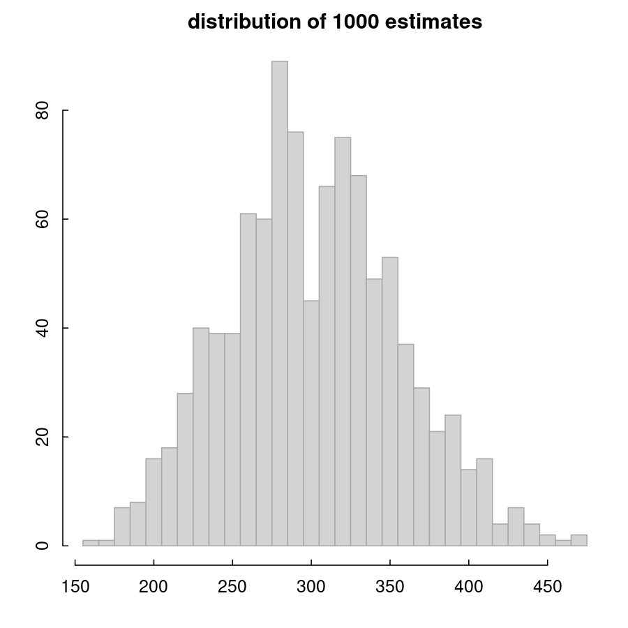

]


---

### Statistics

.pull-left[

**Mean of estimates:** 
$$\widehat{N} = 301.5$$

**S.D. of estimate:**
$$s_{\widehat{N}} = 54.6$$

.red[**important**: the *standard deviation* of an *estimate* = **standard error**, SE]


**95% Confidence Interval:**

$$\widehat{N} \pm 1.96 \times SE = \{195-408\}$$
.green[**note:** the 1.96 is the number of standard deviatinos that captures 95% of a Normal distribution.]
]


.pull-right[
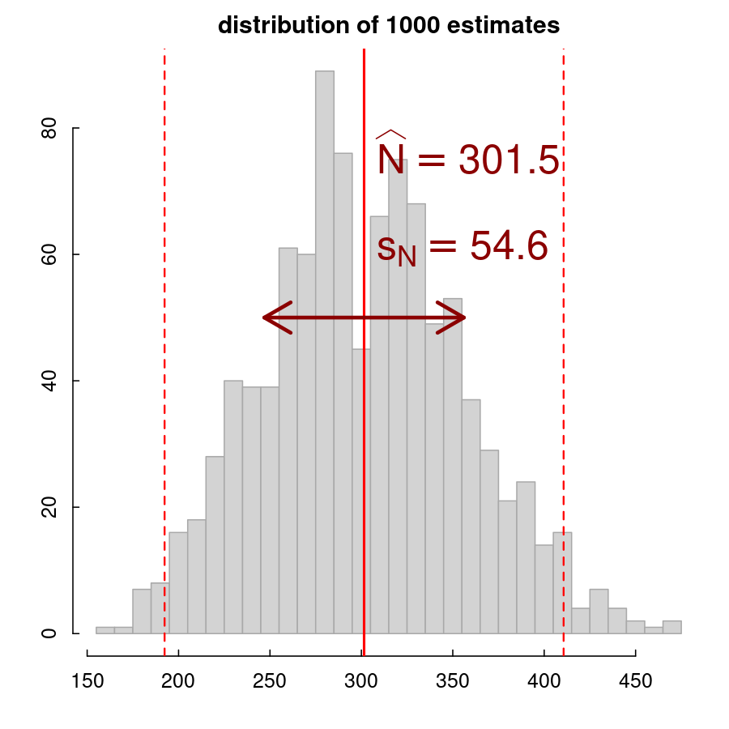
]

--


Conclusion: this estimate is **accurate** (unbiased), but not very **precise** (big confidence interval).


---
### General principle: The bigger the sample, the smaller the error. 


`1.` If $a_s \ll A$  (i.e. low sampling intensity)

$$SE(\widehat{N}) = {A \over a} \sqrt{\sum n_i}$$
**remember:** $n_s = \sum n_i$ is the total sample count

.center.red[
in our example: $SE = 100²/(10\times10²) \sqrt{30} = 54.8$
]

--


`2.` If you are NOT resampling previously sampled locations: 

$$SE(\widehat{N}) = {A \over a} \sqrt{\sum n_i (1 - a_s/A)}$$

This is the .blue[Finite Area Correction].  If $a = A$ - you sampled everything - SE goes to 0 as expected.  

.center.red[
in our example: $SE = 54.5$
... Almost no difference (because $a \ll A$).
]


---
## Some more complex formulae


 from Fryxell book Chapter 12:


These are used when **sampling areas** are unequal, and account for differences when sampling **with replacement** or **without replacement**. 


---
### Poisson process

Models *counts*.  If you have a perfectly random process with mean *density* (aka *intensity*) 1, you might have some 0 counts, you might have some higher counts.  The *average* will be 1:


---
### Poisson process

Here, the intensity is 4 ...

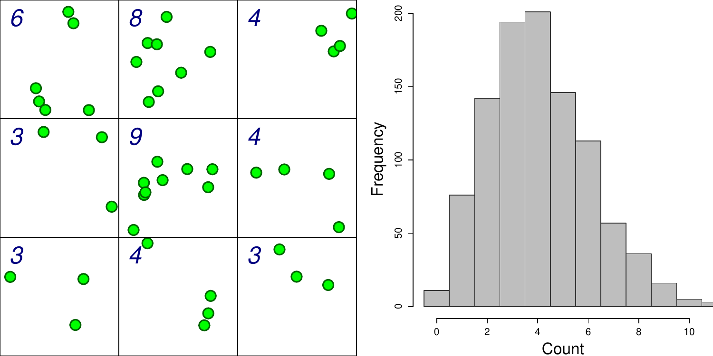


---
### Poisson process

... and 10.  Note, the bigger the intensity, the more "bell-shaped" the curve. 

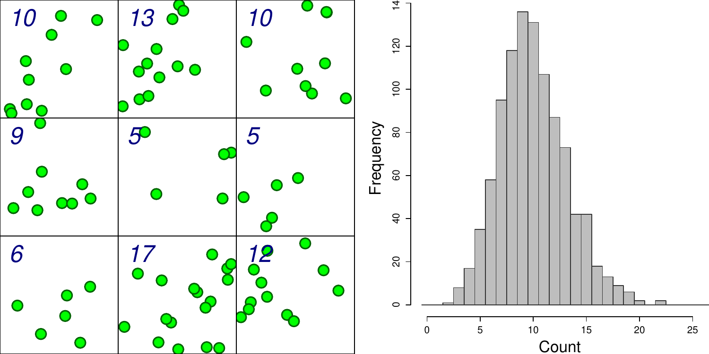

Here's the formula of the Poisson Distribution: $\!f(k; \lambda)= \Pr(X{=}k)= \frac{\lambda^k e^{-\lambda}}{k!}$


---
### Poisson distribution holds if process is truly random

... not **clustered** or **inhibited**

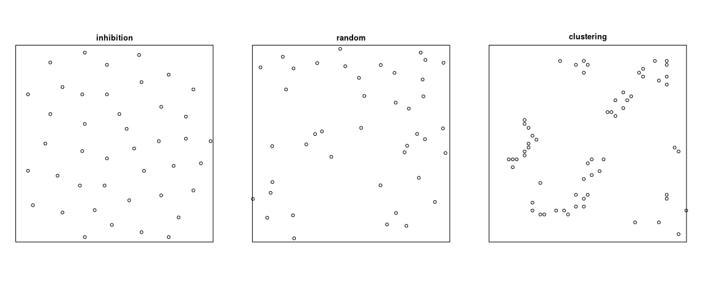
If you **sample** from these kinds of spatial distributions, your standard error might be smaller (*inhibited*) or larger (*clustering*).  This is called *dispersion*.  


---
## Also ... densities of animals can depend on habitat
.pull-left-60[
**Wolf habitat use**
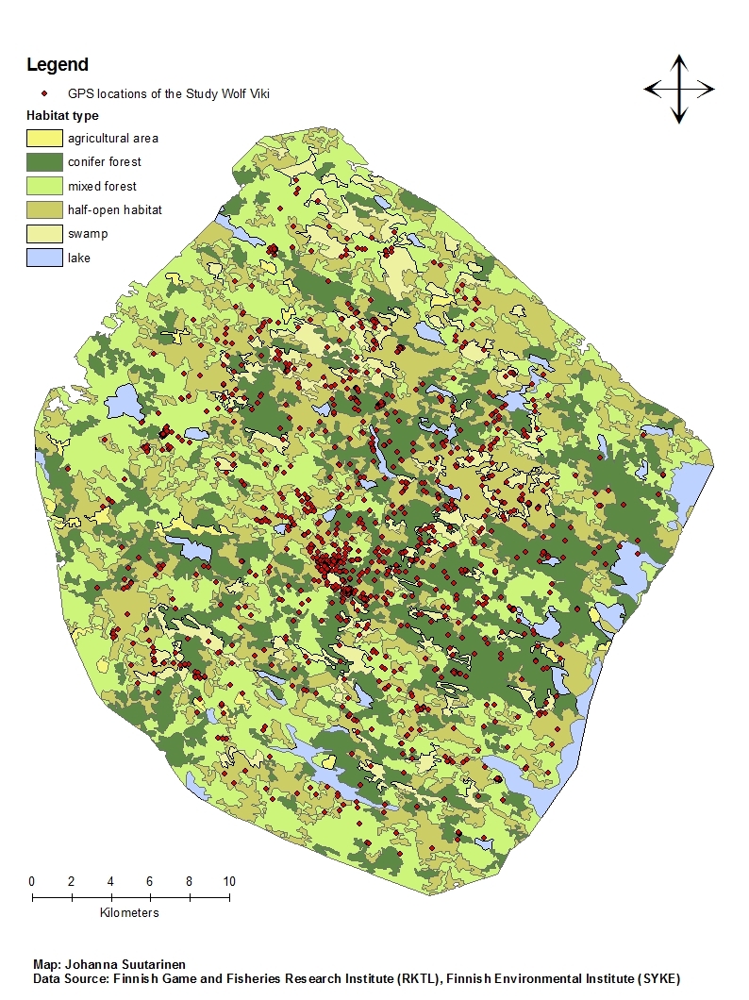

]

.pull-right-40[
If you look closely: 

- No locations in lakes
- Relatively few in bogs / cultivated areas.
- Quite a few in mixed and coniferous forest

]

---
## Imagine a section of forest ...

.pull-left-60[
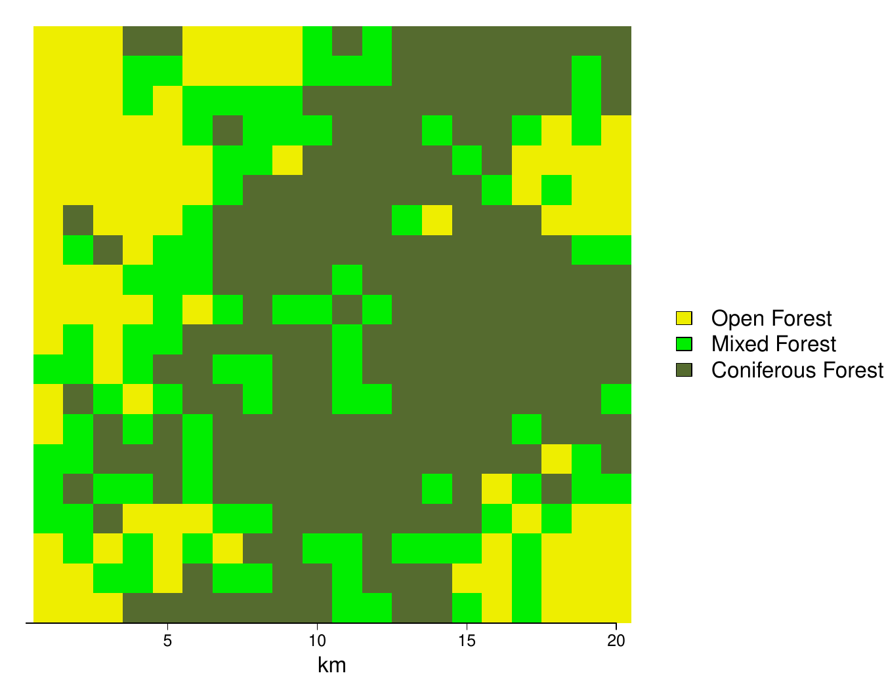]


---
## ... with observations of moose

.pull-left-60[
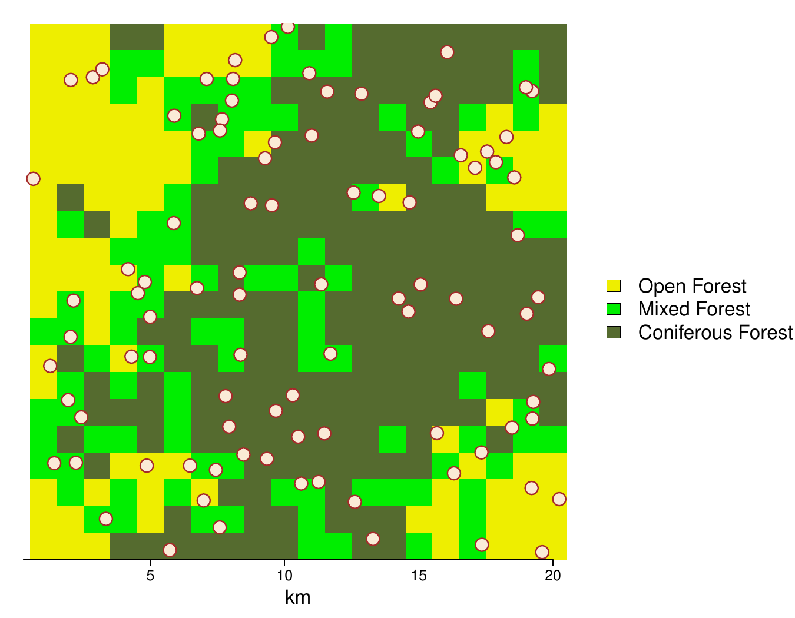]

.pull-right-40[
**How can we tell what the moose prefers?**


Habitat | Area | n | Density
---:|:---:|:---:|:---
open | 100 | 21 | 0.21
mixed | 100 | 43 | 0.43
dense | 200 | 31 | 0.17
**total** | 400 | 95 | 0.24

]

.blue[Knowing how densities differ as a function of **covariates** can be very important for generating estimates of abundances, increasing both **accuracy** and **precision**, and informing **survey design**.]


---
### Sample frames need not be **squares**

.pull-left-60[

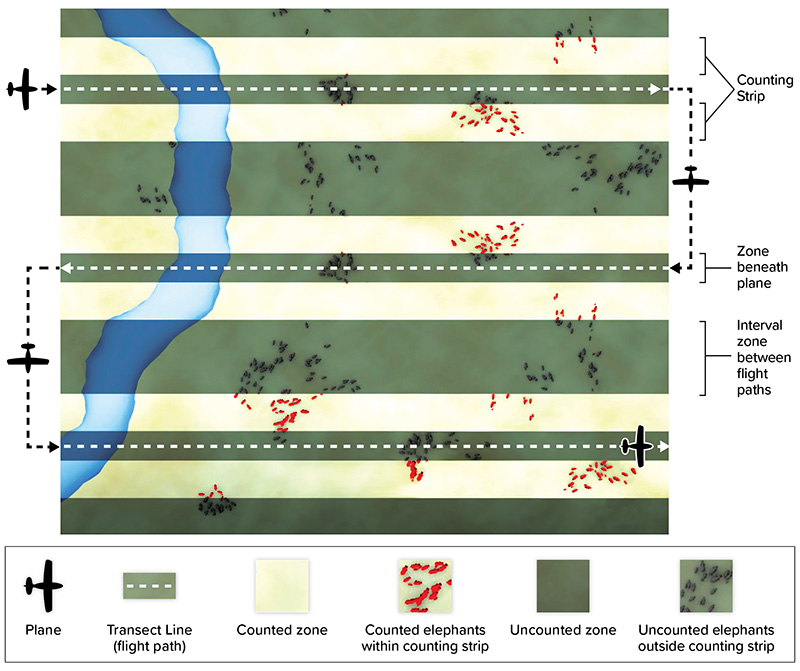

]

.pull-right-40[
## Transects


Linear strip, usually from an aerial survey. 

Efficient way to sample a lot of territory. 

If "perfect detection", referred to as a **strip transect**. 

Statistics - essentially - identical to quadrat sampling. 


]

.footnote[https://media.hhmi.org/biointeractive/click/elephants/survey/survey-aerial-surveys-methods.html]


---
### **Stratified sampling** for more efficient estimation

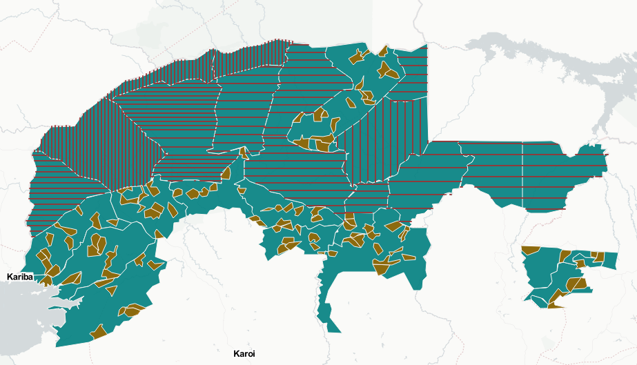

Sample more intensely in those habitats where animals are more likely to be found. 
Intensely survey .orange[**blocks**] where detection is more difficult. 

.footnote[https://media.hhmi.org/biointeractive/click/elephants/survey/survey-aerial-surveys-methods.html]


---
### **Stratified sampling** for more efficient estimation

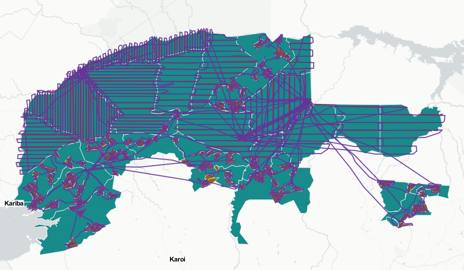

Actual elephant flight paths,

.footnote[https://media.hhmi.org/biointeractive/click/elephants/survey/survey-aerial-surveys-methods.html]


---
### **Stratified sampling** 

.pull-left[]
.pull-right[]

**Stratification** is used to optimize **effort** and **precision**.  Aircraft cost thousands of dollars per hour!

(In all of these comprehensize surveys - *design* takes care of **accuracy**). 


---
### Sampling strategies

.pull-left[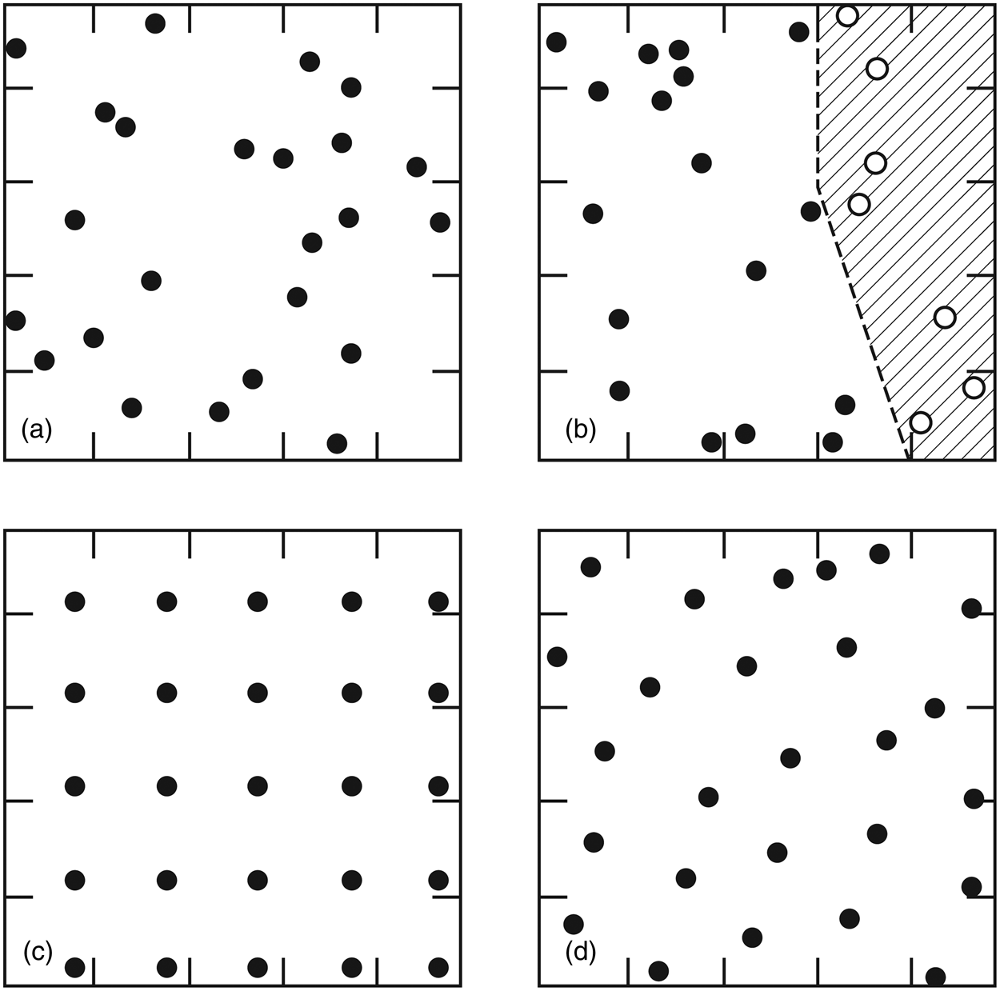]

.pull-right[
(a) simple random, 

(b) stratified random, 

(c) systematic, 

(d) pseudo-random (systematic unaligned).

Each has advantages and disadvantages.

See also: *Adaptive Sampling*
]

---
### Detections usually get *worse* with distance!

.pull-left-30[

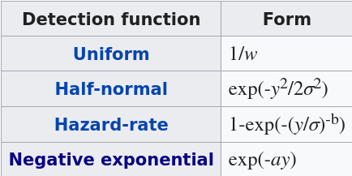

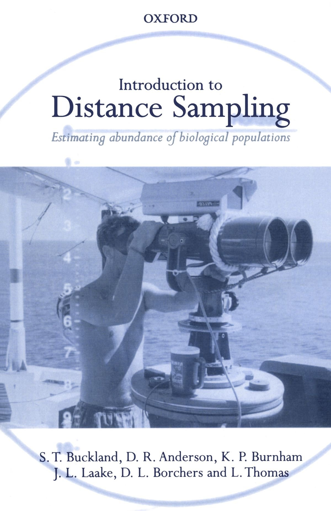
]

.pull-right-70[

## Distance Sampling

The statistics of accounting for visibility decreasing with distance

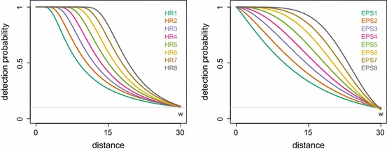

]


---
## Example reindeer in Svalbard


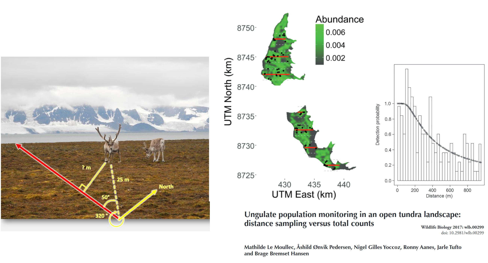


.large[ **Estimated detection distance**, compared to **total count**, incorporated **vegetation modeling**, computed **standard errors**, concluded that you can get a 15% C.V. for 1/2 the cost.]

---
## Example Ice-Seals

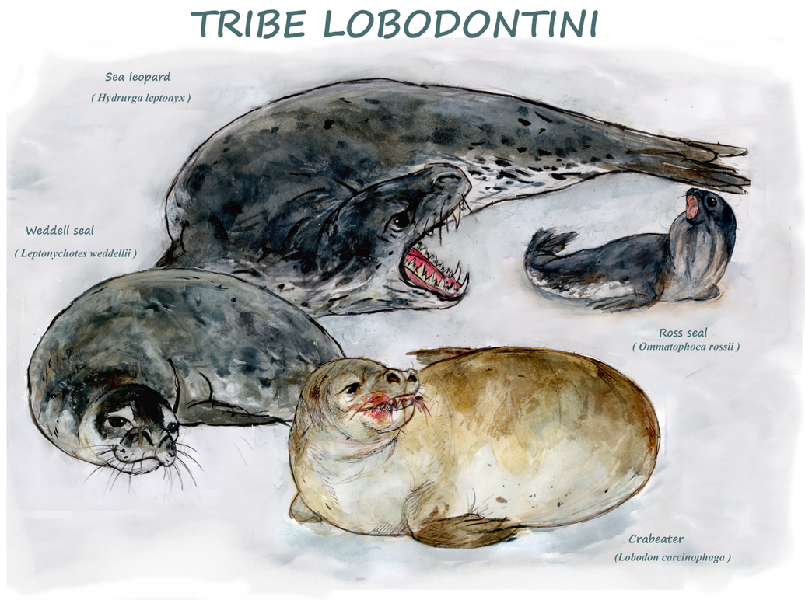

---
## Example: Flag Counting at Baker


---

## Nice video on counting caribou

https://vimeo.com/471257951

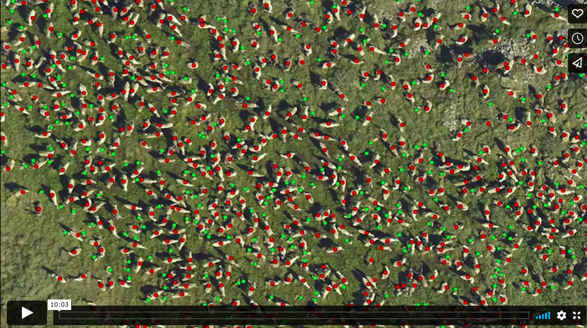
