```{r xaringan-scribble, echo=FALSE}
xaringanExtra::use_scribble()
```

```{r xaringan-tile-view, echo=FALSE}
xaringanExtra::use_tile_view()
```


<!-- https://bookdown.org/yihui/rmarkdown/xaringan-format.html -->
```{r, echo = FALSE, eval = FALSE}
#renderthis::to_pdf("Lecture_PopulationEcology_PartII.Rmd")
# ratio: '16:9'
```

```{r setup, include=FALSE}
knitr::opts_chunk$set(echo = FALSE, message = FALSE, 
                      warning = FALSE, las = 1, dpi = 200)
#output: html_document
```


```{r colsFunction, eval = FALSE}
system("cp ../mycss.css ./")
xaringan::inf_mr()
```

```{r cache = FALSE}
require(elieslides)
require(kableExtra)
```


.pull-left[


### Thursday Nov. 14


Prof. Joshua Millspaugh (SUNY-ESF)

*The North American Model of Wildlife Conservation*

Listen to: [Future Ecologies, Fair Game, Part 1](https://www.futureecologies.net/listen/fe-4-4-model-citizens-pt1)

Read pp 1-30 of [**this overview**](https://wildlife.org/wp-content/uploads/2014/05/North-American-model-of-Wildlife-Conservation.pdf)
.pull-right-70[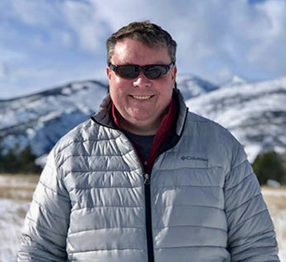]
]

.pull-right[

### Some other day ....

*Critiques of the North American Mdel*

Listen to: [Future Ecologies, Bearly Legal, Part 2](https://www.futureecologies.net/listen/fe-4-5-model-citizens-pt2)

Read [this](https://www.tandfonline.com/doi/full/10.1080/21550085.2021.2002624), [this](https://wolfwatcher.org/wp-content/uploads/2020/05/Hunting-for-Justice-Eichler-and-Baumeister-2018.pdf) and

**Is science used?**
- [Artelle: *Hallmarks of Science missing from NAM*](https://www.science.org/doi/10.1126/sciadv.aao0167)
- [Response to Artelle](https://www.science.org/doi/full/10.1126/sciadv.aat8281)
- [Response (by Artelle) to response](https://www.science.org/doi/full/10.1126/sciadv.aav2571)


]

---

## Shane Mahoney makes his pitch:
.center[
<iframe src="https://www.youtube.com/embed/eGZZ8C4Os2U?controls=0"  width="70%" height="400" frameborder="0" allowfullscreen>
</iframe>
]

---


.pull-left[
## Historical background

Pre-1492, human population in Americas highly uncertain, but likely highly populated (10-200 million people)

Land managed for game and agriculture - plantings / fires / clearings / terracing.

> .red[*pristine wilderness is a persistent myth*]

You could drive a wagon through the forests of New York & Ohio. 

Small founder population ( $N_{eff} < 80$?), susceptibility to disease + genocide left a highly depopulated "pristine" wilderness *Romanticized* in 19th century.  

]

.pull-right-40[
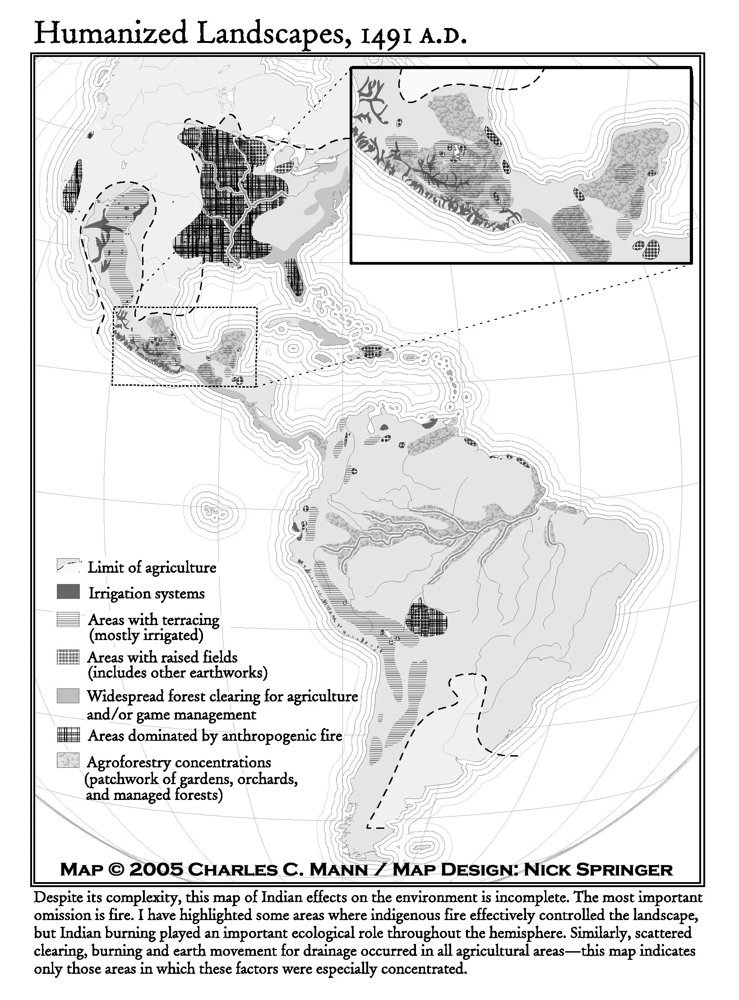
]


.footnotesize[*Denevan 1992*]


---


.pull-left-60[
## Meanwhile: in (feudal) Europe 

Wild-lands were rapidly cultivated and developed.

Feudal system preserved remaining wilderness as strictly **property of the king**, with especial claim on "higher game", esp. **deer**, **boar**. 
  
**Poaching** strongly deterred  (hanging / blinding / maiming / etc.)

This conflicted with common-use of land, though small game (rabbit snaring, bird netting) remained legal. 

**Game Laws of England** (~1400) made wealth was a **legal prerequisite** to hunt.

Motivated several peasant rebellions.
]


.pull-right-40[
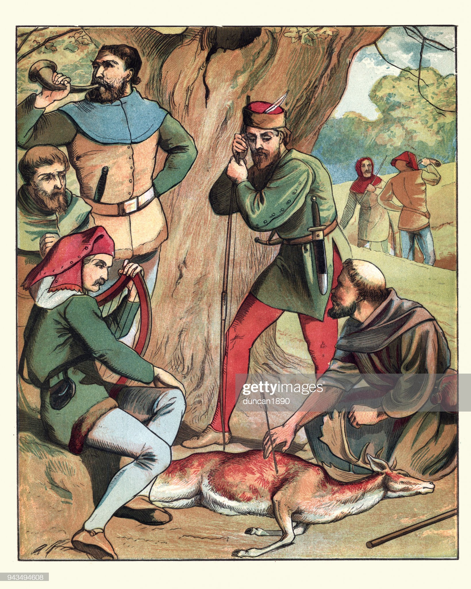
.green.large[**Robin Hood**]
]

---


.pull-left-50[
### In modern Europe (well ... Scotland)

- Most land private
- Wildlife belongs to landowner
- **Ghillies** (fish) | **Stalkers** (fown) | **Keepers** (game)
- Hunting, largely, sport of elite
- No predators!  No forests!


However:
- Landowners may lease land for hunters to take **meat to market**
- All land is accessible(!!!)  *Right to Roam*

.pull-right-70[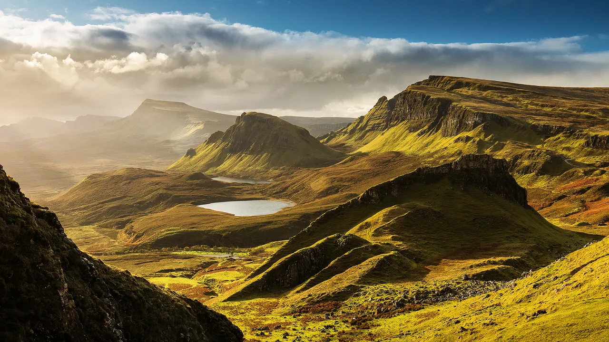]
]


.pull-right-40[
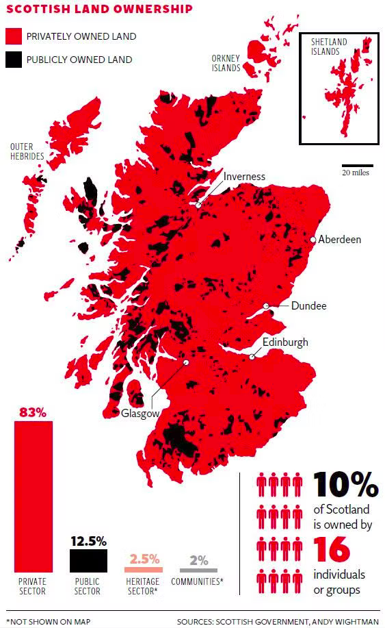

]


---
.pull-left-70[
### Pheasant (*Phasianus colchicus*) hunt
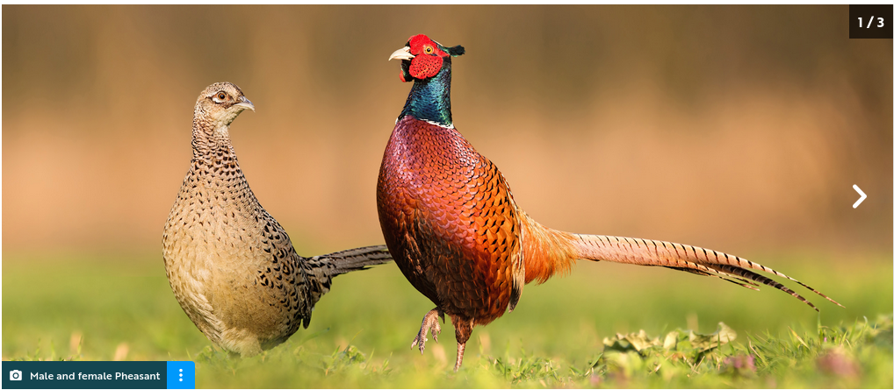
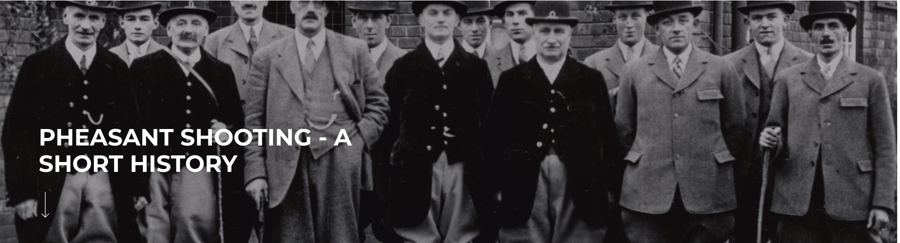

Historically and to date - an elite sport
(see [here](https://fieldsports-journal.com/fieldsports/shoot/pheasant-shooting-a-short-history))
]

.pull-right-30[
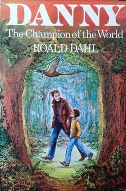
]

---

.pull-left-40[
## Pheasant biomass
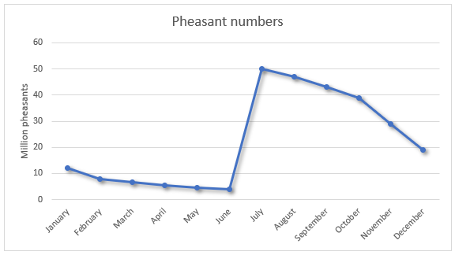
]

.pull-right-40[ 
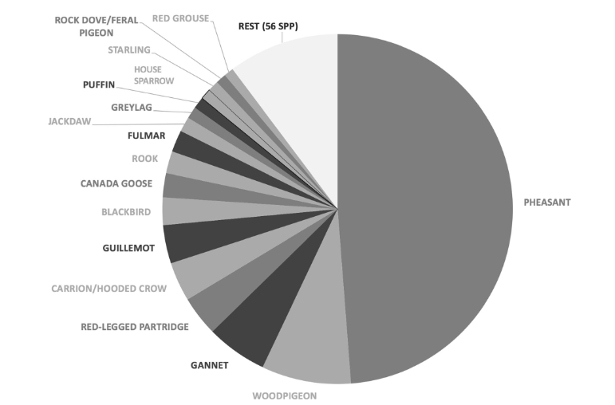
#### Up to 50% of all wild bird biomass in UK!
]
--

### Quick quiz, What's the native range of pheasant? 
--
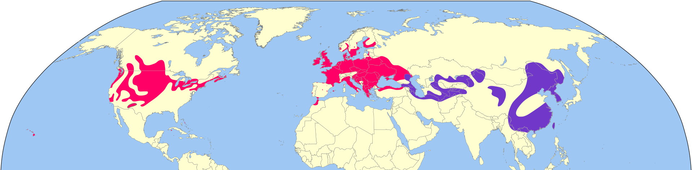


---

### Shane Mahoney explains Public Trust

.center[
<iframe src="https://www.youtube.com/embed/eGZZ8C4Os2U?start=192" width="70%" height="400" frameborder="0" allowfullscreen>
</iframe>
]

---
background-image: url("images/bisonpile.webp")
background-size: cover

### **Age of over-exploitation** (1850-1899)


---
background-image: url("images/bisonpile.webp")
background-size: cover


### **Age of over-exploitation** (1850-1899)

.pull-right-40[

.content-box-gray[**N.A. extinctions**

- Great Auk (1852)
- Sea mink (1852)
- Eastern elk (1867)
- Passenger Pigeon (1914)
- Carolina Parakeet (1917)
]
]


---


.pull-left-60[
## Resource exploitation

Fueled the expansion of people across the continent. 

**Industrial Revolution** changed society 
  - 1820, 5% urban (much subsistence)
  - 1860 - 20%; 1900 - 40%
  
leads to **markets for wildlife** to feed urban masses and *festoon* wealthy elites. 

**Market hunters**  first along coastal waters and interior forests. 
Railway & refrigeration brings bison (*Bison bison*), wapiti (*Cervus elaphus*), and other from West to cities in East.  

The market hunter left many once-abundant species on the brink of extinction. 
]

.pull-right-30[
### *Delmonico's, New York City*

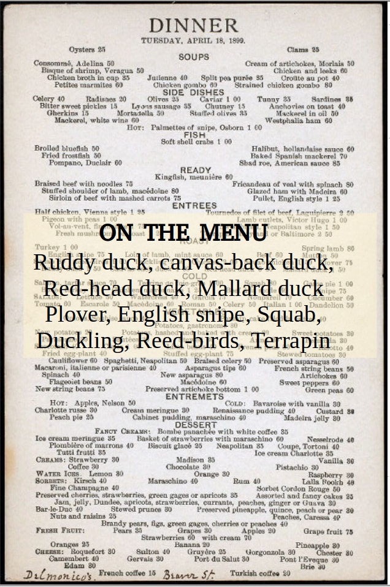]

---
## Hunting as genteel sport

.pull-left.large[

**Urban population** has leisure time. 

**Hunting** pursued  for "rigors" and "challenges" of the chase under
conditions of "fair play" (influenced by Europe). 

Conflicts between **market hunters** who profited and new breed of (elite) hunters who placed value on live wildlife and their sporting
pursuit of it. 

These sport hunters organized and developed **influential clubs** and **wildlife refuges**. 
]

.pull-right.large[
> *True sportsmen were those who hunted for pleasure (never for profit), who in the field allowed game a sporting chance, and who possessed an aesthetic appreciation of the whole context of sport that included a commitment to its perpetuation.*  

> (paraphrase of Grinnell)

]


---

.pull-left-70[
## Era Of Protection (1850-1899) 

.pull-left-40[
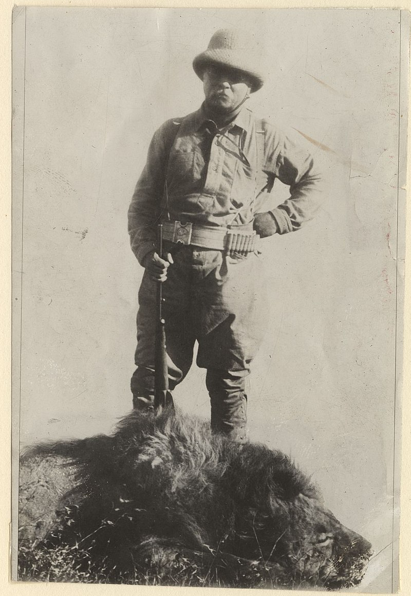
Theodore Roosevelt (1958-1919)

*Big hunter. 
President of U.S. - 1901-1909*
]
.pull-right-60[
Fancy New Yorkers Grinell and Roosevelt compare notes about good times out west ... realize lots of stories don't match because so much game was lost in the meantime. 

Founded **Boone and Crockett Club** in 1893 advocating for a network of public protected game reserves. 

Habitat protection became (remains) synonymous with wildlife stewardship ...  **BUT** ... the main goal was producing more **game** species for **sportsman-like** hunt. 

]
]
.pull-right-30[

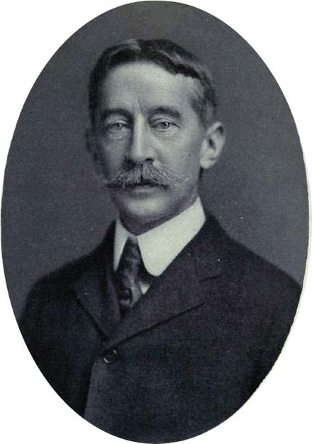
George Bird Grinnell (1849-1938)

*.small[Lots of strongly worded editorials in Field and Stream]*
]


---
## Era Of Protection (1850-1899): Old Boy's Club
.center[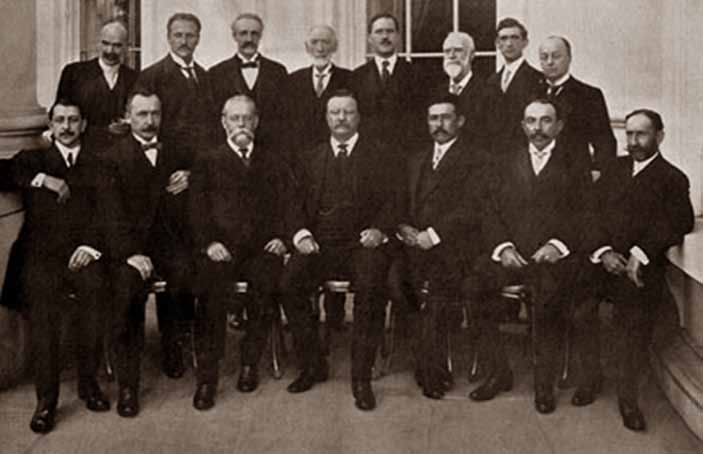

Early conservationists]

---

## Early Conservation Laws

.pull-left[
#### Lacey Act of 1900

Iowa congressman **John Lacey**  (Boone & Crockett club member), signed into law in May 1900 by President William McKinley.  

1. Illegal to traffic in fish, wildlife, or plants that are illegally taken, possessed, transported, or sold, e.g. *across state lines*. 

2. Amended in 2008 to expand ranges and species that are illegally taken outside the US

3. Requires importers to file declarations identifying the scientific name, value, quantity, and country of harvest for most plant and wildlife products.

]

.pull-right[

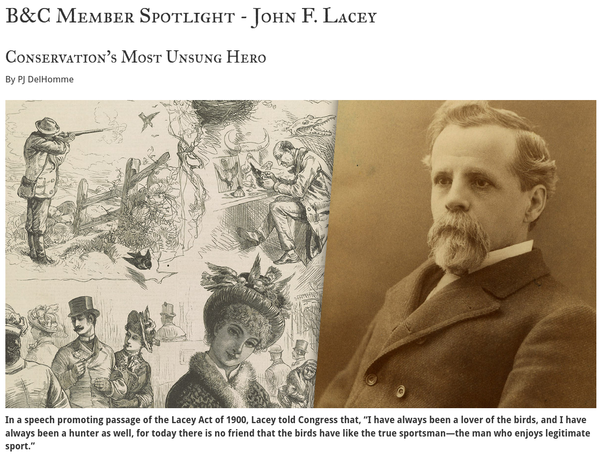

]

---
.pull-left-40[
# Lacey Act
## Amended many times

### Now includes all kinds of taxa. 


]

.pull-right-60[
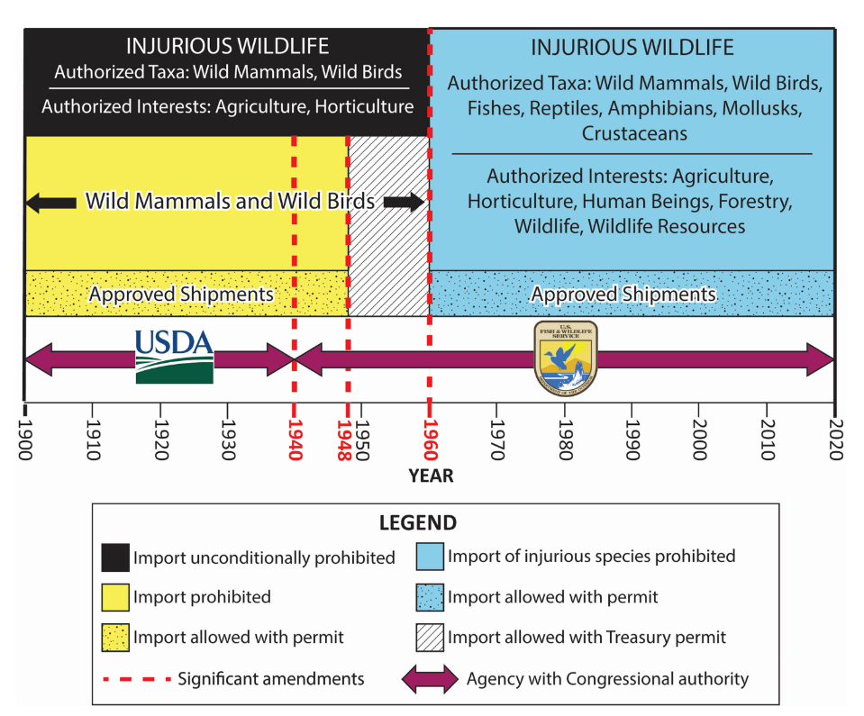

.center[[Jewel 2020](https://www.reabic.net/journals/mbi/2020/3/MBI_2020_Jewell.pdf)]

]


---

## Early Conservation Laws

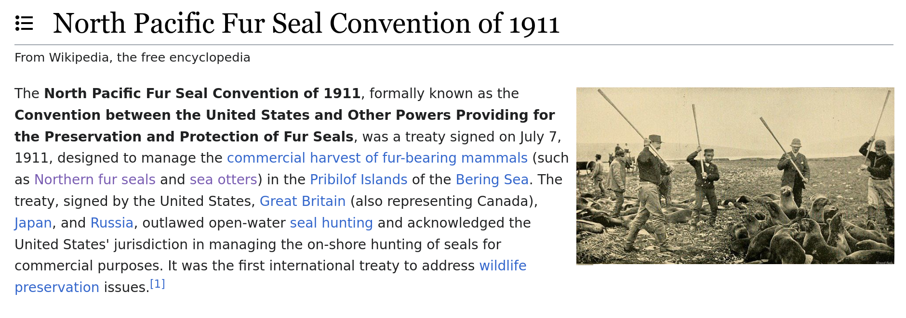


### Precursor of  Marine Mammal Protection Act (1972) - extending protection to cetaceans and others

---

.pull-left-70[


## Early Conservation Laws

### Migratory Bird Treaty Act of 1918 (MBTA)

Illegal to pursue, hunt, take, capture, kill, or sell nearly 1,100 species of birds listed therein as **migratory birds**. Full protection of bird parts including feathers, eggs, and nests. 

Pushed by **Frank Chapman** (Boone & Crockett club member, friend of Roosevelt, curator of Birds at the AMNH, founder of the Christmas bird count). 

Treaty signed with the UK (via Canada, which was a colony at the time).

1920 [**Louis Marshall**](https://en.wikipedia.org/wiki/Louis_Marshall) argued to Supreme Court that this treaty did not violate state’s rights (big deal).

Established the **[Migratory Bird Conservation Commission](https://www.fws.gov/program/land-acquisition-and-realty/migratory-bird-conservation-commission)** to review and approve land acquisitions for waterfowl refuges. 

1934 **Migratory Bird Hunting Stamp Act** created the federal **duck stamp** program, which has generated nearly $1 billion for wetlands conservation.
]


.pull-right-30[

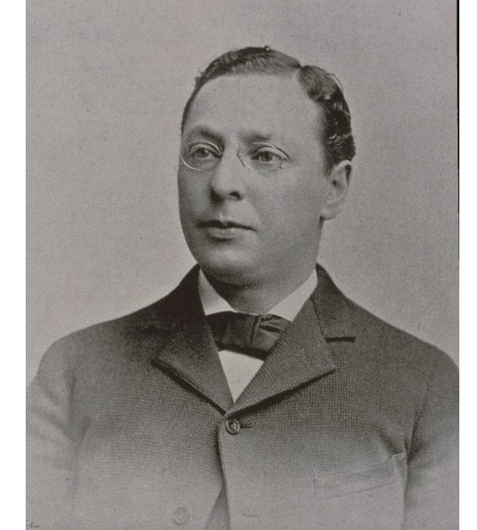 .footnotesize[*L. Marshall: Syracuse-born founder of ESF(!), Catskill and Adirondack Parks(!)*]


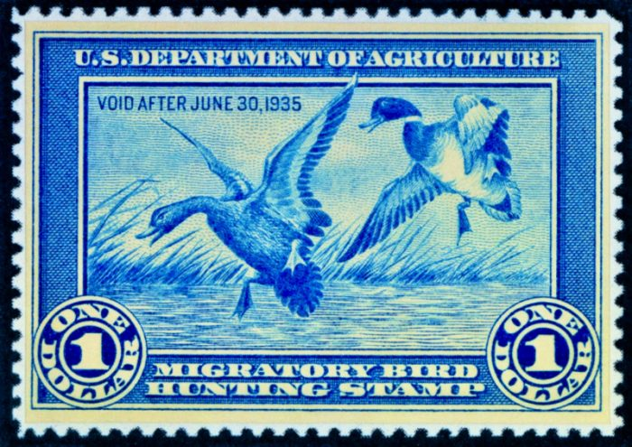

.footnotesize[*Duck stamp*]
]


---


.pull-left-60[

## Era of Game Mangement  **Aldo Leopold**

By the early 20th century, considerable wildlife conservation infrastructure was in place.

In 1920s but emphasis on **restrictive game laws** was insufficient in itself to stem wildlife’s decline. 

**Aldo Leopold** proposed a program of restoration to augment conservation’s legal framework. 

They called for a  **wildlife management profession** with trained biologists, stable, equitable funding to enable their work and university programs to train them.

### Within 10 years:
]

.pull-right-30[
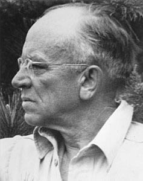

.small[**Aldo Leopold** (1887-48)]
]
.small[

- **Game management curricula** established, including **Cooperative Wildlife Research Units**, 
- Formation of **The Wildlife Society**, 
- **Pittman-Robertson Wildlife Restoration Act** (1937) - excise on guns and ammunition  to fund state wildlife agencies.
- **Duck Stamp Acts** - to fund MBPA
]

???
In the 1930s he saw that wildlife was disappearing. He began asking questions about how to manage animals. Wrote Game Management which became the first step toward wildlife management. In the 1930s he saw that wildlife was disappearing. He began asking questions about how to manage animals. Wrote Game Management which became the first step toward wildlife management.

---

## Aldo Leopold: evolving **Land Ethic**

> The **land ethic** ...  enlarges the boundaries of the community to include **soils**, **waters**, **plants**, and **animals**, or collectively: **the land**. 

--

> This sounds simple: do we not already sing our love for and obligation to the land of the free and the home of the brave? Yes, but just what and whom do we love? 

--

> Certainly not the soil, which we are sending helter-skelter down river. Certainly not the waters, which we assume have no function except to turn turbines, float barges, and carry off sewage. Certainly not the plants, of which we exterminate whole communities without batting an eye. Certainly not the animals, of which we have already extirpated many of the largest and most beautiful species. 

--

> A land ethic of course cannot prevent the alteration, management, and use of these 'resources,' but it does affirm their right to continued existence, and, at least in spots, their continued existence in a natural state. 

--

> In short, a land ethic changes the role of *Homo sapiens* from conqueror of the land-community to plain member and citizen of it. It implies respect for his fellow-members, and also respect for the community as such.
>

.center[*Sand County Almanac* - 1949]


---

## Era of Environmentalism

.pull-left-70[

> A general move to federalize environmental law because of a "race to the bottom" by states

### Legislation 


- Clean Air Act - 1970
- Clean Water Act - 1972, 1977, 1987
- National Environmental Policy Act - 1970
- Marine Mammal Protection Act - 1972 
- Endangered Species Act - 1973
- Environmental Protection Agency  - created in 1970's to make sense of all of the above. 

]

.pull-right-30[
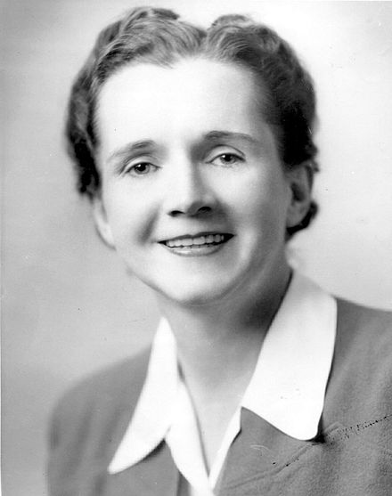

Rachel Carson (1907-1964)

*Silent Spring* (1962)

]

---

## The Seven Tenets of the North American Model of Conservation
>.large[
1. Wildlife is a public resource
2. Markets for game are eliminated
3. Allocation of wildlife by law
4. Wildlife can only be killed for a legitimate
purpose.
5. Wildlife species are considered an
international resource.
6. Science is the proper tool for discharge of
wildlife policy. 
7. The democracy of hunting
]


**Important Note:** the NAM is **not** a set of rules, or laws, or in any way "codified".  They are a *descriptive model* of the set of principles that *generally* characterize central *aspects* of Wildlife Management - mainly in the U.S. and Canada. 

---

## 1. Wildlife resources are a public trust. 


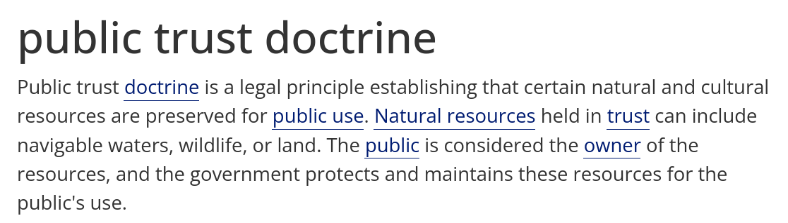


---

## 1. Wildlife resources are a public trust. 

.pull-left-50[
> “By the law of nature these things are common to all mankind - the air, running water, the sea, and consequently the shore of the sea. No one, therefore, is forbidden to approach the seashore, provided that he respects habitations, monuments, and the buildings, which are not, like the sea, subject only to the law of nations.” 

> **Justinian's Code - 537 AD**
]

.pull-right[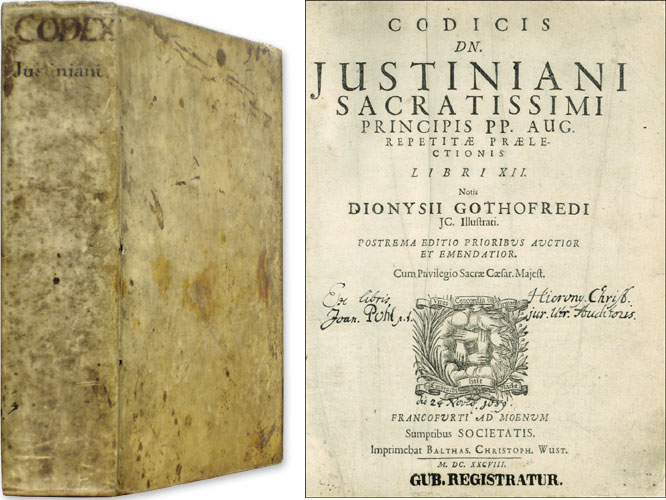]

--
.pull-left-80[
 ### **Question:** How does that fit with private property rights in the U.S.? 
]
---

.pull-left[

## 2. Markets for Game are eliminated


It been held a **principle** that markets for game and non-game wildlife are unacceptable because they privatize a common resource and lead to declines. 

Exceptions made for:  

- fur-bearers
- some meat 
- many fish
]

.pull-right[
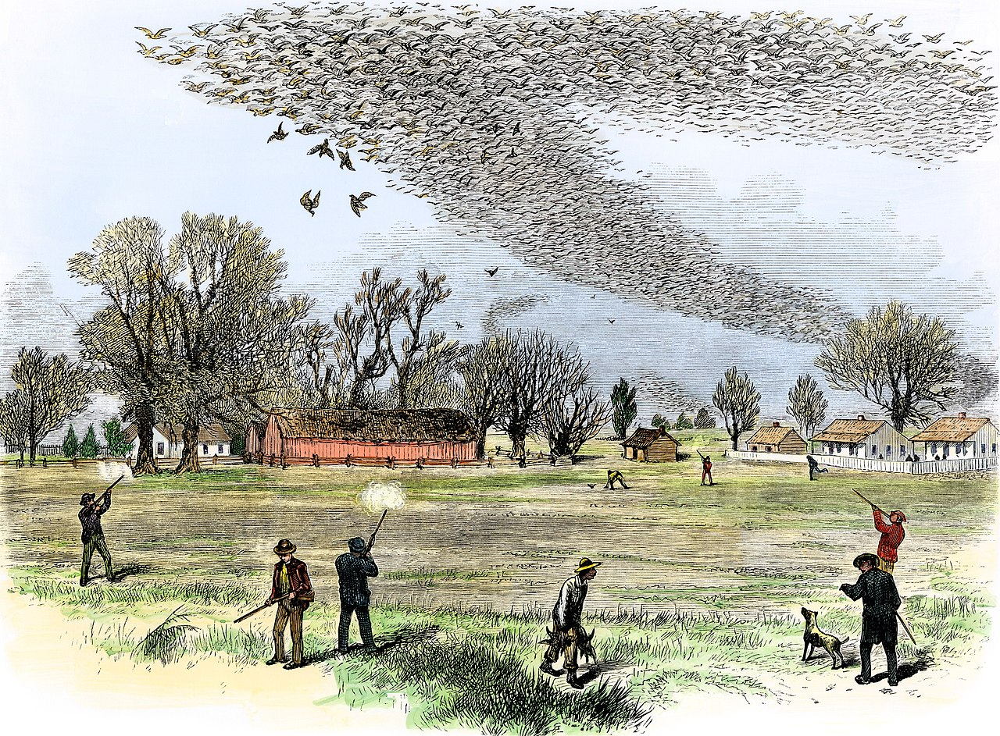

Passenger Pigeon shoot ... from black skies to extinction
]

--

### **Question:** Why can I buy kangaroo meat in the supermarket in Australia, but no venison in supermarkets in USA?  

---


.pull-left[
## 3. Allocation of Wildlife is by Law


*“Surplus wildlife is allocated to the public for consumption by law, not by the market, land ownership or special privileges... This process fosters opportunity for all citizens to become involved in the management of wildlife”*

Democratic processes and public input into law-making help ensure access is equitable.

<!--Game laws, game agencies, and game commissions established by states in the late-19th and early 20th centuries focused primarily on eliminating commercial uses of wildlife (e.g., birds and the millinery trade) and on regulating numbers of game legally killed by sportsmen. -->


]

.pull-right[

> .footnotesize[In 1897, the New York State Assembly passed the Adirondack Deer Law (sponsored by assemblymen who were **Boone and Crockett Club members**) that outlawed jacklighting deer at night and shooting deer after using hounds to drive them into deep water. Most notable about this law was that shooting deer in water was outlawed because of potential deleterious effects on the deer population, and jacklighting (e.g., spotlighting) was banned because it was **unsportsmanlike** (these laws remain intact today).]

]

---

## 4. Wildlife Can Be Killed Only for a Legitimate Purpose

.center.red[[What is this!?]]

--

.pull-left.small[

**Generally this means:**

- does so primarily for the pursuit or chase;

- affords game a “sporting” chance (fair chase);

- seeks knowledge of nature and the habits of animals;

- derives no financial profit from game killed;

- will inflict no unnecessary pain or suffering on game; and

- will not waste any game that is killed.

> How does or doesn't this overlap with **traditional** or **subsistence** use?

]

--

.pull-right[
### Some questions:

- How do longstanding predator removal or control programs fit within this context?

- How precisely evaluated are the concerns over property protection, and how well justified should such interventions be? 

- Are hunters who secure only the skin, head, antlers, or horns and discard the meat consistent with our understanding of the NAM’s history and intent?
]


---

## 5. Wildlife Is An International Resource


.large[
- Marine Mammal Protection Act

- Migratory Bird Treaty

- Convention on International Trade in Endangered Species of Wild Fauna and Flora (CITES)
]

Must be international.  Hard to argue with.  

---


.pull-left-40[
## 6. Science Is the Proper Tool to Discharge Wildlife Policy

The scientific mandate has been reinforced by the writings of Aldo Leopold and embedded within **The Wildlife Society’s** code of ethics:

TWS members:  “*recognize research and scientific management of wildlife and its environments as primary goals …*”
]

.pull-right-50[

### Juicy debate!

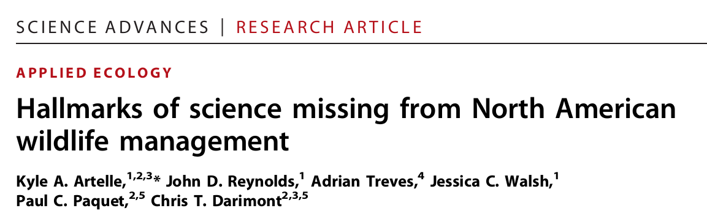
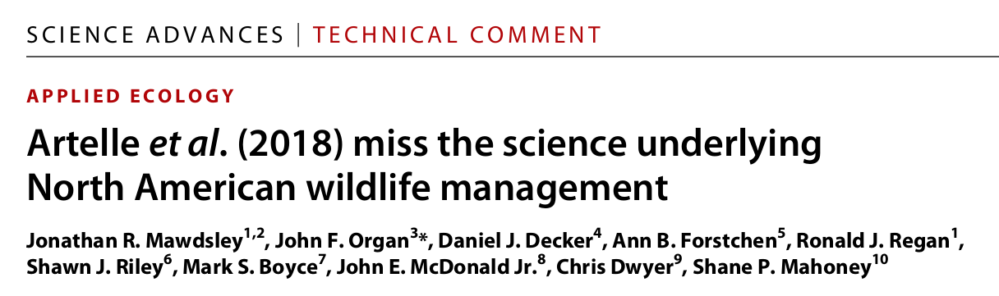
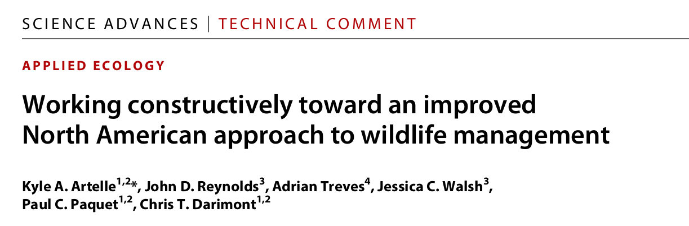
]

---


.pull-left[


.small[

## "Natural" science
> .darkred[
“One of the anomalies of modern ecology is the creation of **two groups**, each of which seems barely aware of the existence of the other. The one studies the **human community**, almost as if it were a separate entity, and calls its findings **sociology**, **economics** and **history**. The other studies **the plant and animal community** and comfortably relegates the hodge-podge of politics to the liberal arts. The inevitable fusion of these two lines of thought will, perhaps, constitute the outstanding advance of this century.”
<br><br> .center[*Aldo Leopold*]
]
]
]


.pull-right[

## Traditional Ecological Knowledge

> .darkred[***Indigenous Knowledge*** *is a body of observations, oral and written knowledge, innovations, practices, and beliefs developed by Tribes and Indigenous Peoples through interaction and experience with the environment.*

*It is applied to phenomena across biological, physical, social, cultural, and spiritual systems. Indigenous Knowledge can be developed over millennia, continues to develop, and includes understanding based on evidence acquired through direct contact with the environment and long-term experiences, as well as extensive observations, lessons, and skills passed from generation to generation.*

.small[[***Guidance for (United States) Federal Departments and Agencies on Indigenous Knowledge***](https://www.nps.gov/subjects/tek/description.htm)
]]
]


---

## 7. Democracy of Hunting Is Standard

- Accessible to all ... **But is it?**

- In practice, the best hunting is often on private lands, but property laws are **very strong**.

- Other barriers to participating in hunting. 

.pull-left-40[
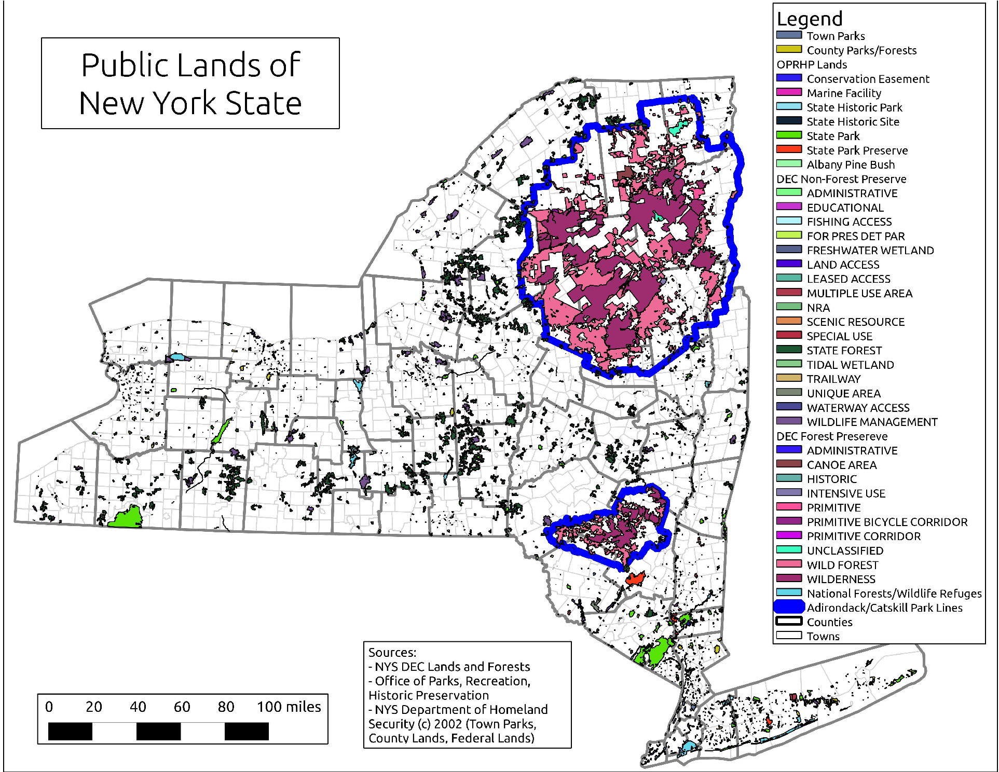
]
 .pull-right[
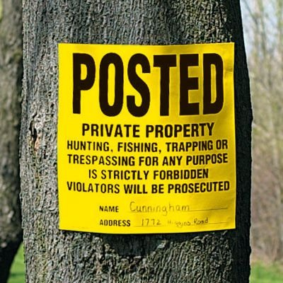
]


---

### How is Wildlife Science funded? 


## The Pittman-Robertson Wildlife Restoration Act

.pull-left-60[
> .darkred[*The Pittman-Robertson Wildlife Restoration Act (Pittman-
Robertson; 16 U.S.C. §§669 et seq.), initially enacted in
1937 as the **Federal Aid in Wildlife Restoration Act** (50
Stat. 917), provides funding for states and territories to
support wildlife restoration, conservation, and hunter
education and safety programs.*

*Funding for Pittman-Robertson programs comes from federal excise taxes on firearms, ammunition, and archery equipment. All 50 states and the five major, permanently inhabited U.S. territories receive Pittman-Robertson funds. In general, neither tribes nor the District of Columbia receives funding through Pittman-Robertson programs.*

https://crsreports.congress.gov/product/pdf/IF/IF12229
]
]

--

.pull-right-40[

- 90% of Pittman-Robertson Act revenues is generated from taxes on guns and ammunition

- of those items, 78% are not purchased by hunters.

.darkred[
 ### Depressing Fact: 
A very large proportion (**MOST?**) of state-level funding for Wildlife Monitoring and Management in the USA comes from ***Handgun sales!***
]

]

---


.pull-left-60[
## Economic realities. 
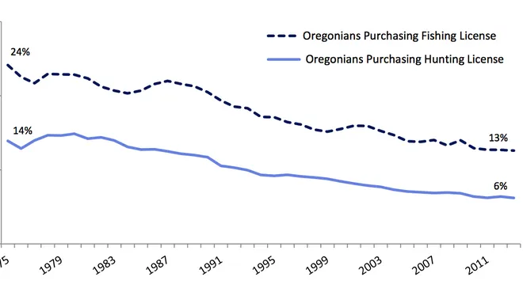

Currently, most public **recreation funding** entirely reliant on appropriations, such as the *Land and Water Conservation Fund* - $900 million of permanent funding (mainly taxes on oil and gas). 

*Should they contribute to public conservation & management funds?*
]


.pull-right-30[
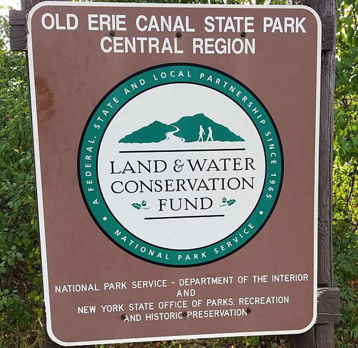

Non-extractive **outdoor recreational activities** are increasing.  About $374 billion, of which only $15 billion are hunting / fishing / trapping (& $30 billion is R.V.'s!)  See [this link](https://www.bea.gov/news/2021/outdoor-recreation-satellite-account-us-and-states-2020).

]


---

## What's happening next ... 

when | what | who
--|:--:|:--:
Tues, Nov 12 | North American Model - origins | me
Thurs, Nov 14 | NAMWC | Dr.  Josh Millspaugh
Tues, Nov 19 | Furbearer Management | Dr. Stacy McNulty
Thurs, Nov 16 | Waterfowl management | Dr. Mike Schummer
| **THANKSGIVING BREAK**| 
Tues, Dec 3 | Physiology in Wildlife Science | Dr. Cynthia Downs
Thurs, Dec 5 | Final Comments & Exam Review | me
Tues, Dec 10 | Exam #2 |
Tues, Dec 17 | **Final Presentations**


