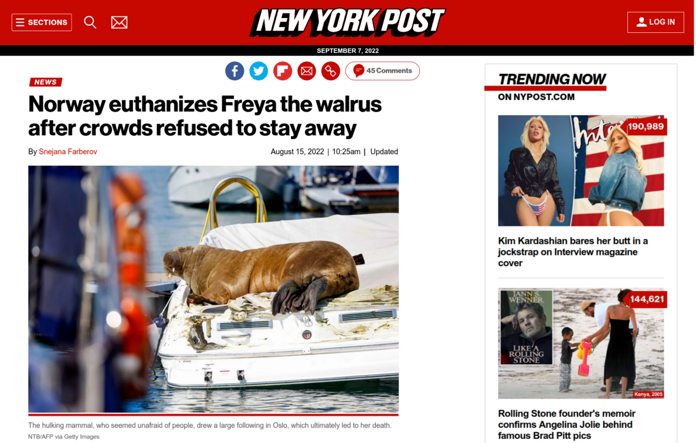
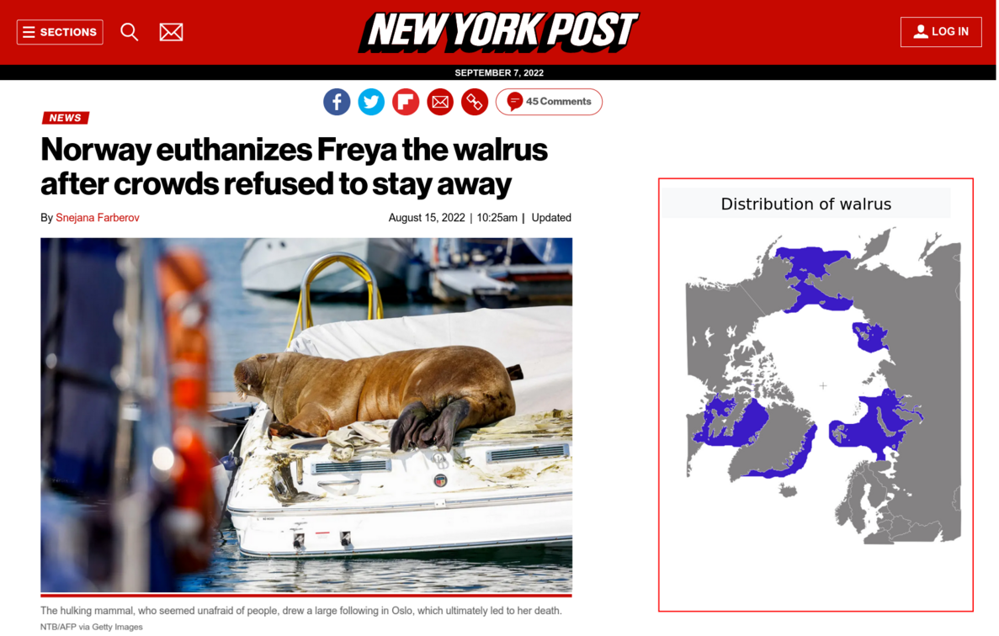
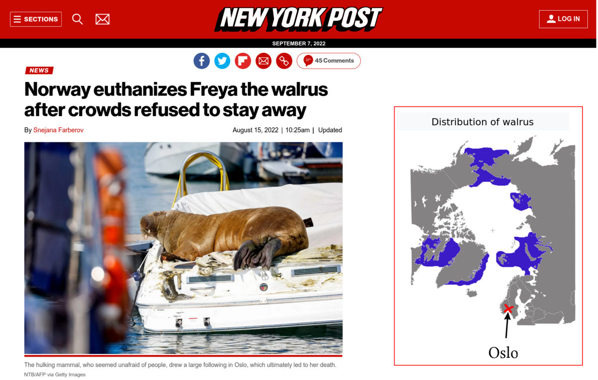

```{r setup, include=FALSE}
knitr::opts_chunk$set(echo = FALSE, fig.align = "center", message = FALSE, warning = FALSE)
```

```{r}
f <- list.files()
require(knitr)
```


```{r colsFunction, eval = FALSE, echo = FALSE}
#system("cp ../mycss.css ./")
#system("cp images/huntingwithcheetahs.jpg ./bg.jpg")
xaringan::inf_mr()
```


background-image: url("Assgn1_spp.png")
background-size: 70%
class: center


### What species were involved? 


---
class: center
### What people were involved? 

```{r, align = "center", out.height = "90%"}
include_graphics(f[2])
```


---

background-image: url("Assgn1_locs.png")
background-size: 70%
class: center


### Where were they? 


---
### What was the nature of the interaction? 

```{r}
include_graphics(f[1])
```


---
background-image: url("Assng1_titles.png")
background-size: 70%
class: center

### What were the headlines?


---
background-image: url("Assgn1_sources.png")
background-size: 70%
class: center
### News sources

---

### Surprise popular story



---

### Surprise popular story




---

### Surprise popular story




