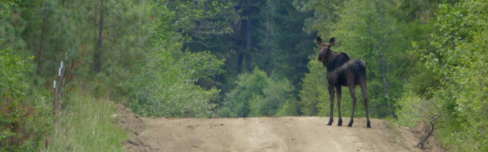

<!-- Google tag (gtag.js) -->
<script async src="https://www.googletagmanager.com/gtag/js?id=G-DTFGD3SPTQ"></script>
<script>
  window.dataLayer = window.dataLayer || [];
  function gtag(){dataLayer.push(arguments);}
  gtag('js', new Date());

  gtag('config', 'G-DTFGD3SPTQ');
</script>

> ## Course Materials
>
> This page mainly contains lectures, sometimes assignments and other resources, and will expand as the semester progresses.  Assignments, discussion boards and  announcements are on the [Blackboard site](https://blackboard.syracuse.edu/ultra/courses/_531605_1/outline).  Archived materials from 2024 are [here](Archive2024/index_archive.html)
>

```{r, echo=FALSE, eval = TRUE}
htmltools::img(src = "assets/ESFStacked_Full color.png", alt = 'banner', 
               style = 'position:absolute; top:0; right:0; padding:10px; width:150px')
```



**Instructor:** [**Dr. Elie Gurarie**](https://www.esf.edu/faculty/gurarie/), Illick 206

**Office hours:**  Thursday 3:30-4:30 - Illick 206 - or by appointment, 

**Co-instructors:** 

- [Rachelle Ketelhohn](mailto:rketelhohn@esf.edu) 
    - email: [rketelhohn@esf.edu](mailto:rketelhohn@esf.edu)
    - Office Hours:  **Thursdays 1-2 | Illick 305** or by appointment, 
- [Seanna Jobe](mailto:sjobe@esf.edu) 
    - email: [sjobe@esf.edu](mailto:sjobe@esf.edu)
    - Office Hours: **Wednesday 2:30-3:30 | Illick 305** or by appointment, 

**Locations and Times:** 

- Lecture: Illick 5; Tue-Thu 2:00-3:20
- Recitation Sections: 
  - **A:** Tues, 3:30-4:25 - Baker 310
  - **B:** Tues, 5:00-5:55 - Baker 314
  - **C:** Wed, 3:45-4:40 - Baker 314
  - **D:** Thurs, 8:00-8:55 - Baker 314

**Syllabus: [EFB390_Syllabus_2025.pdf](EFB390_Syllabus_2025.pdf)**

## Overview

This is a broad, foundational course, the overarching goal is to make students familiar with fundamental topics in wildlife ecology and management. 

Wildlife *ecology* is an extremely complex science, that explores themes like population dynamics, behaviors, space use, disease, habitat, trophic interactions, that is studied with a suite of rapidly evolving tools – field observations, advancing technology, statistics and modeling. 

Wildlife *management* places all the complexity of wildlife ecology into a sloppy social, political, historical, ethical and legal realm. Most professional “wildlife” managers will openly admit that they spend much more time trying to manage people. 

In this course, we will introduce methods, theories, concepts, and contemporary research topics in wildlife ecology, placing these into the very human inflected context of management. 

We will hopefully also get you even more interested in wildlife ecology than you maybe already are!  It is my opinion (and that of a great many of my colleagues) that there is no better or more interesting job than being a wildlife ecologist.   


## Unit I. Basics and history: *What do animals mean to us?*
- `0`. [Highlights of the Syllabus](lectures/Lecture00/HighlightsOfTheSyllabus.html)  
- `1`. [Definitions](lectures/Lecture01/Lecture_Basics.html) 
- `2`. [Mini-Lecture on Referencing](lectures/Lecture02/ResearchAndCaribou.pdf)
- `3`. [Deep History of Human-Wildlife Interactions](lectures/Lecture03/Lecture03_DeepHistory.html)
- `4`. [History of Human-Wildife Interaction to present](lectures/Lecture04/Lecture04_HistoryPartII.html)
    - [Wildlife in the News- 2025](lectures/Lecture04/WildlifeInTheNews.pdf)
    
## Unit II. Estimating Abundances: *How many animals are out there?*
- `5`. [Counting Animals, Part I](lectures/Lecture05/Lecture05_CountingAnimals.html)
- `6`. [Counting Animals, Part II](lectures/Lecture06/Lecture06_CountingAnimals_PartII.html)
- `6b`. [Counting Ice Seals](lectures/Lecture06/Lecture06b_EstimatingAntarcticIceSeals.pdf)
- `7`. [Mark-Recapture and Index Counts](lectures/Lecture07/Lecture07_MarkRecaptureAndIndexCounts.html)    
    
    
## Unit III. Habitats and Ranges: *Where are the animals and why?*    
- `8`. [Habitats Part I](lectures/Lecture08/Lecture_Habitat_PartI.html)
- `9`. [Habitats Part II: The Niche Concept](lectures/Lecture09/Lecture09_NichesAndHabitats.html)
- `10`. [Modeling (just about) Everthing Part I](lectures/Lecture10/Lecture_Modeling.html)
- `11`. [Modeling (just about) Everthing Part II](lectures/Lecture10/Lecture_Modeling_PartII.html)
- `11b`. [Caribou Habitat Selection](lectures/Lecture10/Lecture11b_PCH_RSF.pdf)


## Unit IV Population Ecology: *Why are there as many (or few) as there are?*   
- `12`. [Part I: Exponential Growth and Stochasticity](lectures/Module_PopEcology/Lecture_PopulationEcology.html)

## Labs

These are mainly **R** labs.  To use **R**, you have to either:  (a) Use R on tour own computer (**recommended**).  To do this you need to install R and R studio. Those are 2 different programs - both free. Links to download and install are here: https://posit.co/download/rstudio-desktop/; (b) work with R on the cloud - which works fine for most purposes.  To do this, you have to get a Posit Account at this link: https://posit.cloud/; or (c) work on computers in the computer labs, which should all have R and Rstudio installed. 

- `1.` [**Introduction to R**](labs/Lab1_IntroToR/IntroToR.html) <br> (also [R code](labs/Lab1_IntroToR/IntroToR.R), [sea lion dataset](labs/Lab1_IntroToR/SeaLions.csv), and [flag abundance data](https://docs.google.com/spreadsheets/d/17NFcXVew_QLd1FED5-xYiEaXP0dCIXasWRXkXQCqec0/edit?usp=sharing)). 
- `1b.` [**Estimating Abundances in R**](labs/Lab1b_EstimatingFlagAbundances/EstimatingAbundancesInR.html) <br> (also [R code](labs/Lab1b_EstimatingFlagAbundances/EstimatingAbundancesInR.R) and [flag count dataset](labs/Lab1b_EstimatingFlagAbundances/CirclesAndSquares.csv))
- `2.` [**Linear Modeling in R**](labs/Lab2_LinearModeling/Lab2_Modeling.html) and [SeaLions.csv](labs/Lab2_LinearModeling/SeaLions.csv))
- `3.` [**Exponential Growth**](labs/Lab3_ExponentialGrowth/Lab3_FittingExponentialGrowth.html) <br>
(also using the [Washington State sea otter dataset](labs/Lab3_ExponentialGrowth/SeaOtters.csv) and the [British Columbia sea otter dataset](labs/Lab3_ExponentialGrowth/BC_SeaOtters.csv))


  
<!-- 

- 3. [**Linear Models**](labs/Lab2_LinearModeling/Lab2_Modeling.html) <br>
(also using the [sea lion dataset](labs/Lab1_IntroToR/SeaLions.csv))

- 4. [**Exponential Growth**](labs/Lab3_ExponentialGrowth/Lab3_FittingExponentialGrowth.html) <br>
(also using the [Washington State sea otter dataset](labs/Lab3_ExponentialGrowth/SeaOtters.csv) and the [British Columbia sea otter dataset](labs/Lab3_ExponentialGrowth/BC_SeaOtters.csv))

- 5. [**Structured Populations**](labs/Lab4_AgeStructuredPopulations/Lab4_AgeStructuredPopulations.html)
-->


    