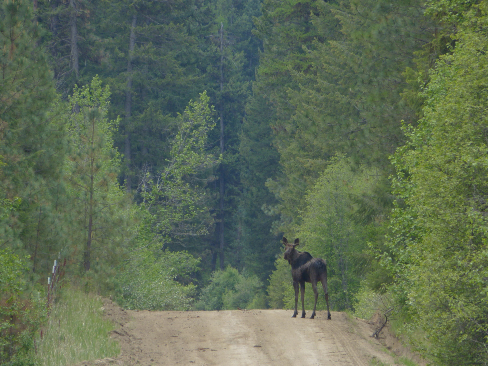

```{r, echo=FALSE, eval = TRUE}
htmltools::img(src = "assets/ESFStacked_Full color.png", alt = 'banner', 
               style = 'position:absolute; top:0; right:0; padding:10px; width:150px')
```




## Course Materials

Taught by Dr. [Elie Gurarie](https://www.esf.edu/faculty/gurarie/).  This page contains lectures, assignments and other resources.  [**Jump to latest unit**](#where-are-the-animals-and-why).


#### Class basics

- [Highlights of the Syllabus](lectures/HighlightsOfTheSyllabus.html) ([pdf](pdfs/Lecture00_HighlightsOfTheSyllabus.pdf))


## Lectures

### Unit I. Basics and history
#### *What do animals mean to us?*

- [1: Basics and Definitions](lectures/Lecture01/Lecture_Basics.html) ([pdf](pdfs/Lecture01_Basics.pdf))


## Archive

- 2022 materials can be found here:  [2022 course](Archive2022/index.html)
