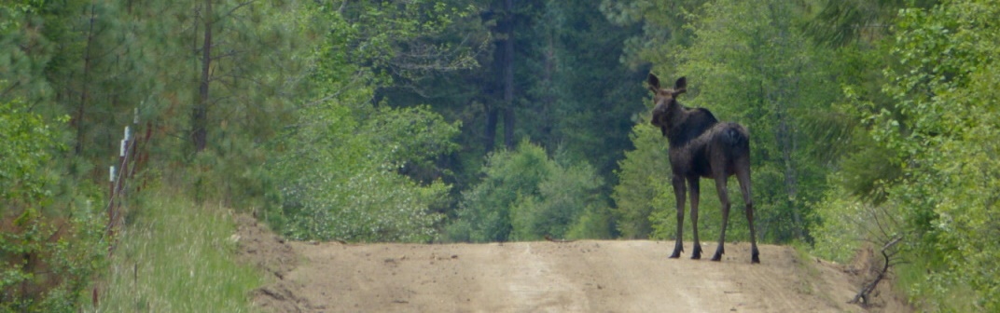

```{r, echo=FALSE, eval = TRUE}
htmltools::img(src = "assets/ESFStacked_Full color.png", alt = 'banner', 
               style = 'position:absolute; top:0; right:0; padding:10px; width:150px')
```



**Instructor:** Dr. [Elie Gurarie](https://www.esf.edu/faculty/gurarie/), Illick 206

**Office hours:**  Thursday 3:30-4:30 or by appointment, 

**Co-instructors:** 

- Chloe Beaupré | Monday 12-1pm, Illick 244
- Sydney Opel | Monday 1-2pm, Illick 244

**Locations and Times:** 

- Lecture: Illick 5; Tue-Thu 2:00-3:20
- Recitation Sections: 
  - Tues, 3:30-4:25 - Baker 310
  - Tues, 5:00-5:55 - Baker 314
  - Wed, 3:45-4:40 - Baker 314
  - Thurs, 8:00-8:55 - Baker 314


## Course Materials

This page mainly contains lectures, sometimes assignments and other resources.  Assignments, discussion boards and announcements are on the [Blackboard site](https://blackboard.syracuse.edu/ultra/courses/_507578_1/cl/outline).

#### Class basics

- [Syllabus](EFB390_Syllabus_2023.pdf)
- [Lecture 0: Highlights of the Syllabus](lectures/Lecture00/HighlightsOfTheSyllabus.html)([pdf](lectures/Lecture00/HighlightsOfTheSyllabus.pdf)) 


## Lectures

### Unit I. Basics and history: *What do animals mean to us?*

- [Lecture 1: Definitions](lectures/Lecture01/Lecture_Basics.html) ([pdf](lectures/Lecture01/Lecture_Basics.pdf))

- [Mini-Lecture 2: on Caribou and Research](lectures/Lecture02/ResearchAndCaribou.pdf) 

- [Lecture 3: Deep History of Humans and Wildlife](lectures/Lecture03/Lecture03_DeepHistory.html) ([pdf](lectures/Lecture03/DeepHistory.pdf)) 

- [Lecture 4: History of Humans and Wildlife, Part II](lectures/Lecture04/Lecture04_HistoryPartII.html) ([pdf](lectures/Lecture04/HistoryPartII.pdf)) 

**extra:** [Wildlife in the News results](lectures/Lecture03/WildlifeInTheNews.pdf)


### Unit II. Estimating Abundances: *How many animals are there?*

- [Lecture 5: Counting Animals Part I](lectures/Lecture05/Lecture05_CountingAnimals.html) ([pdf](lectures/Lecture05/Lecture05_CountingAnimals.pdf))

- [Lecture 6: Counting Animals Part II](lectures/Lecture06/Lecture06_CountingAnimals_PartII.html) ([pdf](lectures/Lecture06/Lecture06_CountingAnimals_PartII.pdf))

- [Lecture 6b: A bit more on uncertainty](lectures/Lecture06b/Lecture06b_CountingAnimals_Uncertainty.html) ([pdf](lectures/Lecture06b/Lecture06b_CountingAnimals_Uncertainty.pdf))

- [Lecture 7: Mark Recapture and Index Counts](lectures/Lecture07/Lecture07_IndexCounts.html )([pdf](lectures/Lecture07/Lecture07_IndexCounts.pdf))


### Unit III. Habitat: *Where are they? And why?*

- [Lecture 8: Habitats Part I](lectures/Lecture08/Lecture_Habitat_PartI.html) ([pdf](lectures/Lecture08/Lecture08_Habitat_Part1.pdf))

- [Lecture 9: Habitats Part II](lectures/Lecture09/Lecture09_NichesAndHabitats.html) ([pdf](lectures/Lecture09/Lecture09_NichesAndHabitats.pdf))


- [Lecture 10: Modeling Everything](lectures/Lecture10/Lecture_Modeling.html) ([pdf](lectures/Lecture10/Lecture10_Modeling.pdf))


#### Examples of habitat analysis

- [Long Island Ducks](lectures/Lecture09/DuckSlides.pdf)
- [Porcupine Caribou](lectures/Lecture09/Lecture9b_PCH_RSF.pdf)


### Unit IV. Population Ecology: *What is happening to how many there are?*

- [Lecture 11: Population Ecology Part I](lectures/Module4_PopulationEcology/Lecture_PopulationEcology.html)
- [Lecture 12: Population Ecology Part II](lectures/Module4_PopulationEcology/Lecture_PopulationEcology_PartII.html)


## R/Computer labs

- [Lab 1: Intro to R](labs/Lab1_IntroToR/IntroToR.html)
- [Lab 2: Exponential Growth with R](labs/Lab2_ExponentialGrowth/Rlab2_FittingModels.html)

## Archive

- 2022 materials can be found [here](Archive2022/index_archive.html)
