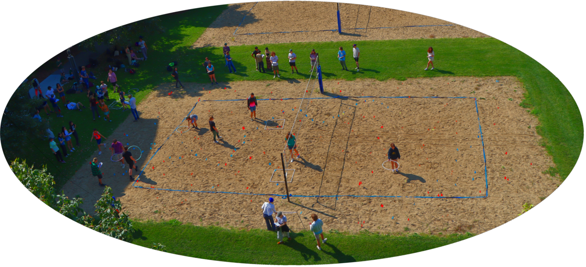

```{r setup, include=FALSE}
knitr::opts_chunk$set(echo = TRUE)
```



> **Goals:** In this lab we analyze some count data, obtaining **point estimates** and **confidence intervals** using the three types of survey strategies: full census, linear transects, and sample frames.  

# Census

## Data

The census data is very short.  According to the instructions, there should be 3 independent counts.  Here's an example if the three counts are $\{180, 200, 220\}$.

First, enter these into R.

```{r}
total.counts <- c(180,200,220)
```


## Point Estimate

The point estimate is just the **arithmetic mean** of all the counts:

$$\bar{X} = \sum_{i=1}^n X_i$$

This can be done in 2 ways in R.  The slightly longer way:

```{r}
sum(total.counts)/length(total.counts)
```

Or the fast way:

```{r}
mean(total.counts)
```

## Confidence Interval

The confidence interval is the **standard error** of those estimates:

$SE = {SD \over \sqrt{n}}$$

Where $SD$ is **standard deviation**: 

$$SD_X = \sqrt{\frac{1}{n - 1}  \sum_{i=1}^n (X_i-\overline{X})^2} $$

Woah!  That's crazy complicated.  The LONG WAY to do this in R is:

```{r}
n <- length(total.counts)
counts.sd <- sqrt( (1/(n-1)) * sum( (total.counts - mean(total.counts))^2 ) )
```

A short way is:

```{r}
sd(total.counts)
```
And a standard error would be:

```{r}
counts.se <- sd(total.counts)/sqrt(n)
```

Now you have a point estimate and a standard error, so the 95% confidence interval:

```{r}
mean(total.counts) - 2*counts.se
mean(total.counts) + 2*counts.se
```
Your final reported flag abundance will be 200 (95% C.I.: 177-223).  


# Transects

## Data

The transect data is also usually pretty short, so we can enter that by hand too.  Let's say there were $k = 5$ transects of $8\, m^2$ each, with counts: $\{3, 5, 8, 2, 4\}$.

```{r}
transect.counts <- c(2,5,8,6,4)
transect.areas <- c(8,8,8,8,8)
```


## Point estimate

For both transects and sampling frames, the key is always to FIRST estimate the density, and then turn that into an abundance estimate. Remmber, the density estimate is:

$$\widehat{D} = {\sum_{i = 1}^k c_i \over  \sum_{i = 1}^k a_i}$$

i.e., sum up the counts and divide by the sum of the areas.  In the transect study, there are always 40m x 1m of area total, so $\sum a_i = 40$. 

Estimate the density:

```{r}
D.hat <- sum(transect.counts) / sum(transect.areas)
D.hat
```

The point estimate of the total number is the density times the total area of the volleyball court:

$$\widehat{N} = A\widehat{D}$$
where $A \approx 20 \,\, m \times 15\,\,m = 300\,\,m^2$.

So the estimated abundance would be:

```{r}
D.hat * 300
```

## Confidence Interval

We will use the "sampling-with-replacement" (SWR) formula, which looks like this:

$$SE(\widehat{N}) = {A \over ka}  \sqrt{ {\sum c_i^2 - (\sum c_i)^2/k) \over k(k - 1)}}$$
where $a$ is the area of the *individual, identical* sample frame (in this example, it's $8\,\,m^2$), $k$ is the the number of transects, and $c_i$ is the counts.  There's no real shortcut for this one!  So we'll carefully work it out in R.  Note, that it's really useful to create new variables that contain some of the numbers we need, like:

```{r}
k <- length(transect.counts)
a <- 8
A <- 300
```


Ok, here goes:

```{r}
SE.transect <- (A/(k*a)) * sqrt( (sum(transect.counts^2) - 
                                    (sum(transect.counts)^2/k)) / 
                                   (k * k-1)  ) 

SE.transect
```

Notice how I spread out that formula across multiple lines, just to make sure all the parentheses were lined up correctly. 

So, the final point estimate is:

```{r}
D.hat * A
```

And the confidence interval is:

```{r}
D.hat*A - 2 * SE.transect
D.hat*A + 2 * SE.transect
```

So: 188 (95% C.I. 174-201).  Usually, we round these to the nearest integer.  

# Circles and Squares

## Data

This is the trickiest!  And also involves the most & most complicated data.  For this, we will not be entering the data directly in R, but loading it from a data frame, as per the R lab instructions.  In short, you can click through entering data, or you can load data from your working directory with something like the following:

```{r}
CirclesAndSquares <- read.csv("CirclesAndSquares.csv")
```

This is a data frame (see [R Lab 1](link)), with three columns: `Group`, `Shape` and `Count`:

```{r}
CirclesAndSquares
```

For this example, let's just extract the `Shape` and `Count` columns, so we can work with them separately: 

```{r}
Shape <- CirclesAndSquares$Shape
Count <- CirclesAndSquares$Count
```

And check out some summary statistics.  Like, the `table()` function is really good at counting:

```{r}
table(Shape)
```

So 10 circles and 15 squares.  The total estimate will somehow combine both of these datasets.  

> Note: If you only used Squares or only used Circles, you can use the exact same formulas as for the transect study above!


## Point estimate

### Version 1: Using density

At this point, you should be completely comfortable with the *point estimate* of the total abundance ALWAYS being the total count divided by the total area simpled times the total area:

$$\widehat{N} = A {\sum c_i \over \sum a_i}$$

No problem!  Except, we have a situation where the squares and the circles are different areas.  Namely, the area of the square is 1m.  And the area of the hula hoop is $a_{hh} = \pi r^2$ where the radius $r = 0.4$ cm, so:

```{r}
(a_hh <- pi * 0.4^2)
```
i.e, basically 0.5 m^2.  

So - we need to compute the total area of both the hula hoops and the squares.  We're going to do this extremely generically, so if the data change, you can still get the results.  This is a bit tricky, so pay attention:

```{r}
n.square <- sum(Shape=="Square")
n.circle <- sum(Shape=="Circle")
areas <- c(rep(1, n.square), rep(0.5, n.circle))
A <- 20*15
```


Great!  Now we can estimate the total abundance:

```{r}
A * sum(Count) / sum(areas)
```

### Version 2: Weighted Mean

We can also think of the new point estimate as a *average* of an estimate based **only** on squares, and one based **only** on circles.   We can do that,  but we have to "weight" each estimate based on how much we surveyed with each type. 

In our example, we have a lot more area covered in squares (15 square meters) than in circles (5 square meters).  The weighted mean would be:

$$\widehat{N} =   \left(a_1 \over a_1 + a_2\right)  \widehat{N_1} + \left(a_2 \over a_1+a_2\right) \widehat{N_2}$$

where $a_1$ and $a_2$ are the total areas sampled by the two kinds of surveys.  See how I compute this below:

```{r}
count.square <- Count[Shape == "Square"]
count.circle <- Count[Shape == "Circle"]

area.square <- 1
area.circle <- 0.5

Nhat.square <- sum(count.square) * A / (n.square * area.square)
Nhat.circle <- sum(count.circle) * A / (n.circle * area.circle)
```

Ok - we have two estimates!  They are:

```{r}
Nhat.square
Nhat.circle
```

Now, we do the weighted average.  Note, how I first identify the weighting - in this case 15 m vs. 5 meters:

```{r}
weight.square <- (n.square * area.square)/(n.square * area.square + n.circle * area.circle)

weight.circle <- (n.circle * area.circle)/(n.square * area.square + n.circle * area.circle)
```

The weights are:

```{r}
weight.square; weight.circle
```

So exactly a 3:1 ratio.  So we value the estimate from the squares 3 times more than the estimate from the circle. 

Putting it all together: 

```{r}
weight.square * Nhat.square + weight.circle * Nhat.circle
```

Note - this is exactly the same as the earlier point estimate!   But thinking of this as a weighted mean really helps us use both numbers to get a new standard error. 


## Confidence Interval

Now, to adapt that to standard errors, we have to use the following rule for the standard error of a *weighted mean*:  

$$\text{SE}_{\text{combined}} = \sqrt{\sum_{i=1}^{n} w_i^2 \cdot \text{SE}_i^2}$$

In our case, the weights are $w_1 = {a_1 \over a_1 + a_2}$ and $w_2 = {a_2 \over a_1 + a_2}$.  So the final standard error is: 

$$SE_{\text{combined}} = \sqrt{w_1^2 SE_1 + w_2^2 SE_2}$$

> It'll be up to you to figure out how to do this in R!

<center>

</center>
