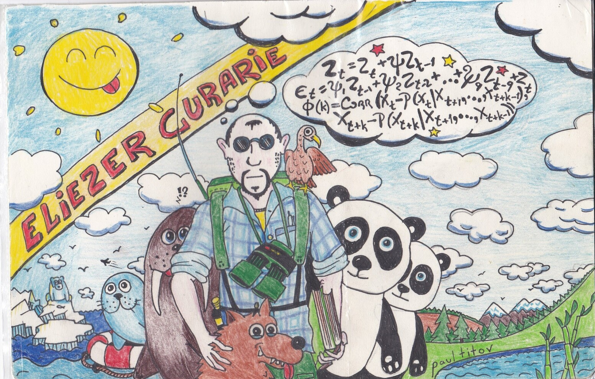
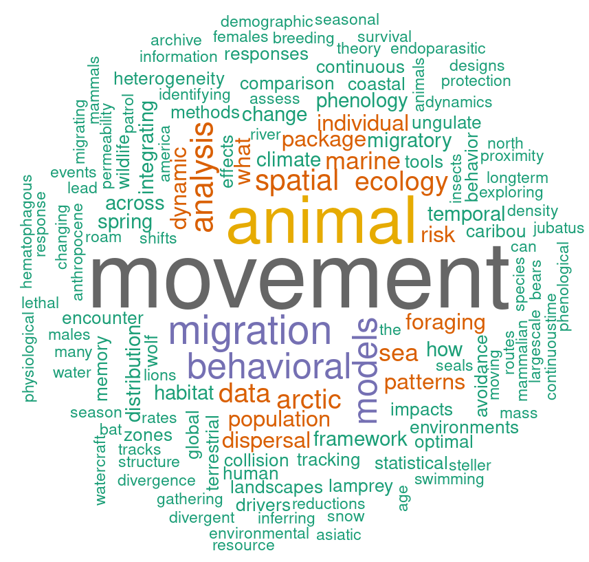
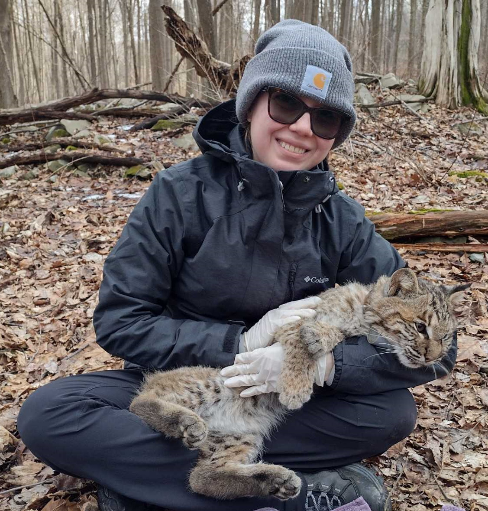
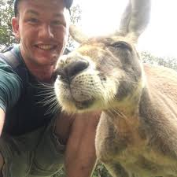
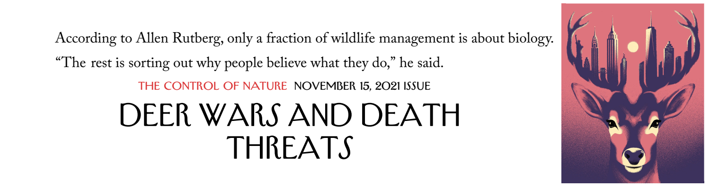
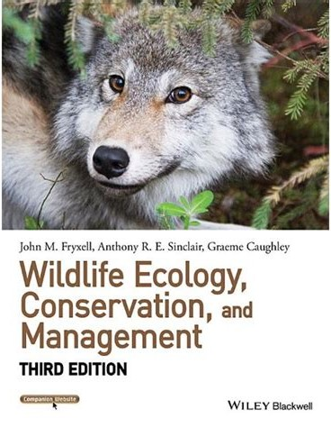
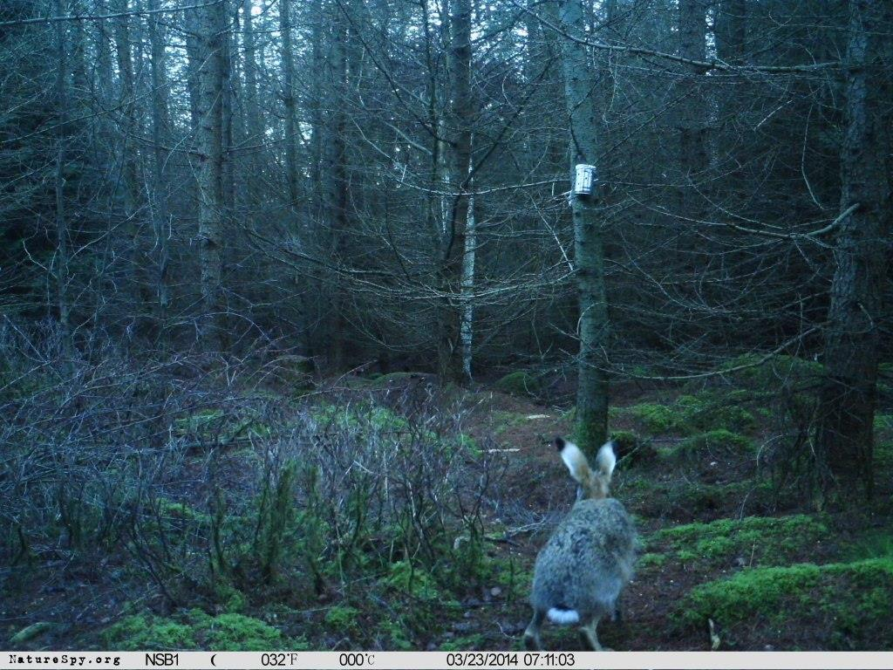
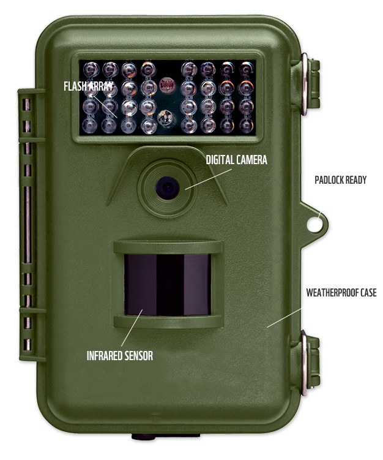

<!-- https://bookdown.org/yihui/rmarkdown/xaringan-format.html -->

```{r setup, include=FALSE}
knitr::opts_chunk$set(echo = FALSE, message = FALSE, 
                      warning = FALSE, las = 1)
#output: html_document
```


```{r xaringan-scribble, echo=FALSE}
xaringanExtra::use_scribble()
```

```{r xaringan-tile-view, echo=FALSE}
xaringanExtra::use_tile_view()
```

```{r colsFunction, eval = FALSE, echo = FALSE}
#system("cp ../mycss.css ./")
xaringan::inf_mr()
```


### A bit about me: 

**Dr. Elie(zer) Gurarie** (rhymes with *Smelly Ferrari*) 

**Quantitative Wildlife Ecologist** .green[206 Illick] | Office hours: .red[Thursday, 3:30-4:30 (might change)]

.pull-left-40[

**BS/BA** - Physics | Languages 

**MS** - Environmental Geosciences

**Ph.D.** - Quantitative Ecology and Resource Management

]

.pull-right-60[]

**Employment:** National Marine Mammal Laboratory, NOAA | University of Helsinki | University of Maryland | University of Wisconsin | 

**Consultant:** USGS | USFWS | Great Lakes Fisheries Commission | Environment Climate Change Canada | Florida Fish and Wildlife Conservation Commission | Gov't of Northwest Territories | Gov't of Yukon | Wekweezhi Renewable Resources Board | Natural Resources Institute Finland       

---


.pull-left-50[

## Research word cloud


]


```{r createWordCloud, eval = FALSE}
require(rvest)
require(magrittr)
require(plyr)

page <- read_html("https://scholar.google.com/citations?hl=en&user=d_G0tbAAAAAJ&view_op=list_works&pagesize=100&cstart=0")
titles <- page %>% html_nodes (".gsc_a_at") %>% html_text() 
titles <- titles[-98]

replace <- function(list, before, after){
   laply(list, function(l) gsub(before, after, l, fixed = TRUE))
}

titles <- titles %>% 
    replace("migrations", "migration") %>% 
    replace("movements", "movement") %>%
    replace("modelling", "modeling") %>% 
    replace("modeling", "models") %>% 
    replace("behaviour", "behavior") %>% 
    replace("ecological", "ecology") %>% 
    replace("wolves", "wolf") %>% 
    replace("the ", "") %>% replace("how ", "") %>% 
    replace("what ", "") %>% replace("can ", "") %>% 
    replace("will ", "") %>% replace("use ", "") %>% 
    replace("using ", "")
    

require(wordcloud)
png("GurarieWordCloud.png", 
    width = 1000, height = 1000, res = 200)
set.seed(233)
wordcloud(titles, 
          max.words = 150,
          random.order=FALSE, min.freq = 2, 
          rot.per=0.2, colors=brewer.pal(8, "Dark2"))
dev.off()
```

.pull-right[
## Some wildlife ...

**That I know-know**

.footnotesize[Caribou | Wolves | Steller sea lions | Northern fur seal | Pacific salmon]

**That I pretty much know**
.footnotesize[Sea otters | Sea lamprey | Brown bear | White-tailed deer | Fisher | Coyote]

**That I have visited**
.footnotesize[Ladoga ringed seal | Panda bear | Roe deer | Manatee | Southern three-banded armadillo]

**That I've seen the data for**

.footnotesize[Polar bear | Antarctic ice seals | Dall sheep | Mexican fish-eating bats | Asiatic Cheetah | Persian Leopard | Kestrel | Bowhead whales | more ...]
]


---
# Co-Instructors:


.pull-left-30[

##Sydney Opel



email: [slopel@esf.edu]()

]

.pull-right[

## Colton Moyer



email: [cmoyer@esf.edu]()

### Office hours **TBD**!

]

---
class: inverse

# This class is foundational

Necessarily more **broad** than **deep**, but should provide the  **critical** and **reasoning** skills and **research skills** needed to succeed - in other wildlife courses and beyond.  



- **Wildlife Ecology** is a super complex natural science.

- But the **science** is a relatively **small** part of **Wildlife Management** - which involves *society*, *culture*, *law*, *policy*, *governance*, *history* and all sorts of "human" stuff. 


---
class: inverse

# No required text

.pull-left[
Any reading materials will be shared on Blackboard.  


**Fryxell | Sinclair | Caughley** is a text I'll probably refer to / scan most frequently in (the first half) of class.
]

.pull-right-50[



]


---


.pull-left[
# Arc of the class

### 1. Science

**Fundamentals**
  - Deep history of human-wildlife interactions

**Topics and Tools in Wildlife Ecology**
  - Abundance estimation and Sampling
  - Population Ecology + Interactions
  - Habitats
  - Behavior, space-use and movement 
  - Physiology / Disease / Movement / Other
  

]

--

.pull-right[

### 2. Management

**The North American Model of Wildlife Management**
  - What is the NAM? History, context, critiques 
  - Role of harvest
  - Legal frameworks
  - Indigenous perspectives*
  - Alternative models

**Management in Practice**
  - Game bird management*
  - Fur-bearers*
  - Urban ecology*
  - Predators*
  - Adaptive management*
]


---

# Content Goals: 

### 1. What do we need to know about wildlife

--

### 2. How do we collect and analyze data on wildlife? 

- (There will be MATH ... hooray!)

--

### 3. What are philosophies and approaches to managing wildlife? 

--

### 4. How does **history**, **culture**, **economics** and **politics** interact with **science** in the context of wildlife management and conservation.  

---

## Technical Goals 

#### 1. Learn to do research 

You will be exposed to a lot of information, but **how do we know what we know**? 

- Learning to do **research**, follow up on claims, read original sources.  Separate *popular literature* from *"grey literature"* (very prominent in wildlife management) from *peer-reviewed literature*.   

- You will build an **annotated bibliography** with a (near)-weekly mini-assignment to find, cite & briefly summarize a source for a **fact**, **assertion** or **argument** presented in lecture.  

- key tool: 


.pull-left-70[
#### 2. Some quantitative / statistical tools

- E.g. - estimating abundance with confidence intervals

- Because as wildlife ecologists you MUST get comfortable with *Uncertainty* / *Randomness* / *Modeling*]

.pull-right-20[

]


---

## Field Techniques:

.pull-left-30[

### Camera Trapping Study

- Characterize the faunal community of Oakwood cemetery

- Maintaining equipment

- Building a well-structured dataset

- Collect covariates

]


.pull-right-70[
.pull-left-70[]
.pull-right-30[]
]

### Surveying and abundance estimation

- of orange flags

---
class: inverse

# There will be lots of guest lecturers!

Especially in the latter half of the class.  

These will expose you to broad and diverse set of experiences in the broad domain of wildlife ecology and management:

.large[
- Indigenous Nation co-management
- Role of hunting and harvest
- Waterfowl and birds
- Furbearers
- Wildlife law
- Dynamic management
- Disease 
- Adaptive Management
- New York State wildlife issues
]

---

# Assessment

.large[
1. HOMEWORK (**35%**): 
    - (Near-)weekly short assignments, a few longer projects

2. EXAMS (**30%**): 
    - Two exams, both open book and open note - one on the last day of class.

3. FINAL PROJECT **25%**
    - Group project + presentation + individual write-up
    
4. PARTICIPATION (**10%**) 
    - Participation (class / recitation / online discussion forums / in-class presentations). 
]


---


.pull-left[

# Recitation sections

.large[

-   Tues, 3:30-4:25 - Baker 310
-   Tues, 5:00-5:55 - Baker 314
-   Wed, 3:45-4:40 - Baker 314
-   Thurs, 8:00-8:55 - Baker 314

In computer labs ... but for **Zotero** and **R programming** (and other activitities) best to have software installed on your own computer.]

]

.pull-right.large[

# Course Materials


- [Blackboard](https://blackboard.syracuse.edu/ultra/courses/_531605_1/outline)

    - Assignments / Announcements


- [Course Website](https://eligurarie.github.io/EFB390/)

    - 

]

---
class: center, inverse
background-image: url('bg.jpg')
background-size: cover

# I reserve the right ...

.large[to change anything anytime for any reason.]

**(in practice - this policy only ever benefits students)** 
