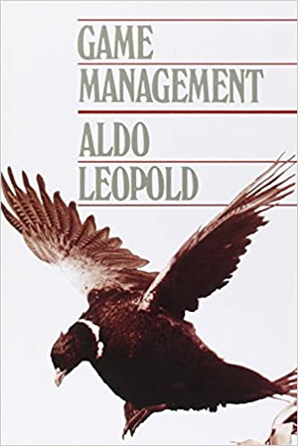
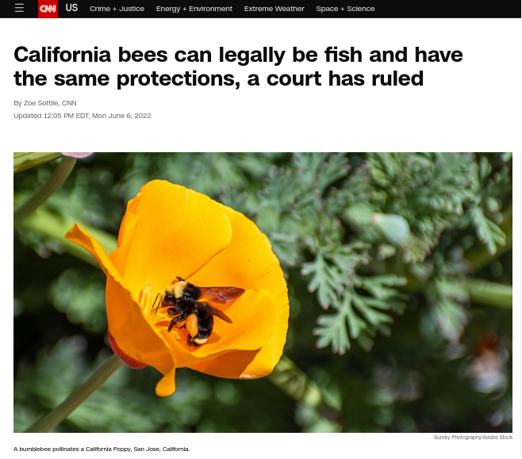
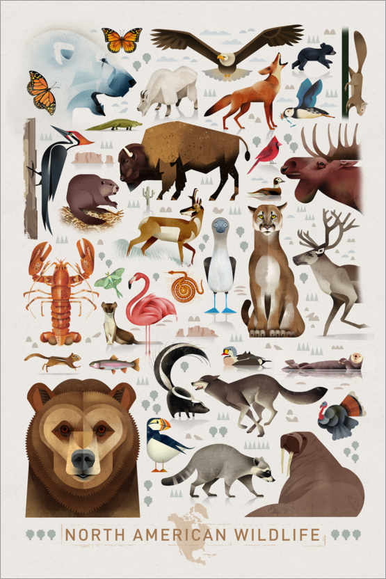
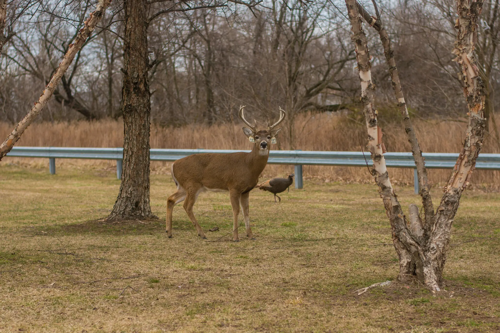
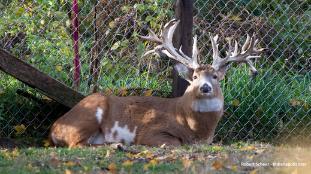
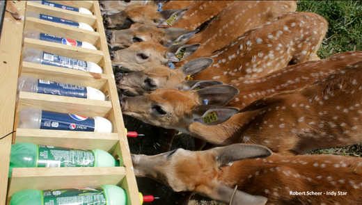
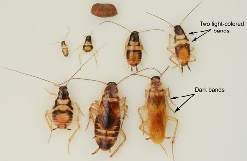
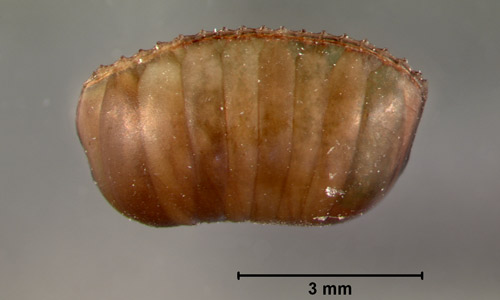
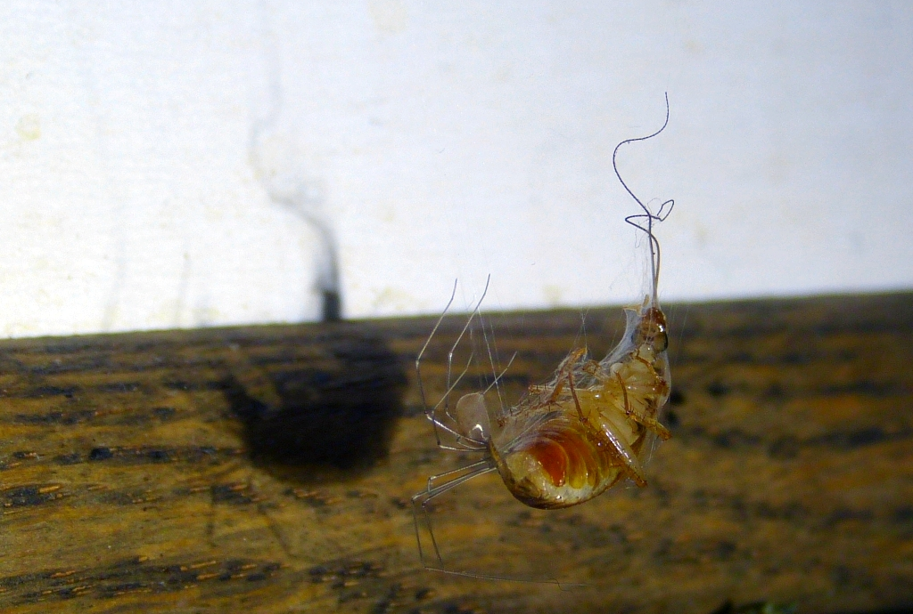
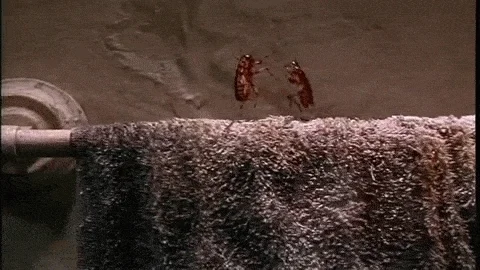

class: center

<!-- https://bookdown.org/yihui/rmarkdown/xaringan-format.html -->

```{r setup, include=FALSE}
knitr::opts_chunk$set(echo = FALSE, message = FALSE, 
                      warning = FALSE, las = 1)
#output: html_document
```


```{r colsFunction, eval = FALSE, echo = FALSE}
system("cp ../mycss.css ./")
system("cp ../moose2.jpg ./bg.jpg")
xaringan::inf_mr()
```


## This class is called 

#**Wildlife Ecology and Management**

which begs some questions ... 


---
class: center

# What is wildlife?


---

## Is wildlife: **Only game species...?**
.green.small[**wild** (adj.) from Proto-Germanic *wildia- (source also of Old Saxon wildi, Old Norse villr, Old Frisian wilde, Dutch wild, Old High German wildi, German wild, Gothic wilþeis "wild," German Wild (n.)* ***"game"***),
]

.pull-left-40[]

.pull-right-40[]


---

## According to U.S. Federal Law 

.content-box-green[
*Fish and wildlife* means any member of the animal kingdom, including without limitation any mammal, fish, bird (including any migratory, non-migratory, or endangered bird for which protection is also afforded by treaty or other international agreement), amphibian, reptile, mollusk, crustacean, arthropod, or other invertebrate, and includes any part, product, egg, or offspring thereof, or dead body or part thereof. 

<center>[CFR: Title 50 - Wildlife and Fisheries § 36.2](https://www.law.cornell.edu/cfr/text/50/36.2).
]

---

### Words matter (legally)

.pull-left-50[
.content-box-yellow[
.small[The California ESA protects *“native species or subspecies of a bird, mammal, fish, amphibian, reptile, or plant.”* Notably, **no inverterbrates**.

But in a lucky loophole for insects, the CESA  defines a **“fish”** as *“a wild fish, mollusk, crustacean, invertebrate, amphibian, or part, spawn, or ovum of any of those animals.”*]]]

.pull-right-40[

.footnotesize[[(click here for link)](https://www.cnn.com/2022/06/06/us/california-bees-fish-court-ruling-scn-trnd/index.html)]
]

--

.content-box-green[**Judge says:**
.small[*Although the term fish is colloquially and commonly understood to refer to **aquatic species**, the term of art employed by the Legislature in the definition of fish in section 45 is **not so limited**.*]
]

---

## Wildlife: a working definition 


.pull-left[.content-box-blue[
All terrestrial and marine vertebrates but not domesticated animals. This includes game, non-game species, feral animals, invasive/exotic, and native species.]
]

.pull-right-40[**Are these all wildlife?**  (*poster: Dieter Braun*)]


---

## Is this wildlife? 




---

## Is this wildlife? 


---

## Is this wildlife? 




---
class: center

# What does a wildlife ecologist study?


---

# Wildlife ecology (in brief) ...

is the interaction among free-living wild animals and their environment.  

- It is a branch of ecological *science*, i.e., a process of inquiry.  

- There are questions, hypotheses, observations, a variety of tools to collect the information and to try to answer those questions.  

- As a science, it is **incredibly complex**, riddled with uncertainty, imperfect observations, etc. 


---

# What does a **Wildlife Manager Do**?
.center[

]


---

# Wildlife Management

### Restrictive definition
.content-box-blue[
*Management of wildlife populations in the context of the ecosystem.* 
(FSC book)

(i.e. implementation of actions that directly/indirectly impact the population).
]

--

### Goals of wildlife management

.content-box-green[
1. Make it increase
2. Make it decrease
3. Harvest for a continuing yield
4. Leave it alone (but keep an eye on it)
]


---

---

## Broader defition of Wildlife Management ...

...  a story (about a good friend, Dr. Furarie)

.pull-left-50[

One day, Dr. F (*not an entomologist*) casually oberved a fascinating bug in the kitchen, then went (with family) on a several week vacation.  (thinking *huh!  cute beetle*)

**Spoiler:  It was not a beetle!**
]

.pull-right-50[



]


--

.pull-left-50[
Returned some time later to see dozens scurrying under appliances in kitchen.]


--

.pull-right-50[.center[.large[**Brown-banded cockroach** (*Supella longipalpa*)]]

.red.small[*not usually considered "wildlife" ... but - in California - can be considered a "fish"*]]


---

## Management objective...

articulated clearly and unambigously (mainly by partner): **Eliminate ASAP!**

.pull-right-40[]

--

.pull-left-50[

**Step 1.** Consulted with professional "managers" (aka *exterminators*) - who suggested emptying house for several weeks and fumigating fully, for THOUSANDS of dollars.  
]

--

.full-width[
## More nuanced objective:
]
.center.Large[**Reduce numbers while balancing costs and feasibility!**]

---

# Ecology of *Supella longipalpa*


.pull-left[
- **Behavior**:  Social, Nocturnal
- **Habitat**: Dark areas, under appliances / sink / crevasses. Need not be moist, Between 25 C and 33 C. 
- **Diet**: anything
- **Population ecology**: Females leave oblong, ~5 mm  egg case (*ootheca*) contain ~15 offspring.  Glues the casing to cabinets or walls. One female lays ~15 casings in a lifetime. Females live between 13-45 weeks, each adult will produce from 90-276 roaches per year.
- **Natural predators**:  Very few ... but, spiders!
]

.pull-right[


.center[Egg case (*ootheca*)]

.center[Predation!]
]

---


# Management plan:


.pull-left-60[
#### Habitat
- Extreme cleanliness of kitchen (**diet**)
- Regular monitoring of usual **habitats**
- Freezing of potential habitats (toaster, microwave, easy in Wisconsin winter)

#### Population ecology
- Removal of adults (with vacuum)
- Discovery and destruction of ootheca


#### Inter-species interactions 
- Firm **spiders are our friends** policy. 
]

.pull-right-40[


#### Regular monitoring
- do rounds every night, until numbers decrease enough (then allowed to slack off). 
]


---

## *Supella longipalpa* are **not** "Wildlife" but ...

### this story touches (on a small scale) on universal themes of professional wildlife management were demonstrated. 

- A **management goal**.  This is *not* science.  This is **social** / **cultural** / **political**.  

--

- Basic knowledge of **biology** and **ecology**:

  - *diet*, *habitat*, *interactions*, *reproductive ecology*

--

- Using the knowledge to develop (and agree upon) a **management plan**. 

--

- Tools and  protocols for **monitoring**

--

- Tools and protocols for **implementing** the management goal.


---

## Major takeaway:

.large[**Management** is (almost) *never* a One-Time-Deal - it is an *adaptive and dynamic process*, an ongoing interaction, a dance of knowledge, monitoring, intervention, effort, communication and adaptation, that involves **economic**, **social**, **political**, **ethical** considerations.]

.center[]

---

## Assignment (due next Tuesday, Sep. 6):

Find **three popular press articles** about the interaction of wildlife and humans from the past year, involving **different species** and **different geographical areas** (at least one outside the United States).  These should be **news** (not editorial or opinion pieces). 

Write a short summary, identifying:

- the species (one or more) involved,
- the location of the interaction,
- the nature of the interaction: (e.g. conflict, intervention, conservation, harvest, something else)
- whether there was a role played by wildlife ecologists, government agencies, non-government organization (NGO), the citizenry, random individuals.


### Readings

Chapters 1 and 2 from Taber and Payne (uploaded on **BLACKBOARD**)


