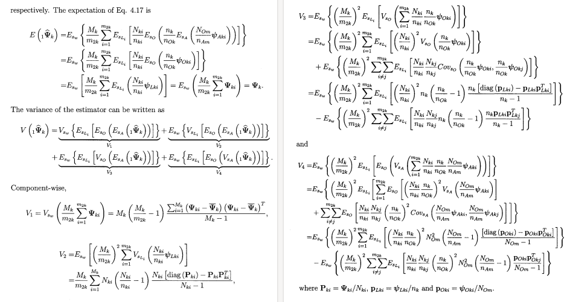

<!-- https://bookdown.org/yihui/rmarkdown/xaringan-format.html -->
```{r, echo = FALSE, eval = FALSE}
renderthis::to_pdf("Lecture05_CountingAnimals_PartII.Rmd")
```

```{r setup, include=FALSE}
knitr::opts_chunk$set(echo = FALSE, message = FALSE, warning = FALSE, las = 1)
#output: html_document
```


```{r colsFunction, eval = FALSE}
system("cp ../mycss.css ./")
#system("cp images/aerialcount.jpg ./bg.jpg")
xaringan::inf_mr()
```
## The trickiest thing in sampling

Is computing the *precision* (standard errors / confidence intervals)



---
### General principle: The bigger the sample, the smaller the error. 


`1.` If $a_s \ll A$  (i.e. low sampling intensity)

$$SE(\widehat{N}) = {A \over a} \sqrt{\sum n_i}$$
**remember:** $n_s = \sum n_i$ is the total sample count

.center.red[
in our example: $SE = 100²/(10\times10²) \sqrt{30} = 54.8$
]

--


---
class: small

## Example - single transect, simple formula

.center[
$SE(\widehat{D}) = {1 \over a}\sqrt{\sum n_i}\,\,\,$ and $SE(\widehat{N}) = A \times SE(\widehat{D})$
]


```{r}
source("functions.R")
set.seed(9)
Z <- setupPop(100)
```

.pull-left[

.red.large.center[
$n = 8$; $a = 1000$; $A = 100,000$
]

```{r, fig.width = 5, fig.height = 5, echo = FALSE, dpi = 100}
performSim <- function(N = 100, width = 5){
    Z <- setupPop(N)
    sum(Im(Z) > (50 - width) & Im(Z) < (50 + width))
}

reps <- 1e3

n.sims <- sapply(1:reps, function(x) performSim()) 
par(mar = c(3,2,2,1), tck =0.01, bty = "l", cex.axis = 1.2, cex.main = 1.5)

plotPopulation(Z)
segments(0,50, 100,50, lwd = 2, col = "darkred")
rect(0,45,100,55, col = rgb(0,.5,0,.2), bor = NA)
```


]

--


.pull-right[


#### point estimates

$$\widehat{d} = 8/1,000 = .008$$
$$\widehat{N} = \widehat{d} \times A = 80$$

#### standard errors:

$$SE(\widehat{D}) = {\sqrt{8} \over 1000}  = 0.0028$$
$$SE(\widehat{N}) = 0.0028 \times 10,000 = 28.28$$
#### final abundance estimate:

.darkred[
$$\widehat{N} = 80$$
$$95\%\, CI(\widehat{N}) = \widehat{N} \pm {1.96 \times SE(\widehat{N})} = \{24.5, 135\}$$
]
]


---

.pull-left[

#### This is why you *want* lots of transects:


```{r, fig.width = 5, fig.height = 5, echo = FALSE, dpi = 100}

width = 5
    
Z2 <- setupPop(100, updown = 2)
y.transect <- 20

par(mar = c(3,2,2,1), tck =0.01, bty = "l", cex.axis = 1.2, cex.main = 1.5)

plotPopulation(Z2)
segments(0,y.transect, 100,y.transect, lwd = 2, col = "darkred")
rect(0,y.transect - width,100, y.transect + width, col = rgb(0,.5,0,.2), bor = NA)
title(paste("n = ", sum(Im(Z2) > (y.transect - width) & Im(Z2) < (y.transect + width))))
```
To capture variation!

]


--

.pull-right[

#### This is also why you go along the **gradient** of variation:

```{r, fig.width = 5, fig.height = 5, echo = FALSE, dpi = 100}

width = 5
    
x.transect <- 20

par(mar = c(3,2,2,1), tck =0.01, bty = "l", cex.axis = 1.2, cex.main = 1.5)

plotPopulation(Z2)
segments(x.transect, 0, x.transect, 100, lwd = 2, col = "darkred")
rect(x.transect - width,0, x.transect + width, 100, col = rgb(0,.5,0,.2), bor = NA)
title(paste("n = ", sum(Re(Z2) > (x.transect - width) & Re(Z2) < (x.transect + width))))
```

.red[**gradient**] - means slope of (steepest) change
]


---

## More complex formulae


 from Fryxell book Chapter 12:


These are used when **sampling areas** are unequal, and account for differences when sampling **with replacement** or **without replacement**. 


---

## Simple-SWR

- **Simple:** Equal sized sampling frames $a_i$ all equal
- **SWR:** Sampling 'with replacement', i.e. frames *OVERLAP*; some individuals counted more than once.. 


$$SE(\widehat{D}) = {1 \over a_i \sqrt{k(k-1)}} \times \sqrt{\sum n_i^2 - {\left(\sum n_i \right)^2 / k}} $$

$$SE(\widehat{N}) = A \times SE(\widehat{D})$$

variable | meaning | in book
:---:|:---:|:---:
$k$ | number of units sampled | .green[*n*]
$a_i$ | the area of a *single* unit | .green[*a*]
$n_i$ | an individual sample count  |.green[*y*]
$A$ | total study area |


---

## Example:

.pull-left[
```{r}
source("functions.R")
set.seed(2)
Z3 <- setupPop(100)
plotPopulation(Z3)
sim <- countSamples(Z3, k = 4)
plotSampling(sim)
```


.red[
**data:** counts = {2,3,1,1}

a = 100; A = 10,000]

]

--

.pull-right[
- $\widehat{N} = {2+3+1+1 \over 100} \times 10,000  = 70$

- $SE(\widehat{N}) = {10,000 \over 100 \times \sqrt{4 \times 3}} \times \\\sqrt{(1 + 1 + 9 + 4) - {(1+1+3+2)^2\over 4}}$

- $SE(\widehat{N}) = {50 \over \sqrt{3}} \times \sqrt{15 - {49 \over 4}} = 48$

- $\widehat{N} = 70; \,\, 95\% \textrm{CI} = (-23, 164)$

.green[*Anything wrong with this confidence interval?*]

]


---

## Example:  More Heterogeneity

.pull-left[
```{r}
source("functions.R")
set.seed(5)
Z4 <- setupPop(100, updown = 10, leftright = 10)
plotPopulation(Z4)
sim <- countSamples(Z4, k = 4)
sim$counts
plotSampling(sim)
```


.red[
**data:** counts = {0,0,0,8}

a = 100; A = 10,000]

]

--

.pull-right[
- $\widehat{N} = 80$

- $SE(\widehat{N}) = {50 \over \sqrt{3}} \times \sqrt{(0+0+0+8)^2 - (0+0+0+8^2)\over 4}} = $

- $SE(\widehat{N}) = {50 \over \sqrt{3}} \times \sqrt{48}  \\ = {50 \over \sqrt{3}} {4\sqrt{3}} = 200$

- $\widehat{N} = 70; \,\, 95\% \textrm{CI} = (-130, 470)$

]


---

## Simple - SWOR

- **SWOR:** Sampling *without* replacement, i.e. design guarnatees no individual is counted more than once. 


$$SE(\widehat{D_{swor}}) = SE(\widehat{D_{swr}}) \times \sqrt{1+{a / A}}$$

The larger the proportion sampled (*coverage*) - the smaller the **sampling error.**

--

## Ratio (SWR/SWOR)

**Ratio**: unequal sample frames .blue[(e.g. both hula hoops and meter squares)].


- $\widehat{D} = \sum n_i / \sum y_i$ (same as before)

- Standard errors: more complicated ... see formulae. 

---

## Take-aways

Is it **very important** to quantify uncertainty!   But also, can be **hard** (and **disheartening**).

--

Larger samples & higher coverage $\to$  smaller errors $\to$ narrower confidence intervals $\to$ more precision. 

--

The error estimates take into account **sample randomness**, but also **heterogeneity**.  The more **heterogeneous** the distribution the larger the errors
--
  - unless .green[(*spoiler alert*)] you take that into account in your **distribution modelling** ...
 

