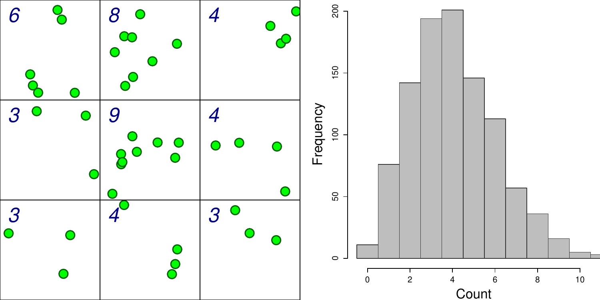
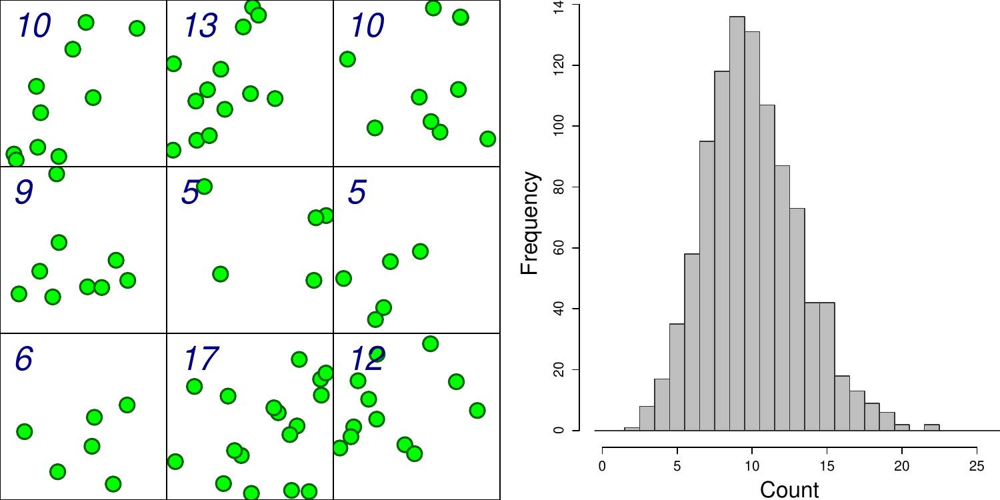
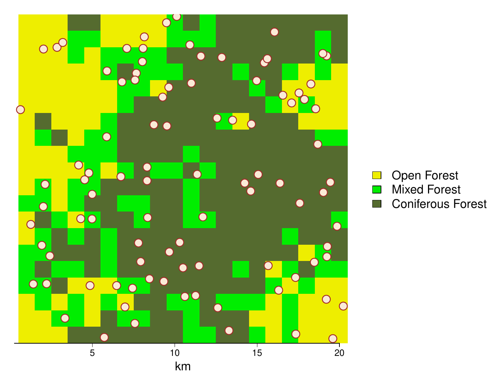

<!-- https://bookdown.org/yihui/rmarkdown/xaringan-format.html -->
```{r, echo = FALSE, eval = FALSE}
#renderthis::to_pdf("Lecture05_CountingAnimals_PartII.Rmd")
```

```{r setup, include=FALSE}
knitr::opts_chunk$set(echo = FALSE, message = FALSE, cache = TRUE, 
                      warning = FALSE, las = 1, dpi = 100)
#output: html_document
```


```{r colsFunction, eval = FALSE}
system("cp ../mycss.css ./")
system("cp images/LEGO_bg.jpg ./bg.jpg")
xaringan::inf_mr()
```


```{r cache = FALSE}
require(elieslides)
require(kableExtra)
```


## Super fast primer on statistical modeling


Everything you need to know to do 95% of all wildlife modeling in less than an hour and **FOUR** (or **FIVE**) easy steps!!

**I.** Linear modeling

**II.** Multivariate modeling

**III.** Model selection 

**IV.** Generalized linear modeling 
  - Poisson; Binomial

**V.** Prediction

---


.pull-left-70[
# **Step I:** Linear modeling 

... is a very general method to quantifying relationships among variables.  .footnotesize[(Also known as  ***LINEAR REGRESSION***, except I really don't like that term, for a variety of reasons.)]

.pull-left[
```{r, fig.width = 3, fig.height = 4, dpi = 200}
pcks <- c("magrittr","plyr","ggthemes","ggplot2")
a <- sapply(pcks, require, character = TRUE)
pups_raykoke <- read.csv("data/SeaLions.csv") %>% subset(Island == "Raykoke")
ggplot(pups_raykoke, aes(Length, Weight)) + 
    geom_point(col = alpha("black", .5)) + 
    geom_smooth(method = "lm") + 
    #facet_wrap(.~Sex) + 
    theme_few() + ggtitle("Steller sea lion size")
```
]
.pull-right[

$X_i$ - is called:
- covariate
- independent variable
- explanatory variable

$Y_i$ - is the property we are interested in modeling:
- response variable
- dependent variable

.small[Note: There actually can be interest in wildlife studies to have models for **length** and **weight**, since **length** is easy to measure (e.g. from drones), but **weight** tells us more about physical condition and energetics.]
]
]


.pull-right-30[


Steller sea lion (*Eumatopias jubatus*) pups.  

]


---

# Linear Models
.pull-left[
#### Deterministic:

$$Y_i = a + bX_i$$

$a$ - intercept; $b$ - slope
]

.pull-right[
#### Probabilistic:

$$Y_i = \alpha + \beta X_i + \epsilon_i$$

$\alpha$ - intercept; $\beta$ - slope; $\epsilon$ - **randomness!**: $\epsilon_i \sim {\cal N}(0, \sigma)$
]


.pull-left[
```{r, fig.width = 4, fig.height =3}
pars()
X <- 0:15
a <- 1; b <- 1/2
plot(X, a + b*X, pch = 19, ylab = "Y", ylim = c(-1,11), 
     main = expression(a == 1~"; "~b == 1/2))
abline(a,b, col = "red", lwd = 2)
```
]


.pull-right[
```{r, fig.width = 4, fig.height = 3}
pars()
set.seed(1976)
X <- 0:15
a <- 1; b <- 1/2
sigma <- 1
plot(X, a + b*X + rnorm(length(X), 0, sigma), pch = 19, ylab = "Y", ylim = c(-1,11), 
     main = expression(alpha == 1~";"~beta == 1/2~";"~sigma == 1))
abline(a,b, col = "red", lwd = 2)
```
]

---

# Fitting linear models is very easy in !

.pull-left[

**Point Estimate**

This command fits a model:
.small[
```{r, echo = -1}
pups <- read.csv("data/SeaLions.csv") %>% subset(Island == "Raykoke")
lm(Weight ~ Length, data = pups)
```
]

So for **each 1 cm** of length, add another **754 grams**, i.e. $\widehat{\beta} = 0.754$

```{r}
my_model <- lm(Weight ~ Length, data = pups)
```
]

.pull-right[
```{r, echo = -1, fig.width = 4, fig.height = 3, dpi = 200}
pars()
plot(Weight ~ Length, data = pups)
abline(my_model)
```

The `abline` puts a line, with intercept `a` and slope `b` onto a figure.
]


---

# Some comments on linear models


$$ Y_i \sim \alpha + \beta X_i + \epsilon_i$$

1. $\epsilon_i$ is **unexplained variation** or **residual variance**.  It is often POORLY/WRONGLY referred to as "**error**".  It is a **random variable**, NOT a **parameter**

--

2. A **better**, more sophisticated way to think of this model is not to focus on isolating the residual variance, but that the whole process is a random variable: $$Y_i \sim {\cal N}(\alpha + \beta X_i, \sigma)$$ This is better because: (a) the three parameters ( $\alpha, \beta, \sigma$ ) are more clearly visible, (b) it can be "generalized".  For example the **Normal distribution** can be a **Bernoulli distribution** (for binary data), or a **Poisson distribution** for count data, etc. 

--

3. $\alpha+\beta X_i$ is the **predictor**, or the "modeled" portion.  There can be any number of variables in the **predictor** and they can have different powers, so: $$Y_i \sim {\cal N}(\alpha + \beta X_i + \gamma Z_i + \delta X_i^2 + \nu X_i Z_i, \sigma )$$ is also a **linear** model. 

---


.pull-left-60[

# Statistical inference

**Statistical inference** is the *science / art* of observings *something* from a **portion of a population** and making statements about the **entire population**.  

In practice - this is done by taking  **data** and **estimating  parameters** of a **model**.  (This is also called *fitting* a model). 

Two related goals: 

1. obtaining a **point estimate** and a **confidence interval** (precision) of the parameter estimate. 
2. Assessing whether particular (combinations of) factors, i.e. **models**, provide any **explanatory power**. 

This is (almost always) done using **Maximum Likelihood Estimation**, i.e. an algorithm searches through possible values of the parameters that make the model **MOST LIKELY** (have the highest probability) given the data. 
]

.pull-right-40[


.small[Another gratuitous sea lion picture.]
]

---

.pull-left-60[

## Statistical output

<font size="4"><pre>
```{r, echo = FALSE, eval = TRUE}
mylm <- lm(Weight ~ Length, data = pups %>% 
               subset(Island == "Raykoke"))
summary(mylm)
```
</pre></font>
]

--
.pull-right-40[

### 1. Point estimates and confidence intervals
.red.center[
**Intercept** ( $\alpha$ ):  $-49.14 \pm 11.5$

**Slope** ( $\beta$ ):  $0.75 \pm 0.104$
]

### 2. Is the model a good one? 

*p*-values are very very small, in particular for **slope**

Proportion of variance explained is high:

.blue.large[$$R^2 = 0.68$$]

]

---

### Models and Hypotheses

> .large[**Every *p*-value is a Hypothesis test.**]

.center[
```{r, results = "asis", echo = FALSE}
require(kableExtra)
summary(mylm)$coef %>% apply(2, round, 3) %>% 
    kable %>% kable_styling
```
]


.large[
- First hypothesis test: $H_0$ .darkred[intercept = 0]
- Second hypothesis: $H_0$ .blue[slope = 0]

Both null-hypotheses strongly rejected. 
]

---

## Linear modeling with a discrete factor

.center[
$Y_{ij} = \alpha + \beta_i + \epsilon_{ij}$
]

$i$ is the index of sex (*Male* or *Female*), so there are two "Sex effects" - $\beta_1$ and $\beta_2$ representing the effect of the sex group; *j* is the index of the individual within each sex group *i*. 

.pull-left-50[


```{r, fig.width = 5, fig.height = 4, dpi = 200}
pups <- read.csv("data/SeaLions.csv") %>% 
    mutate(Sex = ifelse(Sex == "F", "Female", "Male"))
ggplot(pups, aes(Sex, Weight, factor = Sex, fill = Sex, col= Sex)) + geom_boxplot(alpha = 0.5) + theme_few() + 
    theme(legend.position = "none") + 
    ggtitle("Pup weight against sex") 
```
]

.pull-right[

```{r, eval = FALSE, echo = TRUE}
lm(Weight ~ Sex, data = pups)
```

```{r, results = "asis", eval = FALSE, echo = FALSE}
cat(".footnotesize[")
pup.lm <- 
    lm(Weight ~ Sex, 
       data = pups)
tidy(pup.lm) %>% kable(digits = 3)
cat("]")
```
.footnotesize[
<table>
 <thead>
  <tr>
   <th style="text-align:left;"> term </th>
   <th style="text-align:right;"> estimate </th>
   <th style="text-align:right;"> std.error </th>
   <th style="text-align:right;"> statistic </th>
   <th style="text-align:right;"> p.value </th>
  </tr>
 </thead>
<tbody>
  <tr>
   <td style="text-align:left;"> (Intercept) </td>
   <td style="text-align:right;"> 30.151 </td>
   <td style="text-align:right;"> 0.317 </td>
   <td style="text-align:right;"> 95.119 </td>
   <td style="text-align:right;"> <2e-16 </td>
  </tr>
  <tr>
   <td style="text-align:left;"> SexMale </td>
   <td style="text-align:right;"> 6.149 </td>
   <td style="text-align:right;"> 0.429 </td>
   <td style="text-align:right;"> 14.337 </td>
   <td style="text-align:right;"> <2e-16 </td>
  </tr>
</tbody>
</table>
]

*Intercept* here means mean **female** weight. 

Note - this is very similar to a *t*-test comparing two means (baby stats). 

]


---

## Linear modeling with multiple factors

Very easy to extend this to more complicated models!

.pull-left-50[


```{r, fig.width = 5, fig.height = 4.5, dpi = 200}
pups <- read.csv("data/SeaLions.csv") %>% 
    mutate(Sex = ifelse(Sex == "F", "Female", "Male"))
ggplot(pups, aes(Island, Weight, factor = Sex, fill = Sex, col= Sex)) + geom_boxplot(alpha = 0.5) + theme_few() + 
    theme(legend.position = c(.6,.15)) + 
    guides(fill=guide_legend(ncol=2)) + 
    ggtitle("Pup weight against sex and island") 
```
]

.pull-right[
.center.large.green[
$Y_{ijk} = \alpha + \beta_i \, \text{Island}_{ijk} + \gamma_j \, \text{Sex}_{ijk} + \epsilon_{ijk}$
]

```{r, eval = FALSE, echo = TRUE}
lm(Weight ~ Island + Sex, data = pups)
```


```{r, results = "asis", eval = FALSE, echo = FALSE}
cat(".footnotesize[")
pup.lm <- 
    lm(Weight ~ Island + Sex, 
       data = pups)
tidy(pup.lm) %>% kable(digits = 2)
cat("]")
```
.footnotesize[
<table>
 <thead>
  <tr>
   <th style="text-align:left;"> term </th>
   <th style="text-align:right;"> estimate </th>
   <th style="text-align:right;"> std.error </th>
   <th style="text-align:right;"> statistic </th>
   <th style="text-align:right;"> p.value </th>
  </tr>
 </thead>
<tbody>
  <tr>
   <td style="text-align:left;"> (Intercept) </td>
   <td style="text-align:right;"> 31.04 </td>
   <td style="text-align:right;"> 0.54 </td>
   <td style="text-align:right;"> 57.62 </td>
   <td style="text-align:right;"> <1e-16 </td>
  </tr>
  <tr>
   <td style="text-align:left;"> IslandChirpoev </td>
   <td style="text-align:right;"> -2.23 </td>
   <td style="text-align:right;"> 0.67 </td>
   <td style="text-align:right;"> -3.34 </td>
   <td style="text-align:right;"> 0.001 </td>
  </tr>
  <tr>
   <td style="text-align:left;"> IslandLovushki </td>
   <td style="text-align:right;"> -0.84 </td>
   <td style="text-align:right;"> 0.67 </td>
   <td style="text-align:right;"> -1.26 </td>
   <td style="text-align:right;"> 0.21 </td>
  </tr>
  <tr>
   <td style="text-align:left;"> IslandRaykoke </td>
   <td style="text-align:right;"> 0.14 </td>
   <td style="text-align:right;"> 0.67 </td>
   <td style="text-align:right;"> 0.21 </td>
   <td style="text-align:right;"> 0.83 </td>
  </tr>
  <tr>
   <td style="text-align:left;"> IslandSrednova </td>
   <td style="text-align:right;"> -1.50 </td>
   <td style="text-align:right;"> 0.67 </td>
   <td style="text-align:right;"> -2.24 </td>
   <td style="text-align:right;"> 0.03 </td>
  </tr>
  <tr>
   <td style="text-align:left;"> SexMale </td>
   <td style="text-align:right;"> 6.14 </td>
   <td style="text-align:right;"> 0.42 </td>
   <td style="text-align:right;"> 14.47 </td>
   <td style="text-align:right;"> 1e-16 </td>
  </tr>
</tbody>
</table>
]
]


---

## Analysis of Variance  (ANOVA)

Is a technique for seeing which effect in a model is **significant**.  Each row tests a **hypothesis** that the effect coefficients are non-zero.  

.pull-left-60[

In this model, we include an **interaction**, asking: 
"*Do different Islands have different patterns among Sexes? (and vice versa)*"

.center[`lm(Weight ~ Island * Sex, data = pups)`]

.content-box-blue[

```{r, echo=FALSE, results = "asis"}
cat(".small[<pre>")
mylm <- lm(Weight ~ Island * Sex, data = pups)
anova(mylm)
cat("</pre>]")
``` 
]

.blue[**Non-significant interaction term**]
]

.pull-right-40[
### Interpretation: 
- Differences between SEXES very significant  (.red[very very small p-value])
- Differences among ISLANDS very significant (.red[small p-value])
- SEX differences among ISLANDS consistent (.blue[large **interaction** *p*-value])
- ISLANDS differences between SEXES consistent (.blue[large **interaction** *p*-value])
]


---

## Combining **continuous** and **categorical** variables

.pull-left[

**Exploratory plot**

.center[
```{r, fig.width = 5, fig.height = 4, dpi = 200, align = "center", out.width = "90%"}
pups <- read.csv("data/SeaLions.csv") %>% mutate(Sex = ifelse(Sex == "F", "Female", "Male"))
ggplot(pups, aes(Length, Weight, factor = Sex, col= Sex)) + 
    geom_point() + stat_smooth(method = "lm") + 
    theme_few() + 
    theme(legend.position = c(.8,.15)) + 
    guides(fill=guide_legend(ncol=2)) + 
    ggtitle("Pup weight against sex and length") 
```
]
It looks like, maybe, there are different body proportions for .blue[**MALES**] and .red[**FEMALES**]. 
]

--

.pull-right[


### **ANOVA** table confirms our suspicion!


.content-box-blue[
```{r, echo=FALSE, results = "asis"}
cat(".footnotesize[<pre>")
mylm <- lm(Weight ~ Length * Sex, data = pups)
anova(mylm)
cat("</pre>]")
```
]

.large.darkred[Highly significant **interaction** term.]

]

---

.pull-left[
# **Step III:** Model Selection

ANOVA is helpful for "nested" models, where each one is a subset of another more complex one.  For comparing a **set of competing,non-nested** models, we use . 

.footnotesize[

### $\Delta$AIC table

```{r}
formulae <- list(
    M1 = Weight ~ 1,
    M = Weight ~ Island,
    M1 = Weight ~ Sex,
    M1 = Weight ~ Length,
    M2 = Weight ~ Length + Sex,
    M3 = Weight ~ Length + Sex + Island,
    M4 = Weight ~ Length * Sex,
    M5 = Weight ~ Length * Sex + Island,
    M6 = Weight ~ Length * Sex * Island)

names(formulae) <- paste0("M", 1:length(formulae)-1)
fits <- llply(formulae, function(l) lm(l, data = pups))

AICtable <- ldply(fits, function(f){
    f.char <- as.character(formula(f))
    f.char2 <- paste(f.char[3:length(f.char)], collapse = " + ")
    data.frame(Model = f.char2, 
               k =  summary(f)$coef %>% nrow, 
               R2 = summary(f)$r.squared %>% round(3),
               logLik = logLik(f)  %>% round(1),
               AIC = AIC(f)  %>% round(1))
    }) %>% mutate(dAIC = AIC - min(AIC)) %>% plyr::rename(c(.id = "")) %>%
    arrange(logLik)

kable(AICtable) %>% 
     kable_styling() %>%
    row_spec(which(AICtable$dAIC == 0), bold = T, color = "darkblue", background = "yellow")
```
]
]

.pull-right[

**Degrees of freedom *k*:**

- Number of estimated parameters. Measure of *complexity*. 

**Coefficient of determination R<sup>2</sup>:**  

- Percent variation explained. It ALWAYS increases the more complex the model.
- Is is always zero for the **NULL** model. 

**log-likelihood $\log({\cal L})$:**  

- Total probability score of model. It ALWAYS increases the more complex the model.

**Akaike Information Criterion:**  

- $AIC = -2 \log({\cal L}) + 2\,k$
- A measure of model quality. 
- Smaller is better It starts getting bigger if the model complexity gets too high. 
- .red[**The lowest AIC value is the "best" model.**] 
- (but within 2 $\Delta AIC$ is pretty much equivalent to best)
]

---
background-image: url('images/AfricanUngulatesBiomass.png')
background-size: cover

## AIC in action: **What predicts ungulate body size?**

Quality (Nitrogen)? or Type (browse/grass)? 

---
background-image: url('images/GurarieSpringMigrations0.png')
background-size: cover

.pull-left-60[
<video width="100%" controls="controls">
<source src="https://terpconnect.umd.edu/~egurarie/research/ABoVE/springmigration/migrationanimation6.mp4">
</video>
]

.pull-right-40[
## Caribou spring migrations

Remarkable temporal synchrony at a continental scale. 
]

---
background-image: url('images/GurarieSpringMigrations.png')
background-size: cover

## Could the synchrony be driven by global weather drivers?

.pull-right-70[
Pacific Decadal Oscillation, Arctic Oscillation, North Atlantic Oscillation:  determine whether the winter is wet & snowy or dry & cold. 
]

---
background-image: url('images/GurarieSpringMigrations2.png')
background-size: cover

## $\Delta$AIC Table 1: **Departure time** 

.pull-right[... driven by LARGE climate oscillations.]

---
background-image: url('images/GurarieSpringMigrations3.png')
background-size: cover

## $\Delta$AIC Table 2: **Arrival time** 

.pull-right[... completely independent of climate!]

---
class: small

.pull-left[
## ***Step IV:*** *Generalized* linear modeling

### Normal Model

.large[$$Y_i \sim {\cal Normal}(\alpha_0 + \beta_1 X_i, \sigma)$$]
Models continuous data with a "normal-like" distribution.

```{r, fig.height = 3, fig.width = 5}
pars()
set.seed(1976)
X <- 0:15
a <- 1; b <- 1/2
sigma <- 1
plot(X, a + b*X + rnorm(length(X), 0, sigma), 
     pch = 19, ylab = "Y", ylim = c(-1,11), 
     main = expression(alpha == 1~";"~beta == 1/2~";"~sigma == 1),
     xlab = "covariate (X)")
abline(a,b, col = "red", lwd = 2)
```
]

--

.pull-right[
### Binomial model

.large[$$Y_i \sim {\cal Bernoulli}\left( \frac{\exp(\alpha + \beta X_i)}{1 + \exp(\alpha + \beta X_i)} \right)$$]

There's some *probability* of something happening that depends on the predictor $X$.  

**Bernoulli** just means the data are all 0 or 1. 

```{r, fig.height = 3, fig.width = 5}
expit <- function(x) exp(x)/(1+exp(x))

pars()
curve(expit(1/2*x - 3), xlim = c(0,15), lwd = 2, ylim = c(0,1), 
      ylab = "probability", xlab = "covariate (X)", 
      main = expression(alpha==-3~';'~beta==1/2))
```

This models **presence/absence**, **dead/alive**, **male/female** other response variables with **2** possible outcomes. 
]

---
background-image: url('images/SoleaSolea.png')
background-size: cover

### What factors predict occurence of *Solea solea* larvae?

Sampled in the estuary of the Tejo river in Portugal

- Lots of environmental factors in data

.pull-right-70[.footnotesize[
```{r, results = "asis"}
solea <- read.csv("data/Solea.csv") %>% 
    mutate(presence = Solea_solea)
s <- solea %>% mutate(Solea_solea = NULL) %>% head
s[1:6, 5:13] %>% kable %>% kable_styling %>% column_spec(9, bold=TRUE)
```
]]

---

# Presence of *Solea solea* against **salinity**

.pull-left-40[
```{r, eval = TRUE, echo = FALSE, fig.height = 4, fig.width = 4}
ggplot(solea %>% mutate(presence = Solea_solea == 1), 
       aes(presence, salinity, col = presence)) + 
    geom_boxplot() + geom_jitter() + xlab("") + 
    ggtitle("Presence of Solea vs. salinity") + coord_flip() + 
    theme(legend.position = "none")
```
]

.pull-right-60[

Modeling is EXACTLY the same as **linear regression** except:
- `glm` - for **generalized** linear model (instead of `lm`)
- `family = 'binomial'` is the instruction to fit the logistic regression

```{r, echo = FALSE, eval = FALSE}
glm(presence ~ salinity, data = solea, family ='binomial')
```
`glm(presence ~ salinity, family ='binomial')`

<font size = 4>
```{r, eval = TRUE, echo = FALSE}
summary(glm(presence ~ salinity, data = solea, family ='binomial'))$coef %>% apply(2, round, 3) %>% kable
```
</font> 

Clearly - *Solea solea* presence is very significantly *negatively* related to salinity.  
]


---
### Out of this model we can make predictions


```{r, fig.width = 8, fig.height = 4.5, dpi = 100, out.width = "80%"}
par(bty = "l", cex.lab = 1.5, tck = 0.02, mgp = c(1.25,.25,0), mar = c(3,3,1,1), las = 2)
plotBinary <- function (X, Y, ...) 
 {
     plot(X, jitter(Y, factor = 0.1), col = rgb(0, 0, 0, 0.5), 
         pch = 19, ylim = c(-0.2, 1.2), ...)
     boxplot(X ~ Y, horizontal = TRUE, notch = TRUE, add = TRUE, 
         at = c(-0.1, 1.1), width = c(0.1, 0.1), col = "grey", 
         boxwex = 0.1, yaxt = "n")
}
expit <- function(x) exp(x)/(1 + exp(x))
Sole.glm <- glm(presence ~ salinity, family=binomial(link="logit"), data = solea)
Sole.predict <- predict(Sole.glm, 
                        newdata = data.frame(salinity = 0:40), 
                        se.fit = TRUE) %>% data.frame %>% 
    mutate(phat = expit(fit), low= expit(fit - 2*se.fit), high = expit(fit + 2*se.fit))

### The basic plot, and the prediction
plotBinary(solea$salinity, solea$Solea, xlab = "Salinity", ylab = "Presence", yaxt = "n")
lines(0:40, expit(Sole.predict$fit))
with(Sole.predict,{
    polygon(c(0:40,40:0), 
            c(low, high[41:1]), col=alpha("orange", .5), bor = NA)
    lines(0:40, phat, lwd = 2, col = "darkred")

})
axis(side = 2, at = c(0,1))
```

---

.pull-left[

## $\Delta$AIC analysis - and coefficients

```{r, echo = FALSE}
formulae <- list(
    M1 = presence ~ depth,
    M =  presence ~ temp,
    M1 = presence ~ salinity,
    M1 = presence ~ gravel,
    M2 = presence ~ depth + temp,
    M3 = presence ~ depth + salinity,
    M4 = presence ~ depth + gravel,
    M5 = presence ~ temp + salinity,
    M6 = presence ~ temp + gravel, 
    M6 = presence ~ salinity + gravel, 
    M6 = presence ~ depth + temp + gravel,
    M6 = presence ~ depth + temp + salinity)

names(formulae) <- paste0("M", 1:length(formulae)-1)
fits <- llply(formulae, function(l) glm(l, data = solea, family = "binomial"))

AICtable <- ldply(fits, function(f){
    f.char <- as.character(formula(f))
    f.char2 <- paste(f.char[3:length(f.char)], collapse = " + ")
    data.frame(Model = f.char2, 
               k =  summary(f)$coef %>% nrow, 
               logLik = logLik(f)  %>% round(1),
               AIC = AIC(f)  %>% round(1))
    }) %>% mutate(dAIC = AIC - min(AIC)) %>% plyr::rename(c(.id = "")) %>% arrange(AIC)
```

```{r, results = "asis"}
AICtable %>% kable %>% 
    row_spec(which(AICtable$dAIC < 2), bold = T, color = "darkblue", background = "lightgreen") %>% 
    row_spec(which(AICtable$dAIC == 0), bold = T, color = "darkblue", background = "yellow")
```
]

.pull-right[
**Salinity** clearly among the more important covariates (in the top 4 models). 

```{r, echo = FALSE, eval = TRUE, fig.height = 4, fig.width = 4, dpi = 200}
pars()
#f <-  glm(presence ~ depth * salinity + temp + gravel, 
#          data = solea, family = "binomial")
#d <- MuMIn::dredge(f)
#head(d, 10)

require(broom); require(GGally)
f <-  glm(presence ~ gravel + salinity + depth + temp, 
          data = solea, family = "binomial")
df <- tidy(f, conf.int = TRUE)[-1,] %>% 
    mutate(sign = ifelse(conf.high < 0, "negative",
                         ifelse(conf.low > 0, "positive", 
                                "non-significant")))
ggplot(df, aes(estimate, term, 
               xmin = conf.low, xmax = conf.high,
               color = sign)) + 
    ggtitle("coefficients") + 
    geom_vline(xintercept = 0, col = "grey", lwd = 2) + 
    geom_linerange(lwd = 1.5, alpha = 0.6) + 
    geom_point(size = 5) + theme_classic() + 
    theme(legend.position = c(0.8, 0.9))
```

]


---
background-image: url("images/RSF_dAIC.png")
background-size: cover

## FLASHBAK: how the caribou Resource Selection Function was selected

---
## Poisson regression

.pull-left-30[





]

.pull-right-70[

.large[$$Y_i \sim {\cal Poisson}\left(\lambda = \exp(\alpha + \beta X_i) \right)$$]

- We are **counting** something ... the data are between 0 and $\infty$ 
- $\lambda$ is a **density**;  **densities** vary across habitat types (covariate **X**). 

.center[]
]


---

## Field flags

.large[**Did flag densities vary with region?**]

.pull-left-40[

Approximate areas:

region | area
--|--
**North:** | 82 m<sup>2</sup>
**South:** | 82 m<sup>2</sup>
**Perimeter:** | 196 m<sup>2</sup>
--|--
**Sampling square (hula hoop)** | 0.5 m<sup>2</sup>
]
.pull-right-60[

]


---


.pull-left[

### Count data

```{r, echo = FALSE, eval = TRUE}
require(magrittr); require(plyr)
a <- read.csv("data/VolleyballFlags.csv") %>% mutate(Region = ifelse(Location == "north", "South",
                                                                   ifelse(Location == "south", "North",
                                                                          "Perimeter")))
```

Lots of 0's, some 1's, and just one 2 count.

```{r, fig.height= 5}
with(a, table(Count, Region))
with(a, table(Count, Region)) %>% t %>%  
    barplot(legend.text = TRUE, beside = TRUE, xlab = "counts", 
                                               
            col = c("yellow","green","orange"))
```
]

.pull-right[

### Fitting models

.large[
`glm(count ~ region, family = 'poisson')`

Exact same syntax as before, except the "family" is **Poisson.** 
]]

---


.pull-left[

### Count data

```{r, echo = FALSE, eval = TRUE}
require(magrittr); require(plyr)
a <- read.csv("data/VolleyballFlags.csv") %>% mutate(Region = ifelse(Location == "north", "South",
                                                                   ifelse(Location == "south", "North",
                                                                          "Perimeter")))
```

Lots of 0's, some 1's, and just one 2 count.

```{r, fig.height= 5}
with(a, table(Count, Region))
with(a, table(Count, Region)) %>% t %>%  
    barplot(legend.text = TRUE, beside = TRUE, xlab = "counts", 
                                               
            col = c("yellow","green","orange"))
```
]

.pull-right[

### Fitting models


```{r}
Null.model <- glm(Count ~ 1, family = "poisson", data = a %>% subset(Group!= "Science")) 
Region.model <- glm(Count ~ Region, family = "poisson", data = a %>% subset(Group!= "Science")) 

summary(Region.model)$coef %>% apply(2, round, 3) %>% kable
```

The **intercept** here is "North", the *p*-values compare with North.  So **South** has - borderline - significantly more 

#### $\Delta AIC$ table

```{r}
AIC(Null.model, Region.model) %>% round(2) %>% kable
```

Model that includes **Region** has lower AIC

]


---

### Making predictions

```{r}
newdata = data.frame(Region = c("South","North","Perimeter"), 
                     area = c(82, 82, 196))
predict.df <- predict(Region.model, newdata = newdata, se= TRUE) %>%
    data.frame %>% mutate(residual.scale = NULL, 
                          l.hat = exp(fit), 
                          l.low = exp(fit - 2*se.fit),
                          l.high = exp(fit + 2*se.fit),
                          d.hat = l.hat / .5,
                          d.low = l.low / .5,
                          d.high = l.high / .5) %>% apply(2, round, 3)

p.df <- data.frame(newdata, predict.df) %>% 
                   mutate(N.hat = (d.hat * area) %>% round(1),
                          N.low = (d.low * area) %>% round(1),
                          N.high = (d.high * area) %>% round(1)) 

se.minus <- sqrt(sum(with(p.df, (N.hat - N.low)))^2)/(nrow(p.df))
se.plus <- sqrt(sum(with(p.df, (N.high - N.hat)))^2)/(nrow(p.df))
    
kable(p.df)

N.hat <- sum(p.df$N.hat)
N.low <- N.hat - 2*se.minus
N.high <- N.hat + 2*se.minus
```

.small[
- **fit** and **se.fit** are in the log scale, so they need to be transformed via $exp$ to intensities $\lambda$. 

- `l.hat` is the Poisson intensity $\lambda$ of the sampling square (**hula hoop**), which we turn into an actual density by dividing by its area **0.5 m<sup>2</sup>**.

- `d.hat` (and `d.low` and `d.high`) are the density estimates & confidence intervals, which we then turn into our numerical predictions by multiplying by area. 
]

### Total estimate

.large.green[ 
$$\widehat{N} = 122.4 \, (95\%\, \text{C.I.}: 71.4 - 173.4)$$
]

**pretty darned good!**  The true values were 92 total [58 S, 29 N, 13 perimeter]


---
background-image:  url('images/LEGO.jpg')
background-size: cover


.content-box-blue[

## .darkred[**Take-aways on (linear, statistical) modeling**]

1. **Linear modeling** separates **patterns** (the model) from "**randomness**" (unexplained variation).

2. We structure our models to have a **response variable** and one or more **predictors** or **covariates**. 

3. Depending on the reponse variable, a different **family** is chosen:
  - if **continuous** and symmatric: **Normal** family
  - if two values (presence/absence, dead/alive): **Binomial** family
  - if count data: **Poisson** family. 

3. An improtant task is **Model selection**, identifying which model is "best" 
  - Best means *"explains the most variation without overfitting"* 
  - Very common criterion is **AIC.**
  
4. Once a model is "selected", we can:
  - analyze the results by seeing the **effect sizes** (magnitude of coefficients, aka *slopes*) and **directions** (signs of coefficients) 
  - make **inferential predictions** by "spreading" our model over a larger landscape.
  
6. **Well over 90% of habitat modeling is done this way!**
  
]


