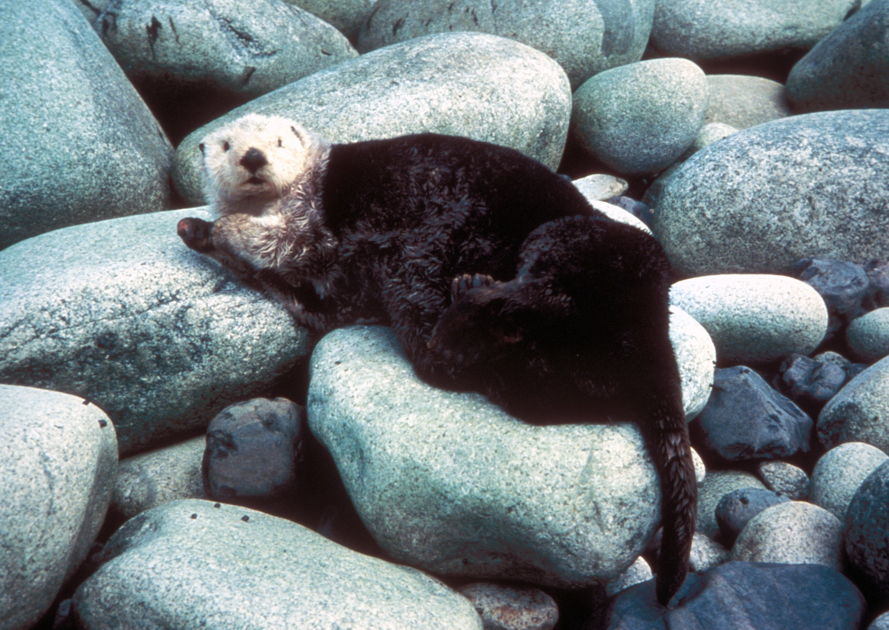
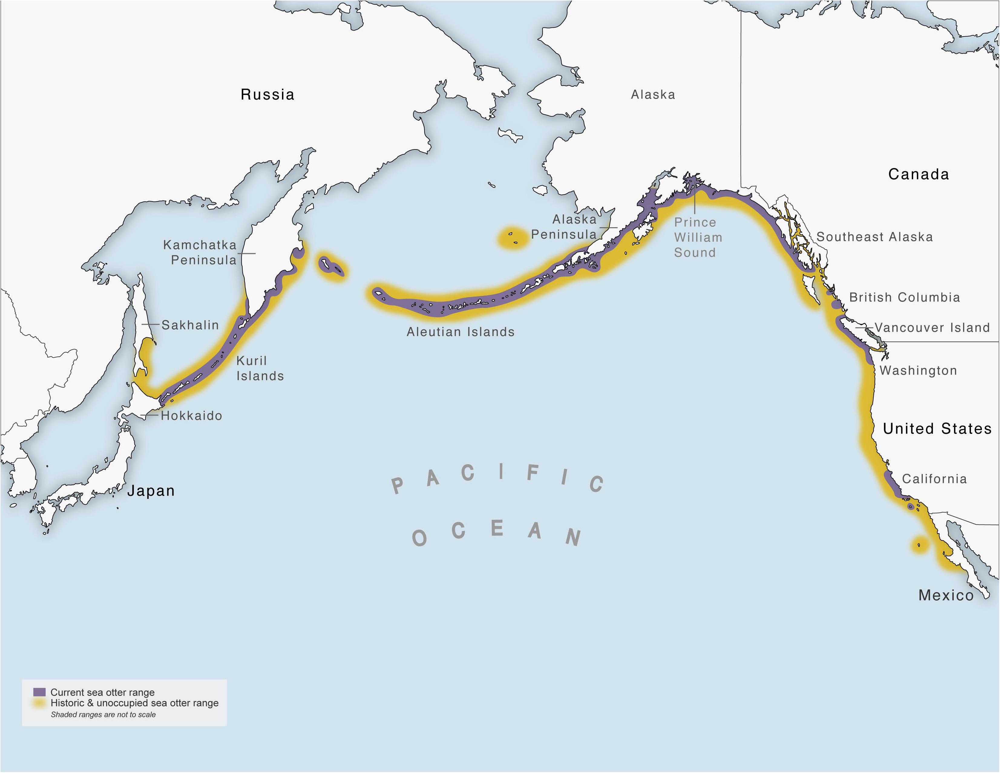
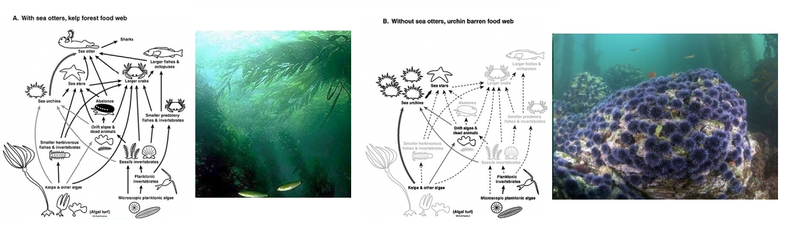
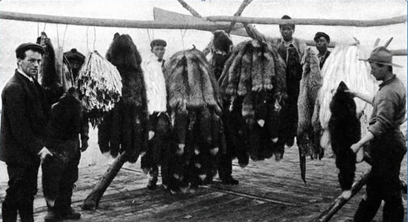
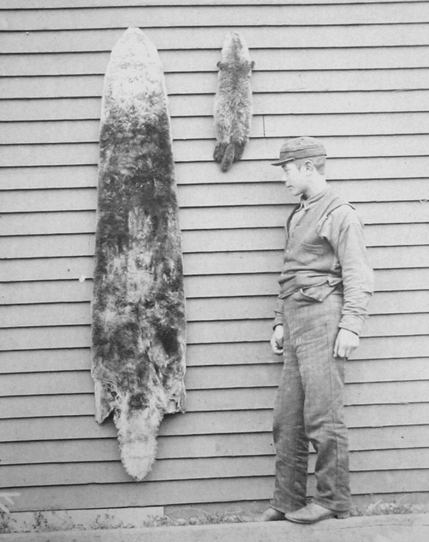
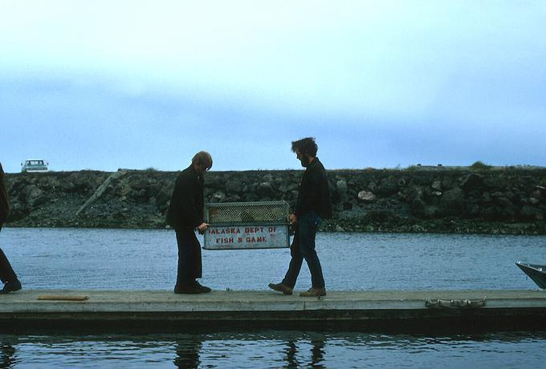
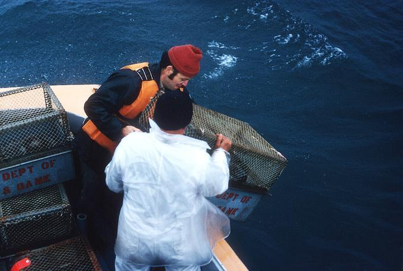
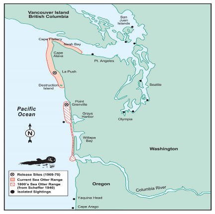
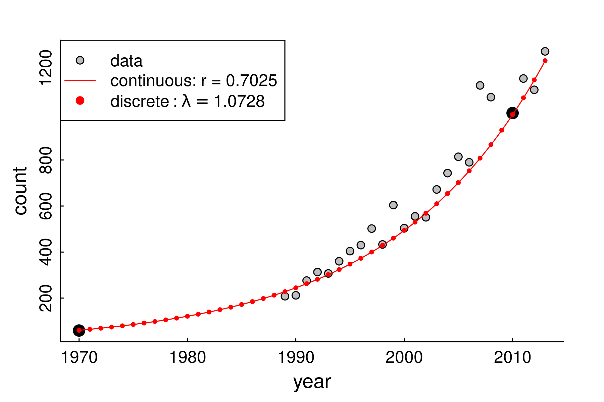

<!-- https://bookdown.org/yihui/rmarkdown/xaringan-format.html -->
```{r, echo = FALSE, eval = FALSE}
#renderthis::to_pdf("Lecture05_CountingAnimals_PartII.Rmd")
```

```{r setup, include=FALSE}
knitr::opts_chunk$set(echo = FALSE, message = FALSE, cache = TRUE, 
                      warning = FALSE, las = 1, dpi = 100)
#output: html_document
```


```{r colsFunction, eval = FALSE}
system("cp images/raft3.jpg bg.jpg")
system("cp ../mycss.css ./")
xaringan::inf_mr()
```


```{r cache = FALSE}
require(elieslides)
require(kableExtra)
```


## Meet ... *Enhydra lutris*

.pull-left[

]

.pull-right[
- The largest ...
- The smallest ...
- The furriest ... 
  * guess how may hairs per in^2^? (*hint, humans are born with  ~100,000 TOTAL.*)
]

---


## Sea otters: Range

.pull-left-60[]
.pull-right-40[*Littorally* the entire North Pacific]


---

## Sea otters: Keystone Species



(Estes et al. 1974)

---

.pull-left-60[

## Sea otters: Furriness > Cuteness


]


.pull-right-30[


]
.pull-left[
- Fur trade (Russian -> British -> American) leads to near **extirpation** across the entire range.
- **> 300,000 in 1740 ... < 2,000 in 1900**.  
- Displacement and indenturing of Indigeneous fishermen (esp. Aleut)
]
.pull-right[
> .footnotesize[*... the rush for the otters’ “soft gold” was a predictable boom and bust ... a cautionary example of unsustainable resource use, and a socioeconomic driver of Western — mainly American — involvement in the Pacific region,*  (Loshbaugh 2021)]

]

---

## Sea otter reintroduction: Pacific NW

Remnant populations from Aleutian Islands ... released in OR, WA, BC and SE-AK  1969 – 1972. 

.pull-left[]

.pull-right[]


---

## Sea otter reintroduction: Washington State ... 

.pull-left[]
.pull-right[
1970: 60 otters

```{r fig.width = 6, fig.height = 4}
WA <- read.csv("data/WA_SeaOtters_PopGrowth.csv")
require(ggplot2)
ggplot(WA, aes(year, count)) + geom_point()
```

2010's: over 1000
]

.center[***Successful!***]


---

## Population ecology is all about ... 

 $$\huge N$$

 but where?  when? 

--

## Here! Now! ..

$$\huge N_t$$

 but how many were there? 

---

## That many, then $\Delta t$ ago!

$$\Large N_t = N_{t - \Delta t} + \Delta N$$

slight rearrangement:

$$\Large N_{t+1} = N_t + \Delta N$$

For now, $\Delta t = 1$, i.e. it's the discrete unit that we measure population change.  VERY TYPICALLY - whether because of biology or field seasons:  $$\Delta t = 1\,\, \textrm{year}$$. 

---

## How does population change?

$$\Large N_{t+1} = N_t + (B - D) + (I - E)$$


### **B**irth
### **D**eath
### **I**mmigration
### **E**migration 

---
  
## Assumption 1: no one's getting on or off the bus

$$\Large N_{t+1} = N_t + B - D$$

### **B**irth
### **D**eath

### .red[**I**mmigration]
### .red[**E**migration]

This is a **closed population** ... 

---
  
## Assumption 2: the important one

The number of *Births* and *Deaths* is proportional to *N*.

$$\Large N_{t+1} = N_t + bN_t - dN_t$$
What does that mean? 

.pull-left[
- Every female gives birth to the same number of offspring? 
- Every female has the same *probability* of giving birth?  
- Every female has the same *probability* of giving birth to the same *distribution* of offspring? 
]

.pull-right[
- A fixed proportion of all individuals dies? 
- Every individual has the same *probability* of dying? 
- the *distribution* of probabilities of dying is constant? 
]

---

## Some math ....

Define $$r_0 = b - d$$

$r_0$: **discrete growth factor**,

$$N_{t+1} = N_t + r_0 N_t$$
$$N_{t+1} = (1 + r_0) N_t$$


$$N_{t+1} = \lambda N_t$$


$\lambda$ is .blue[**rate of growth (or decrease)**]

- If $d > b$, $\lambda < 1$.  
- If $b > d$, $\lambda > 1$.

---
 
## Cranking this forward

$$N_{t+1} = \lambda(N_t)$$
$$N_{t+2} = \lambda(N_{t+1}) = \lambda^2 N_t$$
$$N_{t+3} = \lambda^3 N_t$$

Solution:

$$\large N_{t+y} = \lambda^y N_t$$
or 

$$\huge N_t = \lambda^t N_0$$

.center[***Geometric*** (same as ***Exponential***) growth.]

---

## Some examples

```{r LambdaExamples2, fig.width = 10, fig.height = 5}
pars(); par(mfrow = c(1,2), mar = c(3,3,3,2), las = 1)
lambdas <- c(1,1.1,1.15,1.2)
x <- 0:25
plot(x, x, ylim = c(0, 100), type = "n", xlab = "time", ylab = "count",
     main = expression(lambda >= 1))
cols <- c("darkgrey", "orange", "red", "darkred")
legend("topleft", col = cols, 
       pch = 19, legend = lambdas, bty, cex = 1.25)
for(i in 1:4) points(x, lambdas[i]^x, add = TRUE, 
                     col = cols[i], lwd = 2, pch = 19, type = "o")

lambdas <- c(1,0.95,0.9,0.8)
x <- 0:25
plot(x, x, ylim = c(0, 100), type = "n", xlab = "time", ylab = "count",
     main = expression(lambda <= 1))
cols <- c("darkgrey", "lightblue", "blue", "darkblue")
for(i in 1:4) points(x, 100*lambdas[i]^x, add = TRUE, 
                     col = cols[i], lwd = 2, pch = 19, type = "o")
legend("topright", col = cols, 
       pch = 19, legend = lambdas, cex = 1.25, bg = "white")
```


---

## How fast is exponential/geometric growth?

.pull-left-60[


Legend says the inventor of chess (in India) so delighted the raja, he was offered anything he wanted. 

Inventor said, not much.  One grain of rice on one square, 2 on the next, 4 on the next and so on till the board is filled. 
]
 
--

.pull-right-40[


Not only is there not enough rice in India to fill such a chessboard, **there are not enough atoms on earth**.  
]
---

## Note what the log-scale does

```{r LambdaExamples, fig.width = 10, fig.height = 5}

lambdas <- c(2,1.2,1.1,1,0.95,0.9,0.8)
cols <- c("darkred", "red", "orange", "darkgrey", 
          "lightblue", "blue", "darkblue")

pars(); par(mfrow = c(1,2), mar = c(3,3,3,2), las = 1)


N0 <- 10

x <- 0:25


x <- 0:25
plot(x, x, ylim = c(0, 200), type = "n", xlab = "time", ylab = "count", 
     main = "positive growth")
for(i in 1:length(lambdas)) points(x, N0*lambdas[i]^x, add = TRUE, 
                     col = cols[i], lwd = 2, pch = 19, type = "o")

legend("topright", col = cols, ncol = 2, 
       pch = 19, legend = lambdas, bty)

plot(x, x, ylim = c(1, 300), type = "n", xlab = "time", ylab = "count",
      log = "y", main = "log scale")

for(i in 1:length(lambdas)) points(x, N0*lambdas[i]^x, add = TRUE, 
                     col = cols[i], lwd = 2, pch = 19, type = "o")


```


---

## Estimating some rates ... discrete

.pull-left-30[]

.pull-right-70[

The amazing thing is, if you have an equation "solved", you only need 2 points on the curve to compute. 

Let's use the discrete equation: 

$$N_{t+y} = \lambda^y N_t$$
$$1000 = 60 \times \lambda^{40}$$
$$16.7 = \lambda^{40}$$
$$2.81 = 40 \times \log (\lambda)$$
$$0.07025 = \log (\lambda)$$
$$\lambda = \exp(0.07025) = 1.0728$$

i.e. population increase about $$7.28\%/year$$. 
]
 

---

## Washington sea otter fit to data (7.025% discrete growth)

.pull-left-70[

```{r, fig.width = 7, fig.height = 5, eval = FALSE}
#png("images/SeaOttersFitted.png", width = 1800, height = 1200, res = 300)
pars()
plot(WA, pch = 21, bg = "grey")
points(subset(WA, year %in% c(1970,2010)), pch = 19, cex = 1.5)
curve(60*exp( (x-1970) * 0.07025), add = TRUE, col = "red")
points(1970:2013, 60*1.0728^(0:43), cex = 0.5, pch = 19, col = "red")
legend("topleft", lty = c(NA,1,NA), pch = c(21, NA, 19), 
       legend = c("data", "continuous: r = 0.7025",
                  expression(discrete:lambda == 1.0728)), 
       col = c("black", "red", "red"), pt.bg = "grey")
#dev.off()
```
]

.pull-right-30[
### This is an EXCELLENT fit 


but why isn't it *perfect*?


.darkgreen[What are some potential sources of **variation**?]
]


---

## Sea otter references

- J. A. Estes, J. F. Palmisano. 1974. Sea otters: Their role in structuring nearshore communities. Science 185, 1058–1060. 
- Loshbaugh S. 2021. Sea Otters and the Maritime Fur Trade. In: Davis R.W., Pagano A.M. (eds) *Ethology and Behavioral Ecology of Sea Otters and Polar Bears. Ethology and Behavioral Ecology of Marine Mammals.*
- Gilkinson, A.K., Pearson, H.C., Weltz, F. and Davis, R.W., 2007. Photo‐identification of sea otters using nose scars. *The Journal of Wildlife Management*, 71(6), pp.2045-2051.
-  Veltre, D.W.  “Unangax̂: Coastal People of Far Southwestern Alask,”
