background-image: url('images/slide2.png') 
background-size: cover


<!-- https://bookdown.org/yihui/rmarkdown/xaringan-format.html -->
```{r, echo = FALSE, eval = FALSE}
#renderthis::to_pdf("Lecture_PopulationEcology_PartII.Rmd")
```

```{r setup, include=FALSE}
knitr::opts_chunk$set(echo = FALSE, message = FALSE, cache = TRUE, 
                      warning = FALSE, las = 1, dpi = 200)
#output: html_document
```


```{r colsFunction, eval = FALSE}
system("cp images/raft3.jpg bg.jpg")
system("cp ../mycss.css ./")
xaringan::inf_mr()
```

```{r cache = FALSE}
require(elieslides)
require(kableExtra)
WA <- read.csv("data/WA_SeaOtters_PopGrowth.csv")
```


---

## But you could/should use ALL the data!

.pull-left[

**Using linear model of $\log(N)$ to estimate growth rate**

```{r, fig.height = 3, fig.width = 4, dpi = 200}
pars()
WA.lm <- lm(log(count)~year, data = WA)

WA.predict <- predict(WA.lm, se = TRUE) %>% data.frame(WA) %>% 
    mutate(low = fit - 2*se.fit, high = fit + 2*se.fit)

n <- nrow(WA.predict)
with(WA.predict,
     {
        plot(year, log(count), pch = 21, bg = "grey")
        polygon(c(year, year[n:1]), c(low, high[n:1]), col = rgb(0,0,0,.4), bor = NA)
    })

curve(60*exp( (x-1970) * 0.07025), add = TRUE, col = "red")
points(1970:2013, 60*1.0728^(0:43), cex = 0.5, pch = 19, col = "red")
```

**Look how linear it's become!**
]

.pull-right[

Model output:

.small[
```{r}
WA.lm <- lm(log(count)~year, data = WA)
summary(WA.lm)$coef %>% kable(digits = 4)
```
]

$$\log(N_t) = \alpha + \beta \,t$$ 
$$ N_t = N_0 \exp(\beta t)$$
where: 
$$N_0 = \exp(\alpha);\,\, \lambda = \exp(\beta)$$


.small[
```{r, eval = FALSE}
summary(WA.lm)$coef %>% kable(digits = 4)
a <- s %>% data.frame %>% mutate(lambda = exp(Estimate), low = exp(Estimate - 2*Std..Error), high = exp(Estimate + 2*Std..Error))
a <- a[2,]
```
]
$$\lambda = 1.076 \pm 0.005$$


**With repeated measures, we get the benefit of a precision estimate as well!**

]


---


.pull-left-60[
## Sources of variation?

```{r, fig.width = 4, fig.height = 3, eval = TRUE}
#png("images/SeaOttersFitted.png", width = 1800, height = 1200, res = 300)
pars()
WA <- read.csv("data/WA_SeaOtters_PopGrowth.csv")
plot(WA, pch = 21, bg = "grey")
points(subset(WA, year %in% c(1970,2010)), pch = 19, cex = 1.5)
curve(60*exp( (x-1970) * 0.07025), add = TRUE, col = "red")
points(1970:2013, 60*1.0728^(0:43), cex = 0.5, pch = 19, col = "red")
legend("topleft", lty = c(NA,1), pch = c(21, 19), 
       legend = c("data", 
                  expression(fit:lambda == 1.0728)), 
       col = c("black", "red"), pt.bg = "grey")
#dev.off()
```
]


### Observation error.
- How **precise**/**accurate** is the actual estimate? 


--

### Unexpected immigration / emigration.
- check assumptions about "closed population"

--

###  .red[**Environmental Stochasticity**]
Environment good / bad affecting **birth** and **death** for all animals.


---

.pull-left[
## Demographic Stochasticity

.darkred[**Stochasticity**] means: **randomness** in **time**.  

***Demography*** is the **Science of Population Dynamics**. Often it refers specifically to **births** and **deaths** (and **movements** ... but we're still looking at closed population). 

Individually, *all* demographic processes are stochastic.  An individual has some **probability** of dying at any moment.  An individual has some *probability* of reproducing (or some probability distribution of number of offspring) at a given time.

.green[**Question:**] How important is the randomness of *individual* events for a *population* process?  

.green[**More specific Q:**] What is the probability of extinction?
]
--

.pull-right[

## Human Experiment
.red[
> - 15 students
> - Flip a survival coin.  
>   - If you die (tails) sit down, if you live (heads) stay standing
> - Flip a reproduction coin.  
>   - If you reproduce (heads) call on another student to stand
]
]


---


## Cranking this experiment very many times. 

.pull-left[
https://egurarie.shinyapps.io/StochasticGrowth/

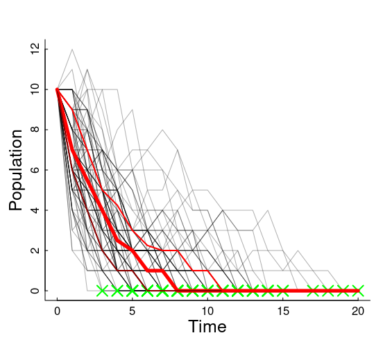
]

.pull-right[

On average, the number of individuals at time $t+1$ is the number that survived + the number that reproduced of those that survived.  

$$E(N_{t+1}) = p_s N_t + p_b\,p_s N_t = p_s (1+p_b) N_t$$

So (in our coin flip example) 
$$\widehat{\lambda} = p_s (1+p_b) = 0.75$$ 

**What does that mean for our population!?**


.center.large.red[Extinction is inevitable!]
]

--


---

## Even when population growth is 0... 


.pull-left-60[

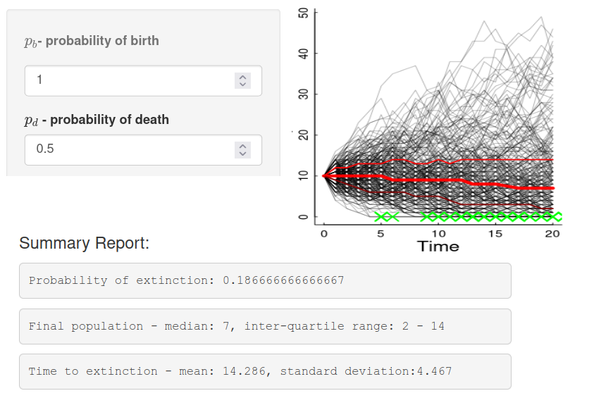
]

.pull-right-40[
Even if the population growth is 0 (neither growing nor falling) ....

$$\widehat{\lambda} = 0.5 \times (1+1) = 1$$   

**demographic stochasticity** leads to *some* probability of extinction always.


### Main take-away

**Demographic stochasticity** is important only for *small* populations.  

]


---

## Environmental Stochasticity

.pull-left-30[
- Affects entire population 

- Can ALSO increase risk of extinction

- or at least drive populations
]

.pull-right-70[
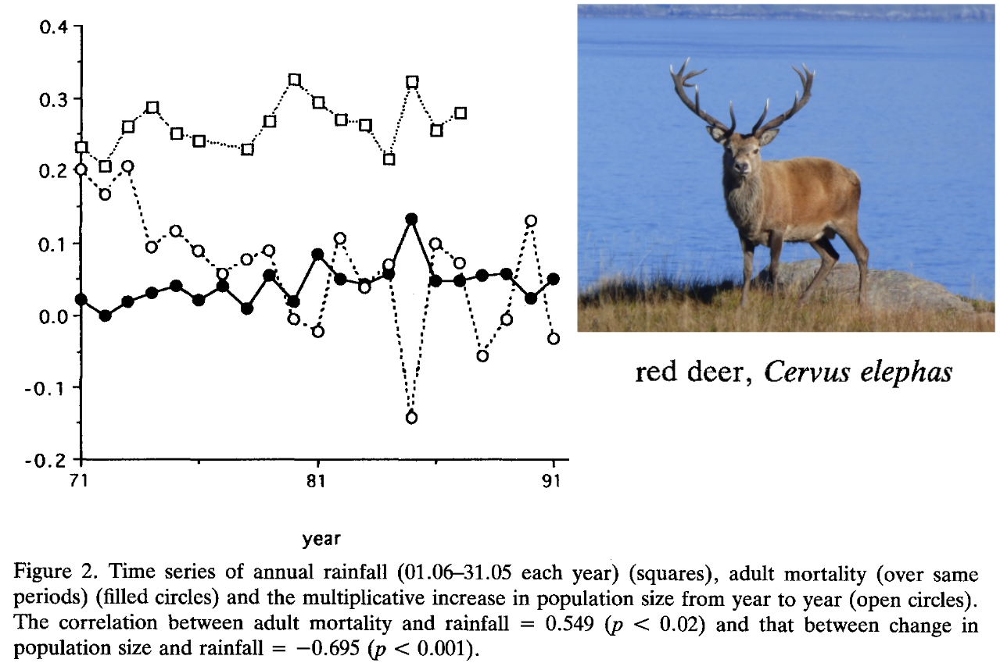

]


.pull-left-70[
---
## As populations grow ...

### they always hit **Limits to growth**

.content-box-blue.large[
- Space limits 

- Resource limitations

- Competition

- Predation

- Disease 

*All of these can interact *
]
]

.pull-right-30[
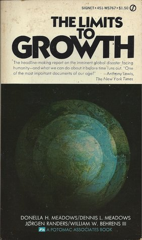
]

---

## Fundamental population equation

$$\huge \Delta N = B - D + I - E$$
.large[

Exponential growth assumes these (especially .red[**Birth**] & .red[**Death**]) are proportional to .red[**N**]. 

But at high N ... B can fall, or D can rise, or I can decrease or E can increase.  

]

### Density dependence

Means that the rate of a parameter, e.g. $b = {B\over N}$ is (a) NOT constant, and (b) dependent on total population (or density) $N$


---

.pull-left-50[
## Example: Wolf populations

-	Dispersal into new area, mainly wolf mating pairs. 
-	Highly territorial! 
-	Wolves produce up to 4 pups per litter that survive
-	If there are no neighbors, wolves will disperse to found new packs
-	Pack with 8 adults or 2 adults, still produces (about) 4 pups per litter 
-	If there are lots of neighbors, packs become larger (more individuals) in smaller territories. 

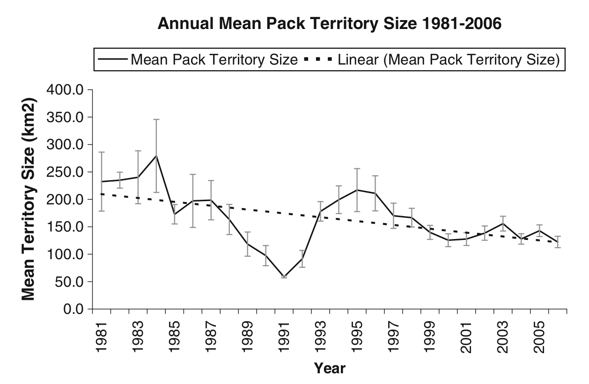

]


.pull-right-50[

**Expansion of Wisconsin Wolves, 1970's to 2000's**

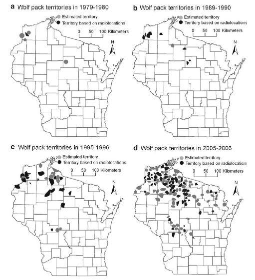
]

---

##  Human-wolf experiment model 

.pull-left-60[

### basics of model
- 8 possible territories
- 1 initial dispersing wolf (female)

### each season ...
- One female / pack gives birth to 2 offspring
- Offspring can choose whether to disperse or not 
- 1/4 of all wolves die each year
]

.pull-right-40[
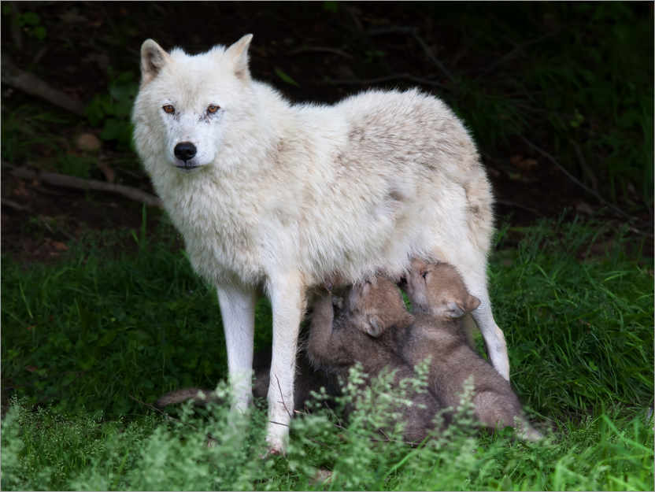
]

Enter data [here](https://docs.google.com/spreadsheets/d/15j2b3FCfbtrPkAlRb6QE6s55aRqggeSDi5YU6OBh7Yc/edit?usp=sharing)


---
class: inverse

##  Results of Human Wolf Experiment

.center[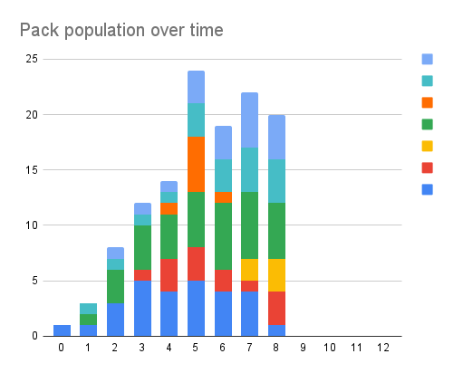

Looks a lot like initial exponential growth stabilizes around 20 ind as die-offs balance out births. 
]


---

.pull-left[

# Modeling wolf population

Population equation: 

$$N_t = (1 + b - d) \times N_{t-1}$$


Death rate is constant: $d = 0.25$

Birth rate is high when population is low:
$b_0 = 2$

Birth rate is small when population is high:
- $N = 1$; $B = 2$; $b = 2$
- $N = 8$; $B = 16$; $b = 2$

But it hits an absolute maximum of 16 total.  So if:
- $N = 32$; $B = 16$; $b = 1/2$
- $N = 64$; $B = 16$; $b = 1/4$

]


.pull-right-40[

```{r WolfLogisticGrowth, fig.width = 4, fig.height = 6}
pars(); par(mfrow = c(2,1), las = 1)
plot(c(0,100),c(0,2), type = "n", ylab = "rate", xlab = "N", main = "Population growth rates")
abline(h = 0.25, col = "red", lwd = 2)
curve(ifelse(x<8,2,16/x), add = TRUE, col = "darkgreen", lwd = 2)
points(c(0,8,16,32,64), c(2,2,1,.5,.25), col = "darkgreen", pch = 19, cex = 0.8)
points(64, 1/4, pch = 19, col = "blue")
legend("topright", col = c("darkgreen", "red", "blue"),
       pch = c(NA, NA, 19), lwd = c(2,2,NA), bty = "n", 
       legend = c("birth", "death", "growth rate = 0"))

N <- 1
for(x in 1:25){
    b <- ifelse(N[length(N)]<8,2,16/N[length(N)])
    d <- .25
    N <- c(N, (1 + b - d)*N[length(N)])
}
plot(N, type = "o", pch = 21, bg = "grey", xlab = "year")
abline(h = 64, col = "orange", lwd = 2, lty = 2)
text(2, 64, "K = 64", pos = 3, xpd = NA, font = 2)
```

]


---


.pull-left-60[

##  Some Concepts

- Natural populations are always eventually limited 

- The "cap" on a population is called the .darkred[***Carrying Capacity*** ] (symbol: **K**).  This is 

- When population rates (*b*, *d*, also *i*, *e*) depend on the **total population**, this is called: .darkred[***Density Dependence***]. 

- Growth that is is not **exponential** is called .darkred[***Logistic***]

- The maximum growth rate (max $b-d$) is called the .darkred[**intrinsic growth rate**].  

]

.pull-right-40[

```{r WolfLogisticGrowth_II, fig.width = 4, fig.height = 6}
pars(); par(mfrow = c(2,1), las = 1)
plot(c(0,100),c(0,2), type = "n", ylab = "rate", xlab = "N", main = "Population growth rates")
abline(h = 0.25, col = "red", lwd = 2)
curve(ifelse(x<8,2,16/x), add = TRUE, col = "darkgreen", lwd = 2)
points(c(0,8,16,32,64), c(2,2,1,.5,.25), col = "darkgreen", pch = 19, cex = 0.8)
points(64, 1/4, pch = 19, col = "blue")
legend("topright", col = c("darkgreen", "red", "blue"),
       pch = c(NA, NA, 19), lwd = c(2,2,NA), bty = "n", 
       legend = c("birth", "death", "growth rate = 0"))

N <- 1
for(x in 1:25){
    b <- ifelse(N[length(N)]<8,2,16/N[length(N)])
    d <- .25
    N <- c(N, (1 + b - d)*N[length(N)])
}
plot(N, type = "o", pch = 21, bg = "grey", xlab = "year")
abline(h = 64, col = "orange", lwd = 2, lty = 2)
text(2, 64, "K = 64", pos = 3, xpd = NA, font = 2)
```

]


---


.pull-left-40[

## Intrinsic growth rates

Strong Relationships with body size:


.large[
$$r_0 = 1.5 \, W^{-0.36}$$
]


$W$ is live weight in kilograms

**Q. Why would this be the case?**


]

.pull-right-60[

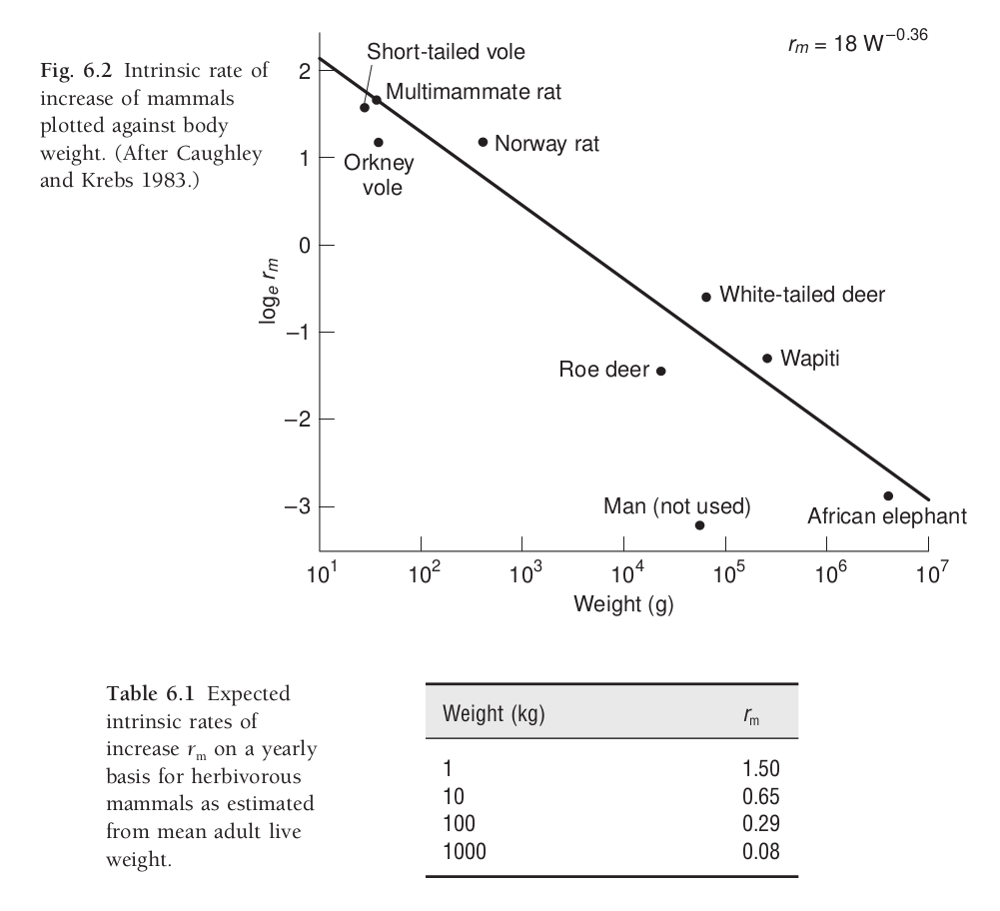


.center[Fryxell chapter 6]


]


---

## Different models of density dependence

.pull-left-30[

**What is it that depends on density?**

Is it birth?  Is it death?  Is it linear?  Is it curvy? 

]

.pull-right-70[
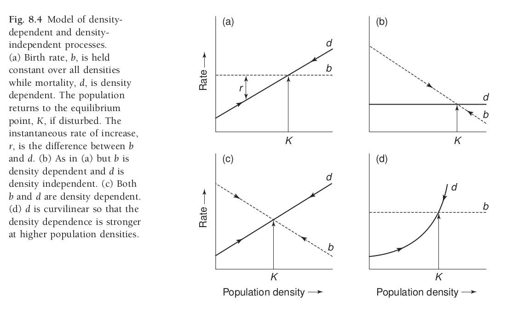

.center[Fryxell chapter 8.]
]


---

## Density dependent mortality & fecundity

.pull-left-30[
- Calf / pup / juvenile mortality is highest when densities are highest.

- **Fecundity** (# of offspring per female) falls at high densities. 

- This effect mainly kicks in at very high numbers (not linear).  
]

.pull-right-70[
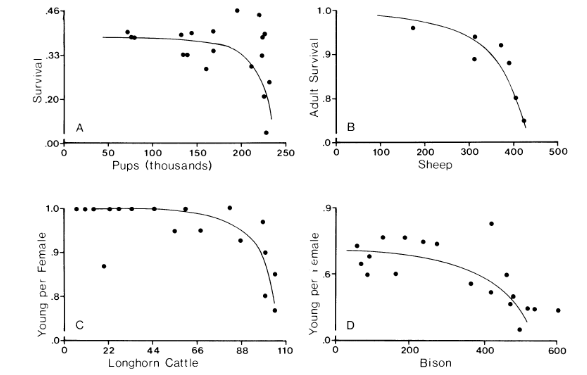

.center[Fowler (1981)]
]


---
.pull.left[
## Concave curves: Butterflies
]

.pull-right[Note that the **density dependent effects** kick in when populations are **small** rather than **large**.]

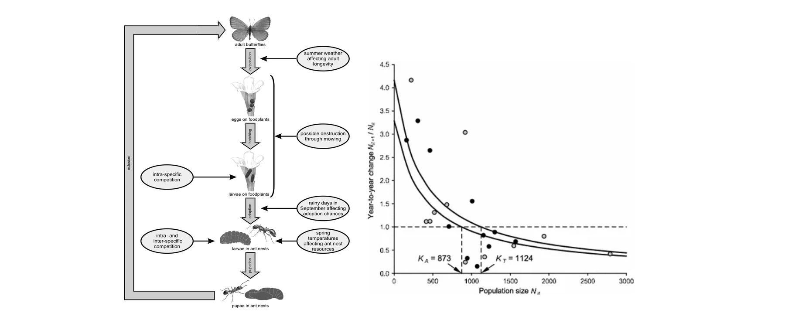
.center[(Nowicki et al. 2009)]


---


## Carrying capacity 

.pull-left[
**Ecological carrying capacity**

Basically - *K* of a logistic growth

Limited (almost always) by: 

- resources: 
  - food
  - shelter
  - breeding **habitat**

- space

- interactions (predation / parasites / disease)
]

.pull-right[
> In **Recitation** you will explore different ways in which **Carrying Capacity** is estimated, and why it is an important question for wildlife ecologists to ask. 
]

---

## Some references

.small[
- Benton, T. G., A. Grant, and T. H. Clutton-Brock. 1995. Does environmental stochasticity matter? Analysis of red deer life-histories on Rum. Evolutionary Ecology 9:559–574.
- Chapman, E. J., and C. J. Byron. 2018. The flexible application of carrying capacity in ecology. Global Ecology and Conservation 13:e00365.
- Fowler, C. W. 1981. Density Dependence as Related to Life History Strategy. Ecology 62:602–610.
- Laidre, K. L., R. J. Jameson, S. J. Jeffries, R. C. Hobbs, C. E. Bowlby, and G. R. VanBlaricom. 2002. Estimates of carrying capacity for sea otters in Washington state. Wildlife Society Bulletin:1172–1181.
- McClelland, C. J. R., C. K. Denny, T. A. Larsen, G. B. Stenhouse, and S. E. Nielsen. 2021. Landscape estimates of carrying capacity for grizzly bears using nutritional energy supply for management and conservation planning. Journal for Nature Conservation 62:126018.
- Nowicki, P., S. Bonelli, F. Barbero, and E. Balletto. 2009. Relative importance of density-dependent regulation and environmental stochasticity for butterfly population dynamics. Oecologia 161:227–239.
- Potvin, F., and J. Huot. 1983. Estimating Carrying Capacity of a White-Tailed Deer Wintering Area in Quebec. The Journal of Wildlife Management 47:463.
- Sibly, R. M., D. Barker, M. C. Denham, J. Hone, and M. Pagel. 2005. On the Regulation of Populations of Mammals, Birds, Fish, and Insects. Science 309:607–610.
- Thébault, J., T. S. Schraga, J. E. Cloern, and E. G. Dunlavey. 2008. Primary production and carrying capacity of former salt ponds after reconnection to San Francisco Bay. Wetlands 28:841–851.
- Wydeven, A. P., T. R. Van Deelen, and E. J. Heske, editors. 2009. Recovery of Gray Wolves in the Great Lakes Region of the United States: An Endangered Species Success Story. Springer New York, New York, NY.
]