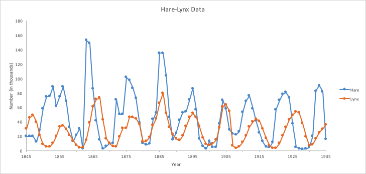

<!-- https://bookdown.org/yihui/rmarkdown/xaringan-format.html -->
```{r, echo = FALSE, eval = FALSE}
#renderthis::to_pdf("Lecture_PopulationEcology_PartII.Rmd")
```

```{r setup, include=FALSE}
knitr::opts_chunk$set(echo = FALSE, message = FALSE, cache = TRUE, 
                      warning = FALSE, las = 1, dpi = 200)
#output: html_document
```


```{r colsFunction, eval = FALSE}
system("cp images/raft3.jpg bg.jpg")
system("cp ../mycss.css ./")
xaringan::inf_mr()
```

```{r cache = FALSE}
require(elieslides)
require(kableExtra)
```

.pull-left-30[
## Terrific seminar!
]
.pull-right-70[

]


---
class:inverse

.center[
# **Limits to growth**
]

.pull-left.large[

- space

- resources 

- food 

- *habitat*

]

.pull-right[
]

--

### .center[Important additional factor: .large[**Species Interactions**]]


---

## Competitive Exclusion Principle

Two species **occupying the same niche** can coexist

.pull-left[

In *theory* Fox (*Vulpes vulpes*) and Coyote (*Canis latrans*) can't co-exist across southern Minnesota prairie / farmland
]


.pull-right[


]

.center[[Levi and Wilmers (2021) *Ecology* 93(4)](https://doi.org/10.1890/11-0165.1)]


---

## Except they often do!  (via niche partitioning)

.pull-left[


]
.pull-right-50[


Madison, Wisconsin


]

---

## Predator-prey dynamics

Based (mainly) on fur sales from the Hudson Bay Company in Canada over 100 years. Roughly a 9 to 11 year, fairly synchronous, cycle.

.pull-left-60[]


.pull-right-40[]


.pull-wide[
Theory suggests the **predators** and **prey** cycle ... but it turns out that is *probably* not the case.] 

--
.pull-wide[
> .center[Learn more in **EFB 370: Population Ecology and Management**]
]


---

## Equations and models

### Exponential model

.pull-left-40[
.red[
$\large \frac{dN}{dt} = r N$
]

Basic assumption: Growth rate is proportional to population size
]

.pull-right-60[]


---

## Equations and models

.pull-left[

### Exponential model

$\large \frac{dN}{dt} = r N$

.red[
### Logistic model

$\large \frac{dN}{dt} = r N \left(1 - \frac{N}{K}\right)$
]

Assumption growth rate goes to 0 at $N=K$

]

.pull-right-50[]


---

## Competition model

.pull-left[

.red[
$${dC \over dt} = r_c C\left(1- {C\over K_c} - \alpha {F \over K_c}\right)$$
$${dF \over dt} = r_f F\left(1- {F \over K_f} - \beta {C \over K_f}\right)$$
]
contains carrying capacities AND interactions
]

.pull-right-50[]


---

## Predator-Prey Model

.pull-left-30[

.darkred[
$\large {dP \over dt}  = -q P + \gamma VP$
]
.blue[
$\large {dV \over dt}  = r V - \sigma VP$
]

]

.pull-right-70[]

--


---

## To learn more ...


---

## Drilling into structure of Birth and Death


$$\huge N_t = N_{t-1} + B_t - D_t$$

.pull-left.large[
- **B** = Births 

- **Fecundity** = `#` births / female / unit time


(*unit time*  can be any unit of time, but is - ususally - year)
]

.pull-right.large[

- **D** = Deaths

- **Mortality (rate)** = probability of death / unit time
- **Survival (rate)** =  1 - Mortality rate
]


---

.pull-left-70[
## **Basic fact of life I:** Survival varies with age!


- **Survival Probability** ( $S_0, S_1, S_2, ...$ ) always between 0 and 1.
- **Cumulative Survival** ( $1, S_0, S_0 S_1, S_0 S_1 S_2, ...$ ) always starts at 1 and goes to 0

]

.pull-right-30[

<br>

Steller sea lions (*Eumetopias jubatus*)


]


---

## **Basic fact of life II:** Fecundity varies with age!


---
background-image: url("images/KhanLifeHistory.png")
background-size: cover
class:white

## .white[**Life History** is the reproduction / mortality pattern]


---

## Survival curves

.pull-left-60[

]

.pull-right-40.large[

- **TYPE I:** high survivorship for juveniles; most mortality late in life

- **TYPE II:** survivorship (or mortality) is relatively constant throughout life

- **TYPE III:** low survivorship for juveniles; survivorship high once older ages are reached
]

---
background-image: url("images/walrusoysters.png")
background-size: cover


## **r** (oysters) vs. **K** (walrus) strategy

.pull-left-30[
### r-selected species
- lots of offspring
- little or no parental investment
- low survivorship
- unstable environments
- small
- early maturity
- semelparous
- short life-expectancy
- Type III survivorship 
]


.pull-right-30[
### K-selected species

- few offspring
- lots of parental investment
- high survivorship
- stable environments
- large
- late maturity
- iteroparous
- long life-expectancy
- Type I survivorship schedule
]
--

.center.large.content-box.red[
**Important note:** 

Walruses do not in fact eat oysters.
]


---

.pull-left-60[
## Nice theory you've got there, but ... 

- What about **trees**?  They're big, they're long-lived (very **K**), but they produce and disperse a **heckload** of seeds (very, very **r**).

- What about **iteroparous** fish species (**K**) that are hedging their bets against high inter-annual variation in environmental conditions (very **r**)? 


]


.pull-right-40[

]

--

.large.content-box.red[
<br>
**To learn more:** Consider **EFB 370**

<br>
]


---


.pull-left-60[

## Body Condition and Physiology

**Fecundity** and **Survival** both depend very much on **body condition**. 

**Body condition** is measured in many ways, for example:.  

> .small[
We analysed two metrics of body condition: i) a direct subcutaneous **fat score (categorical, 1-5)**, assessed by palpating the belly-loin, with the badger laterally recumbent, and ii) a **body condition index (BCI)** estimated using a ratio-based approach for each capture: log (body mass)/log (body length).
]

European badger (*Meles meles*):
.pull-right-50[]

]

.pull-right-40[

<br><br>


.center[[(Ross et al. 2021)](https://www.sciencedirect.com/science/article/pii/S2666900521000228)]


]


---

## Remote assessments of body condition

.pull-left-30[
Field measurements made using categorical assessments. 

]

.pull-right-70[]


---

## Other measurements 


.pull-left-30[


#### Note invasive measures

Kidney fat  
- healthy mammals

Bone marrow fat 
- informative for non-healthy mammals

]


.pull-right-70[
.center[([Sanchez et al. 2018](https://onlinelibrary.wiley.com/doi/epdf/10.1111/ele.13160))]
]


---

.pull-left[
## Influences on body condition

- **Food availability** - including (often) high seasonal variation

  - These relationships make **Body Condition** a good proxy for **Habitat Quality**

- **Disease and parasite loads**

- **Stress** - from human, predator impacts, or social interactions
]

.pull-right[
## Consequences of (poor) body condition

- Lower **survival** & lower **fecundity**
  - Varies by age
  - Often - physiological energetic trade-offs between **survival** and **reproduction** (less gonadal growth, later maturation, skipped estrus)
 
- Population level impacts
  - mechanisms of **Density Dependence**
]


---
class:inverse

## Introducing  ... 

.pull-left-70[
### Eaqan Chaudhry

- Wildlife physiologist 

- Ph.D. candidate in Environmental Biology, SUNY-ESF with **Dr. Cynthia Downs**

- Pop wildlife quiz: **IS** or **IS NOT** holding a New England cottontail rabbit in the image to the right? 

]

.pull-right-30[


]
