<!-- https://bookdown.org/yihui/rmarkdown/xaringan-format.html -->
```{r, echo = FALSE, eval = FALSE}
#renderthis::to_pdf("Lecture_PopulationEcology_PartII.Rmd")
# ratio: '16:9'
```

```{r setup, include=FALSE}
knitr::opts_chunk$set(echo = FALSE, message = FALSE, 
                      warning = FALSE, las = 1, dpi = 200)
#output: html_document
```


```{r colsFunction, eval = FALSE}
system("cp images/raft3.jpg bg.jpg")
system("cp ../mycss.css ./")
xaringan::inf_mr()
```

```{r cache = FALSE}
require(elieslides)
require(kableExtra)
```


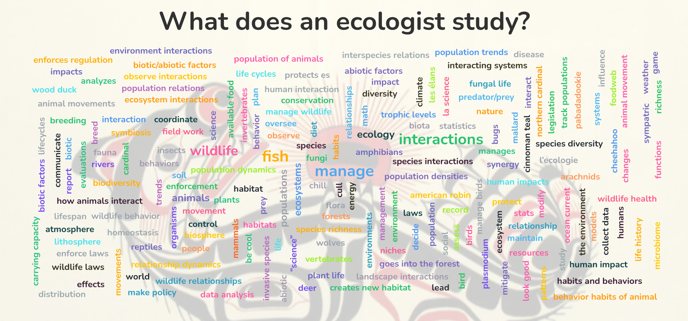

.center[Lots of things.  Including think and worry about interactions. ]

---


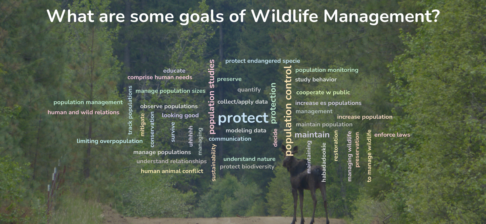
.center.large[**Focused on single-species populations**]

.pull-left-40[
#### goals
- Grow them
- Lower them
- Harvest sustainably
- Do nothing

]

.pull-right-60[

#### tools
- count them
- assess /  improve habitat
- understand population 
- understand interactions
- understand disease & physiology
]

---

## Not-so Pop Quiz


.pull-left-70[
.pull-right-70[]]


---

## Shane Mahoney makes his pitch:

<iframe src="https://www.youtube.com/embed/eGZZ8C4Os2U?controls=0"  width="100%" height="400" frameborder="0" allowfullscreen>
</iframe>


---


.pull-left[
### Historical background

Pre-1492, human population in Americas highly uncertain, but likely highly populated (10-200 million people)

Land managed for game and agriculture - plantings / fires / clearings / terracing.

> .red[*pristine wilderness is a persistent myth*]

You could drive a wagon through the forests of New York & Ohio. 

]

.pull-right[
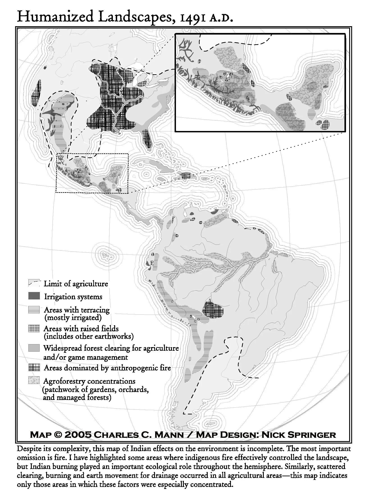
]

Small founder population ( $N_{eff} < 80$?), susceptibility to disease + genocide left a highly depopulated "pristine" wilderness *Romanticized* in 19th century.  


.footnotesize[*Denevan 1992*]


---

## Meanwhile: in (feudal) Europe 

.pull-left-60[

Wild-lands were rapidly cultivated and developed.

Feudal system preserved remaining wilderness as strictly **property of the king**, with especial claim on "higher game", esp. **deer**, **boar**. 
  
**Poaching** strongly deterred  (hanging / blinding / maiming / etc.)

This conflicted with common-use of land, though small game (rabbit snaring, bird netting) remained legal. 

**Game Laws of England** (~1400) made wealth was a **legal prerequisite** to hunt.

Motivated several peasant rebellions.
]


.pull-right-40[
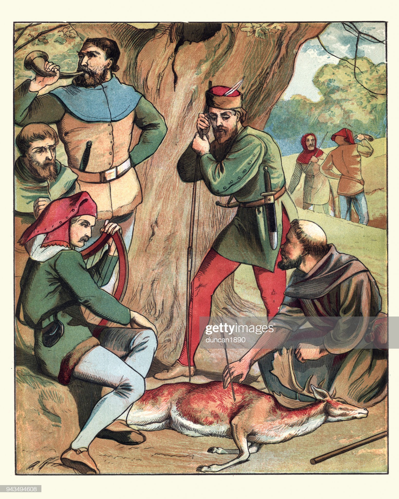
.green.large[**Robin Hood**]
]


---

### In modern Europe (well ... Scotland)

.pull-left-60[

- Most land private
- Wildlife belongs to landowner
- **Ghillies** (fish) | **Stalkers** (fown) | **Keepers** (game)
- Hunting - largely - sport of elite
- No predators!  No forests!


However:
- Landowners may lease land for hunters to take meat to market
- All land is accessible 

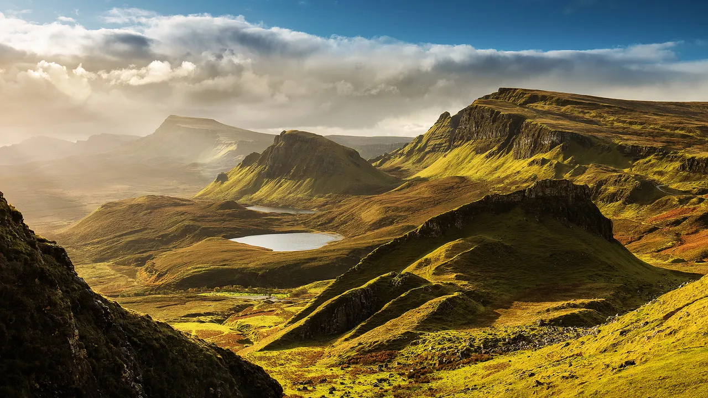
]


.pull-right-40[
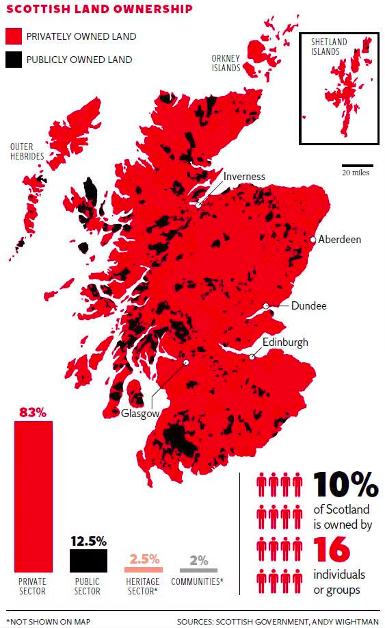

]


---

### Shane Mahoney explains Public Trust

<iframe src="https://www.youtube.com/embed/eGZZ8C4Os2U?start=192"  width="100%" height="400" frameborder="0" allowfullscreen>
</iframe>


---
background-image: url("images/bisonpile.webp")
background-size: cover

### **Age of over-exploitation** (1850-1899)


---
background-image: url("images/bisonpile.webp")
background-size: cover


### **Age of over-exploitation** (1850-1899)

.pull-right-40[

.content-box-gray[**N.A. extinctions**

- Great Auk (1852)
- Sea mink (1852)
- Eastern elk (1867)
- Passenger Pigeon (1914)
- Carolina Parakeet (1917)
]
]


---


.pull-left.footnotesize[
## Resource exploitation

Fueled the expansion of people across the continent. 

**Industrial Revolution** changed society 
  - 1820, 5% urban (much subsistence)
  - 1860 - 20%; 1900 - 40%
  
leads to **markets for wildlife** to feed urban masses and *festoon* wealthy elites. 

**Market hunters**  first along coastal waters and interior forests. 
Railway & refrigeration brings bison (*Bison bison*), wapiti (*Cervus elaphus*), and other from West to cities in East.  

The market hunter left many once-abundant species teetering on the brink of extinction. 
]

.pull-right[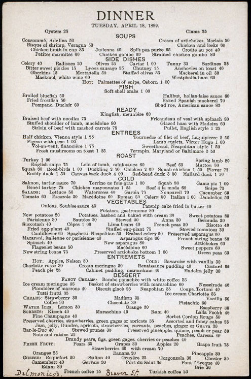]

---
## Hunting as genteel sport

.pull-left[

**Urban population** has leisure time. 

**Hunting** pursued  for "rigors" and "challenges" of the chase under
conditions of "fair play" (influenced by Europe). 

Conflicts between **market hunters** who profited and new breed of (elite) hunters who placed value on live wildlife and their sporting
pursuit of it. 

These sport hunters organized and developed **influential clubs** and **wildlife refuges**. 
]

.pull-right[
> *True sportsmen were those who hunted for pleasure (never for profit), who in the field allowed game a sporting chance, and who possessed an aesthetic appreciation of the whole context of sport that included a commitment to its perpetuation.*  (paraphrase of Grinnell)

]


---
### Era Of Protection (1850-1899) 


.pull-left-70[

.pull-left-40[
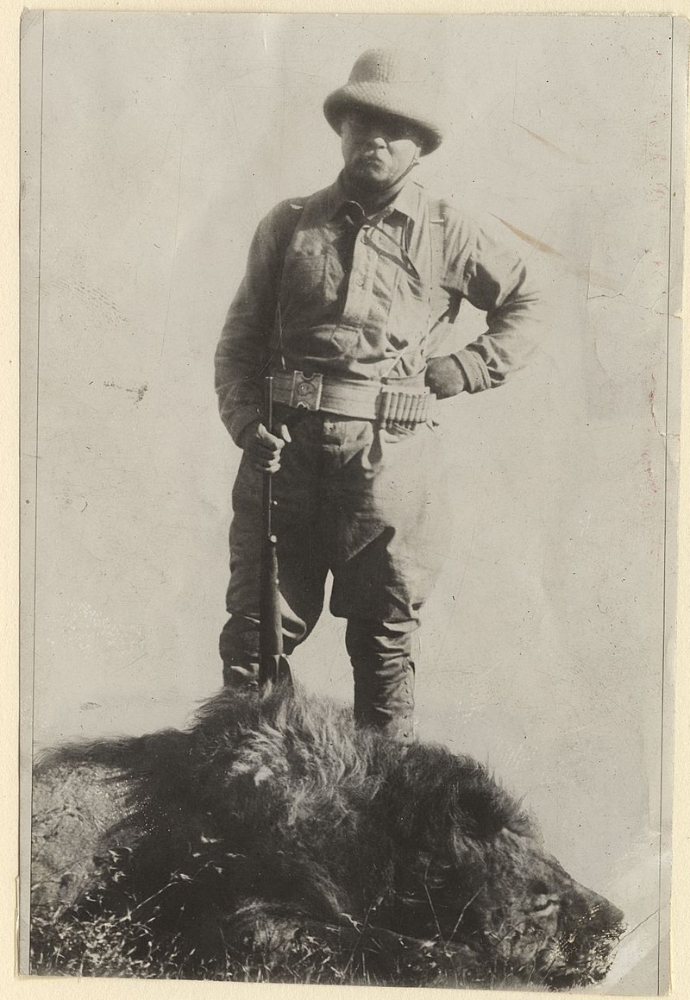
Theodore Roosevelt (1958-1919)

*Big hunter. 
President of U.S. - 1901-1909*
]
.pull-right-60[
Fancy New Yorkers Grinell and Roosevelt compare notes about good times out west ... realize lots of stories don't match because so much game was lost in the meantime. 

Founded **Boone and Crockett Club** in 1893 advocating for a network of public protected game reserves. 

Habitat protection became synonymous with wildlife stewardship.  **BUT** the main goal was producing more **game** species for **sportsman-like** hunt. 

]
]
.pull-right-30[

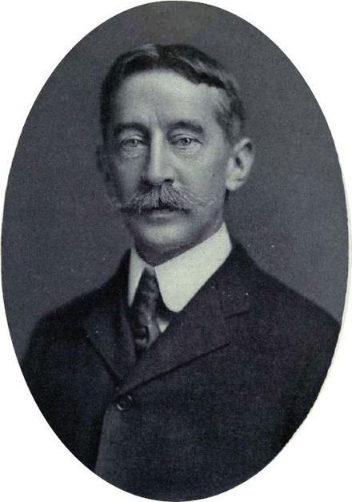
George Bird Grinnell (1949-1938)

*.small[Lots of strongly worded editorials in Field and Stream]*
]


---
### Era Of Protection (1850-1899): Old Boy's Club
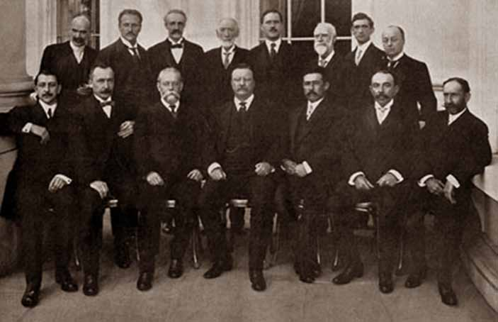
Early conservationists. 

---

## Era of conservation 
.pull-left[
### Lacy Act of 1900

Iowa Republican congressman **John Lacy**  (Boone & Crockett club member), signed into law in May 1900 by Republican William McKinley.  

Illegal to traffic in fish, wildlife, or plants that are illegally taken, possessed, transported, or sold.

Amended in 2008 to expand ranges and species that are illegally taken outside the US

Also requires importers of to file a declaration identifying the scientific name, value, quantity, and country of harvest for most plant and wildlife products.
]

.pull-right[

]
---

## Era of Conservation

.pull-left[

#### Migratory Bird Act of 1918 (MBTA)
.small[
**Frank Chapman** (Boone & Crockett club member, friend of Roosevelt, curator of Birds at the AMNH, founder of the Christmas bird count) lobbied Roosevelt to expand and enact previous legislation. 

Treaty signed with the UK (via Canada, which was a colony at the time)

1920 **Louis Marshall** lobbied on behalf of the Supreme Court that this treaty did not violate state’s rights.
]
]
.pull-right[

.pull-left-40[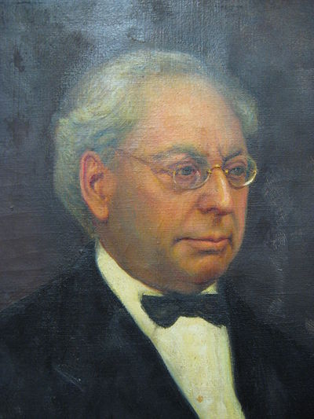 .footnotesize[Syracuse-born, ESF founder,  Catskill and Adirondack Parks]]
.pull-right-60[
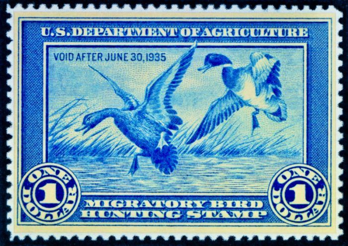

.footnotesize[*Since 1934, the sale of federal duck stamps to hunters have generated nearly $1 billion for wetlands conservation.*]
]]

.small[
Currently offers protection to over 1000 species.  Penalties include arrest and fines. 

Established the **Migratory Bird Conservation Commission** to review and approve land acquisitions for waterfowl refuges. 
]

---
###  Aldo Leopold 

In the 1930s he saw that wildlife was disappearing. He began asking questions about how to manage animals. Wrote Game Management which became the first step toward wildlife management. In the 1930s he saw that wildlife was disappearing. He began asking questions about how to manage animals. Wrote Game Management which became the first step toward wildlife management.


---

### Era of Game Mangement  **Aldo Leopold**

.pull-left-60.small[
By the early 20th century, considerable wildlife conservation infrastructure was in place

In 1920s but emphasis on **restrictive game laws** was insufficient in itself to stem wildlife’s decline. 

**Aldo Leopold** proposed a program of restoration to augment conservation’s legal framework. 

They called for a  **wildlife management profession** with trained biologists, stable, equitable funding to enable their work and university programs to train them.

Within 10 years:
]

.pull-right-30[
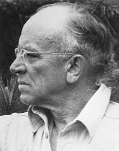

.small[**Aldo Leopold** (1887-48)]
]
.small[

- **Game management curricula** established, including **Cooperative Wildlife Research Units**, 
- the formation of **The Wildlife Society**, 
- **Pittman-Robertson Wildlife Restoration Act** (1937) - excise on guns and ammunition  to fund state wildlife agencies.
- **Duck Stamp Acts** - to fund MBPA
]


---

## Aldo Leopold: **Land Ethic**

> .small[The land ethic simply enlarges the boundaries of the community to include soils, waters, plants, and animals, or collectively: the land. This sounds simple: do we not already sing our love for and obligation to the land of the free and the home of the brave? Yes, but just what and whom do we love? Certainly not the soil, which we are sending helter-skelter down river. Certainly not the waters, which we assume have no function except to turn turbines, float barges, and carry off sewage. Certainly not the plants, of which we exterminate whole communities without batting an eye. Certainly not the animals, of which we have already extirpated many of the largest and most beautiful species. A land ethic of course cannot prevent the alteration, management, and use of these 'resources,' but it does affirm their right to continued existence, and, at least in spots, their continued existence in a natural state. In short, a land ethic changes the role of *Homo sapiens* from conqueror of the land-community to plain member and citizen of it. It implies respect for his fellow-members, and also respect for the community as such.
.center[*Sand County Almanac* - 1949]
]

Worth comparing with many Indigenous approaches and ethoses ... e.g. **Haudenosaunee Thanksgiving Address**.

---

## Era of Environmentalism

.pull-left-70[

> A general move to federalize environmental law because of a "race to the bottom" by states

### Legislation 


- Clean Air Act - 1970
- Clean Water Act - 1972, 1977, 1987
- National Environmental Policy Act - 1970
- Marine Mammal Protection Act - 1972 
- Endangered Species Act - 1973
- Environmental Protection Agency  - created in 1970's to make sense of all of the above. 

]

.pull-right-30[
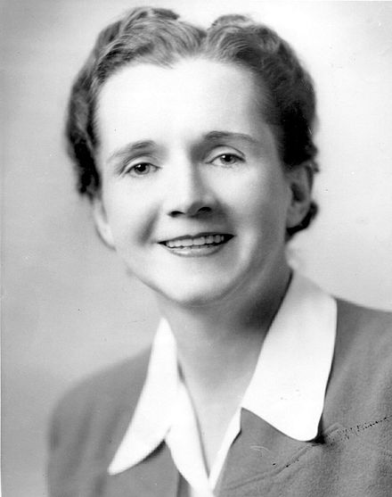

Rachel Carson (1907-1964)

*Silent Spring* (1962)

]

---

### The Seven Tenets of the North American Model of Conservation
.large[
1. Wildlife is a public resource
2. Markets for game are eliminated
3. Allocation of wildlife by law
4. Wildlife can only be killed for a legitimate
purpose.
5. Wildlife species are considered an
international resource.
6. Science is the proper tool for discharge of
wildlife policy. 
7. The democracy of hunting
]

---

## 1. Wildlife resources are a public trust. 

> “By the law of nature these things are common to all mankind - the air, running water, the sea, and consequently the shore of the sea. No one, therefore, is forbidden to approach the seashore, provided that he respects habitations, monuments, and the buildings, which are not, like the sea, subject only to the law of nations.” (Roman Law)

--

How does that harmonize with the supreme role of private property rights in the U.S.? 

---

## 2. Markets for Game are eliminated

.pull-left[


It been held a **principle** that markets for game and non-game wildlife are unacceptable because they privatize a common resource and lead to declines. 

Exceptions made for:  

- fur-bearers
- some meat 
- **ALL FISH**
]

.pull-right[
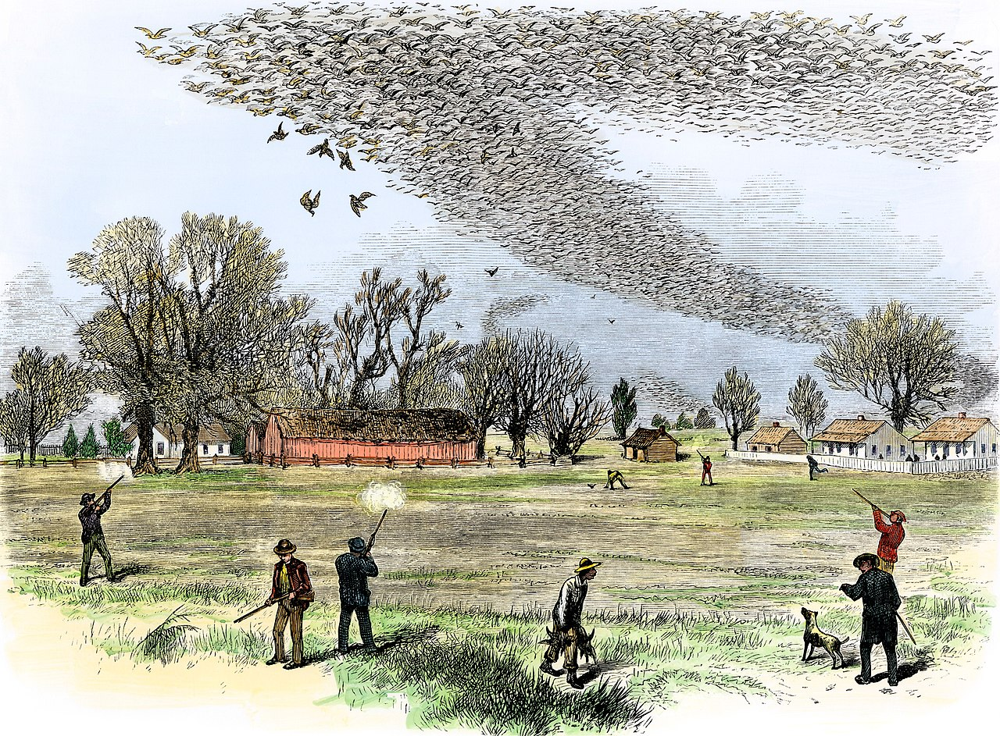

Passenger Pigeon shoot ... from black skies to extinction
]

--

> **Question:** Why can I buy kangaroo meat in the supermarket in Australia? 

---

## 3. Allocation of Wildlife is by Law


.pull-left[

Wildlife is allocated to the public by law, as opposed to market principles, land ownership, or other status. 

Democratic processes and public input into law-making help ensure access is equitable.

Game laws, game agencies, and game commissions established by states in the late-19th and early 20th centuries focused primarily on eliminating commercial uses of wildlife (e.g., birds and the millinery trade) and on regulating numbers of game legally killed by sportsmen.
]

.pull-right[

> .footnotesize[In 1897, the New York State Assembly passed the Adirondack Deer Law (sponsored by assemblymen who were **Boone and Crockett Club members**) that outlawed jacklighting deer at night and shooting deer after using hounds to drive them into deep water. Most notable about this law was that shooting deer in water was outlawed because of potential deleterious effects on the deer population, and jacklighting (e.g., spotlighting) was banned because it was **unsportsmanlike** (these laws remain intact today).]

]

---

## 4. Wildlife Can Be Killed Only for a Legitimate Purpose

What is this!?

--

.pull-left.footnotesize[

- does so primarily for the pursuit or chase;
- affords game a “sporting” chance (fair chase);
- seeks knowledge of nature and the habits of animals;
- derives no financial profit from game killed;
- will inflict no unnecessary pain or suffering on game; and
- will not waste any game that is killed.

> How does or doesn't this overlap with **traditional** or **subsistence** use?

]

.pull-right[
- How do longstanding predator removal or control programs fit within this context?
- How precisely evaluated are the concerns over property protection, and how well justified should such interventions be? 
- Are hunters who secure only the skin, head, antlers, or horns and discard the meat consistent with our understanding of the Model’s
history and intent?
]


---

## 5. Wildlife Is An International Resource


.large[
- Marine Mammal Protection Act
- Migratory Bird Treaty
]

Must be international.  Hard to argue with.  

---

## 6. Science Is the Proper Tool to Discharge Wildlife Policy

.pull-left-40[

The scientific mandate has been reinforced by the writings of Aldo Leopold and embedded within **The Wildlife Society’s** code of ethics:

TWS members “recognize research and scientific management of wildlife and its environments as primary goals …”
]

.pull-right-60[


.small[
> #### Eventual synthesis with Human studies

> “One of the anomalies of modern ecology is the creation of two groups, each of which seems barely aware of the existence of the other. The one studies the human community, almost as if it were a separate entity, and calls its findings sociology, economics and history. The other studies the plant and animal community and comfortably relegates the hodge-podge of politics to the liberal arts. The inevitable fusion of these two lines
of thought will, perhaps, constitute the outstanding advance of this century.”
<br><br> .center[*Aldo Leopold*]
]

]


---

## 7. Democracy of Hunting Is Standard
.pull-left[
Accessible to all. 

But is it? 

In practice, the best hunting is often on private lands, but property laws are **very strong**.

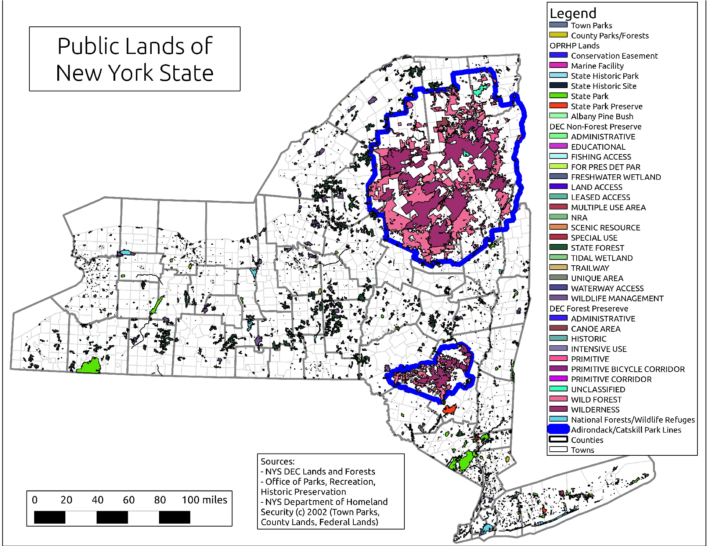
]
.pull-right[
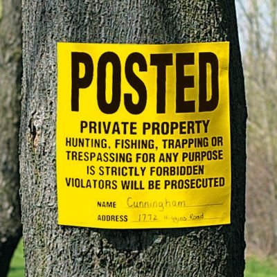
]

---


.pull-left-60[
## Economic realities. 

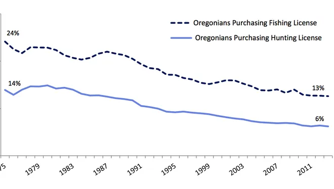
.footnotesize[*Oregon Dep't of Fish and Wildlife*]

**Hunting as an activity** is decreasing in popularity, across North America

Non-extractive **outdoor recreational activities** are increasing.  About $374 billion, of which only $15 billion are hunting / fishing / trapping (& $30 billion is R.V.'s!)  See [this link](https://www.bea.gov/news/2021/outdoor-recreation-satellite-account-us-and-states-2020)

*Should they contribute to public conservation & management funds?*
]


.pull-right-40[
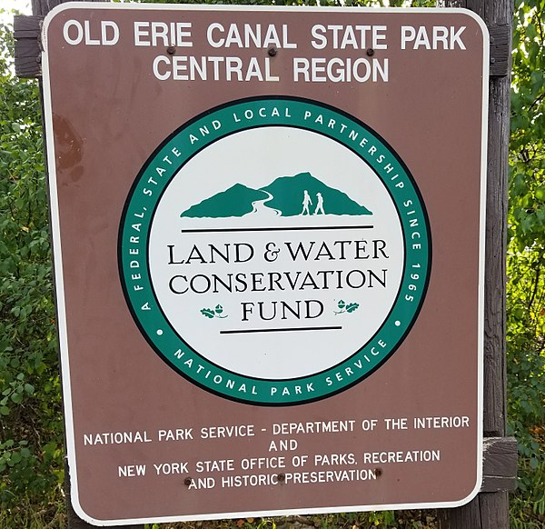


Currently, most public **recreation funding** entirely reliant on appropriations, such as the *Land and Water Conservation Fund* - $900 million of permanent funding (mainly taxes on oil and gas). 

]

---

## Recovering America's Wildlife Act


- Provide $1.3 billion in dedicated funding annually for the implementation of state fish and wildlife agencies’ wildlife action plans.
- Provide $97.5 million in dedicated funding annually for tribal agencies to work on at-risk species recovery.
- Allot 10% of dedicated annual funds towards the implementation of a competitive grants program aimed at fostering regional cooperation among states.
- Leverage funds from state agencies, universities, and non-governmental organizations to boost the power of federal conservation spending.
- Provide greater regulatory certainty for industry and private partners by conserving species and avoiding the need to list them under the Endangered Species Act.
- Empower wildlife professionals to hold the nation’s wildlife in the public trust for generations to come by providing state and tribal agencies with the flexibility to conserve populations in an effective and cost-efficient manner.

---
class: small

## What's happening next ... 

when | what | who
--|:--:|:--:
Tues, Oct. 25 | North American Model - origins & critiques | me
Thurs, Oct. 27 | Hunting & wildlife ecology | Nate Wehr, MSU/ESF
Tues, Nov 1 | Haudenauseaunee perspective | Neil Patterson, CNPE/ESF
Thurs, Nov 3 | Indigenous co-management in Candadian North | Aimee Guile and Laura Behnart
Tues, Nov 8 | Recovery of Galápagos tortoises | Dr. James Gill, ESF
Thurs, Nov 10 | Wildfowl ecology & management | Dr. Mike Schummer & Riley Stedman, ESF
Tues, Nov 15 | **Exam #2**
Thurs, Nov 17 | Furbearer management in NYS | Tim Pyczynski, NY-DEC
| **THANKSGIVING BREAK**| 

